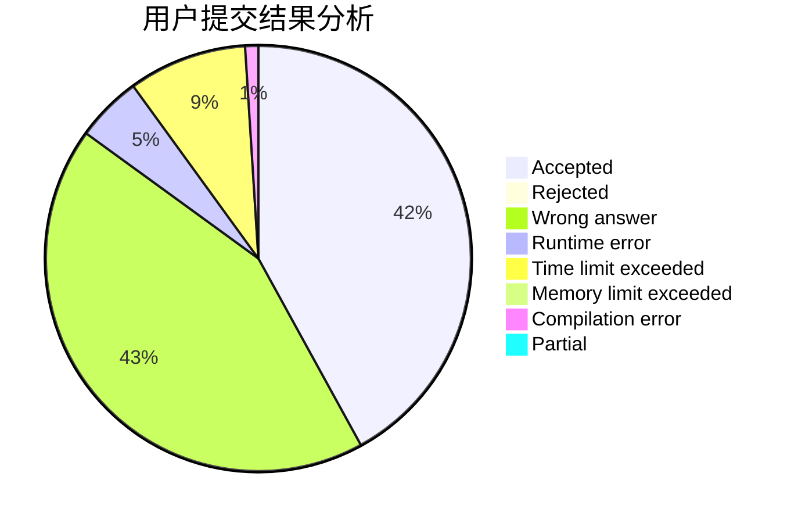
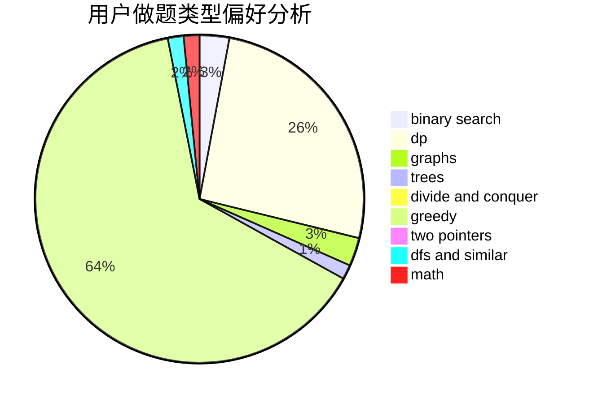

# hht2005

<!-- tabs:start -->

#### **用户提交结果分析**

#### **用户做题类型偏好分析**

<!-- tabs:end -->
# 推荐题目
[1196A](https://codeforces.com/contest/1196/problem/A)
[370A](https://codeforces.com/contest/370/problem/A)
[198B](https://codeforces.com/contest/198/problem/B)
[1173A](https://codeforces.com/contest/1173/problem/A)
[939F](https://codeforces.com/contest/939/problem/F)
[1321F](https://codeforces.com/contest/1321/problem/F)
[723E](https://codeforces.com/contest/723/problem/E)
[903A](https://codeforces.com/contest/903/problem/A)
[548C](https://codeforces.com/contest/548/problem/C)
[11522](https://codeforces.com/contest/1152/problem/2)
