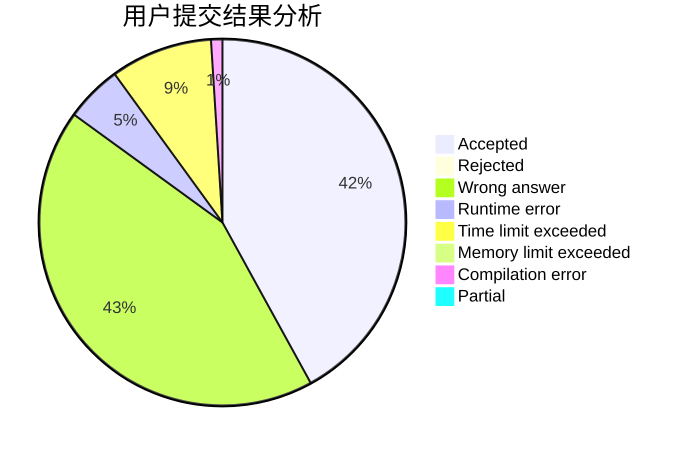
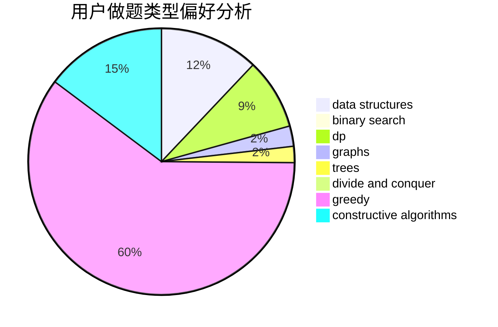

# hht2005

<!-- tabs:start -->

#### **用户提交结果分析**

#### **用户做题类型偏好分析**

#### **用户错题知识点分析**

<!-- tabs:end -->
# 推荐题目
[1196A](https://codeforces.com/contest/1196/problem/A)		brute force,
                        constructive algorithms,
                        math		  
[370A](https://codeforces.com/contest/370/problem/A)		graphs,
                        math,
                        shortest paths		  
[198B](https://codeforces.com/contest/198/problem/B)		shortest paths		  
[1173A](https://codeforces.com/contest/1173/problem/A)		greedy		  
[939F](https://codeforces.com/contest/939/problem/F)		data structures,
                        dp		  
[1321F](https://codeforces.com/contest/1321/problem/F)		dsu,graphs,sortings,trees		  
[723E](https://codeforces.com/contest/723/problem/E)		constructive algorithms,
                        dfs and similar,
                        flows,
                        graphs,
                        greedy		  
[903A](https://codeforces.com/contest/903/problem/A)		greedy,
                        implementation		  
[548C](https://codeforces.com/contest/548/problem/C)		dsu,graphs,sortings,trees		  
[11522](https://codeforces.com/contest/1152/problem/2)		dsu,graphs,sortings,trees		  
