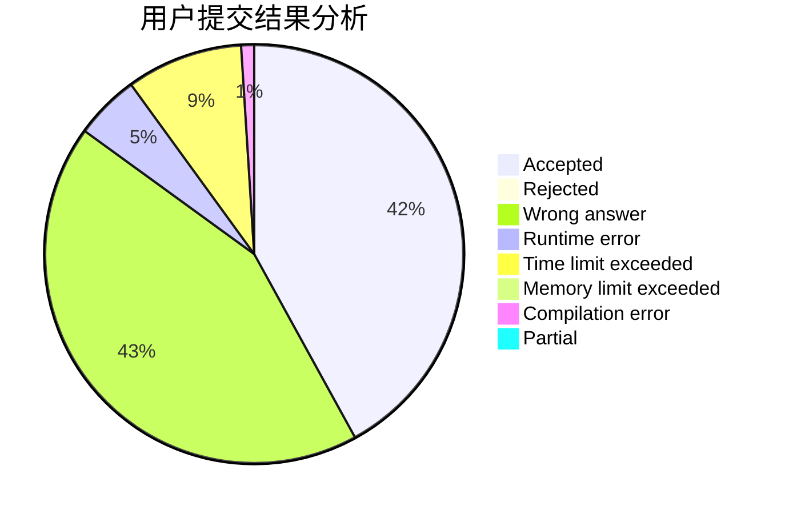
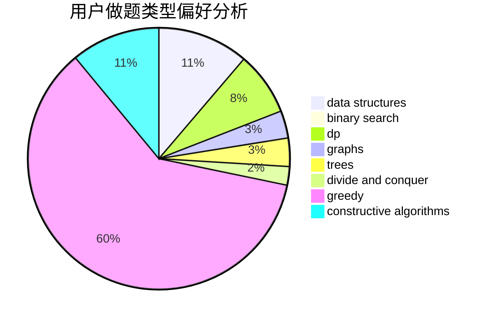

# hht2005

<!-- tabs:start -->

#### **用户提交结果分析**

#### **用户做题类型偏好分析**

#### **用户错题知识点分析**

<!-- tabs:end -->
# 推荐题目
[1190C](https://codeforces.com/contest/1190/problem/C)		brute force,
                        games,
                        greedy		  
[343E](https://codeforces.com/contest/343/problem/E)		brute force,
                        dfs and similar,
                        divide and conquer,
                        flows,
                        graphs,
                        greedy,
                        trees		  
[171B](https://codeforces.com/contest/171/problem/B)		*special problem,
                        combinatorics		  
[1168E](https://codeforces.com/contest/1168/problem/E)		constructive algorithms,
                        math		  
[919E](https://codeforces.com/contest/919/problem/E)		chinese remainder theorem,
                        math,
                        number theory		  
[1312D](https://codeforces.com/contest/1312/problem/D)		combinatorics,
                        math		  
[704E](https://codeforces.com/contest/704/problem/E)		data structures,
                        geometry,
                        trees		  
[884D](https://codeforces.com/contest/884/problem/D)		data structures,
                        greedy		  
[523D](https://codeforces.com/contest/523/problem/D)		*special problem,
                        data structures,
                        implementation		  
[114E](https://codeforces.com/contest/114/problem/E)		dsu,graphs,sortings,trees		  
