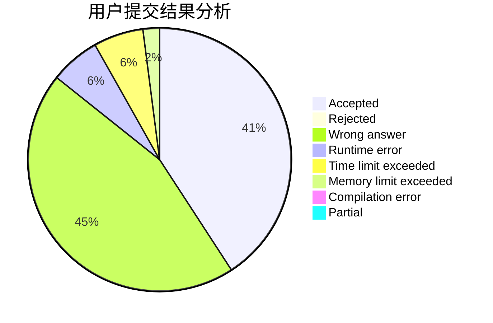
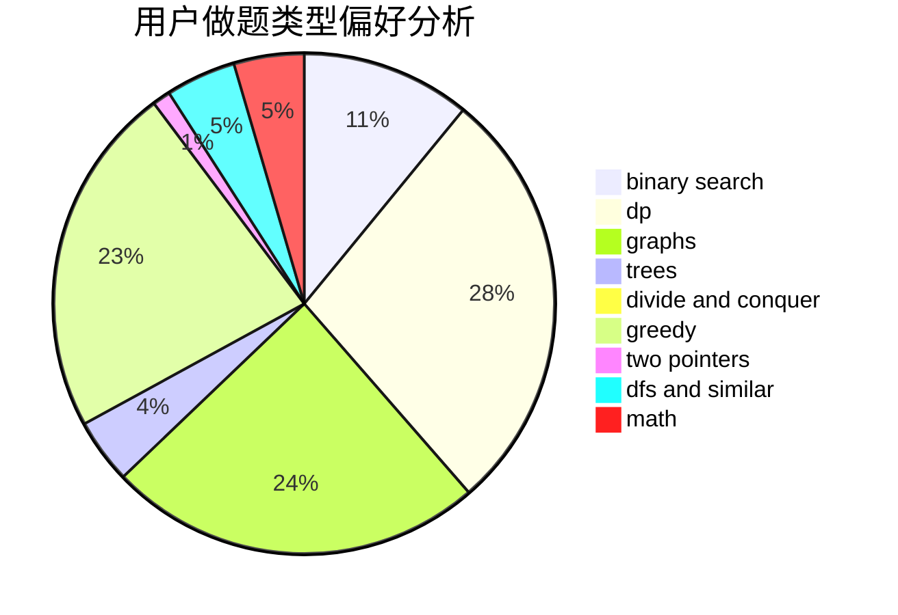

# Ba-bai

<!-- tabs:start -->

#### **用户提交结果分析**

#### **用户做题类型偏好分析**

<!-- tabs:end -->
# 推荐题目
[1504A](https://codeforces.com/contest/1504/problem/A)
[1383F](https://codeforces.com/contest/1383/problem/F)
[1354A](https://codeforces.com/contest/1354/problem/A)
[30C](https://codeforces.com/contest/30/problem/C)
[128C](https://codeforces.com/contest/128/problem/C)
[155A](https://codeforces.com/contest/155/problem/A)
[489B](https://codeforces.com/contest/489/problem/B)
[1425B](https://codeforces.com/contest/1425/problem/B)
[398A](https://codeforces.com/contest/398/problem/A)
[490A](https://codeforces.com/contest/490/problem/A)
