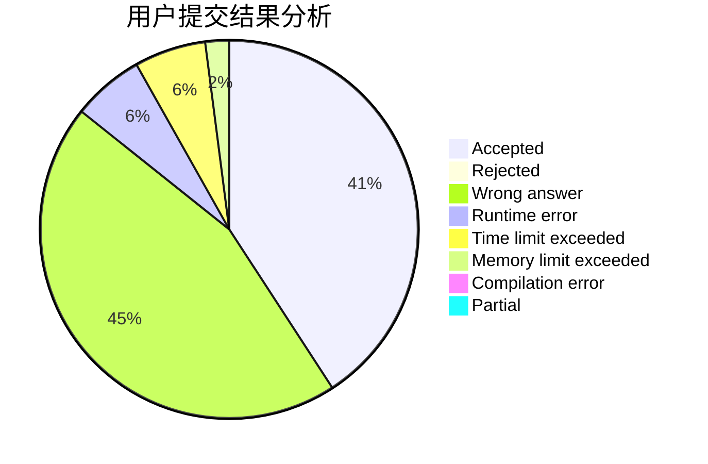
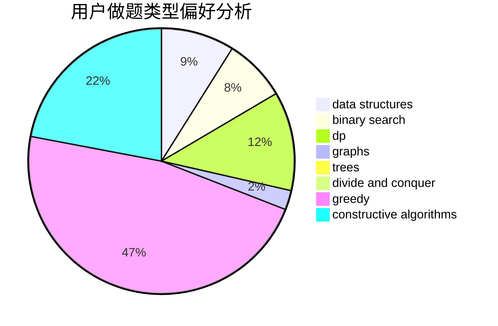

# Ba-bai

<!-- tabs:start -->

#### **用户提交结果分析**

#### **用户做题类型偏好分析**

#### **用户错题知识点分析**

<!-- tabs:end -->
# 推荐题目
[1495A](https://codeforces.com/contest/1495/problem/A)		geometry,
                        greedy,
                        math,
                        sortings		  
[1374F](https://codeforces.com/contest/1374/problem/F)		brute force,
                        constructive algorithms,
                        implementation,
                        sortings		  
[1347B](https://codeforces.com/contest/1347/problem/B)		dsu,graphs,sortings,trees		  
[294B](https://codeforces.com/contest/294/problem/B)		dp,
                        greedy		  
[1282E](https://codeforces.com/contest/1282/problem/E)		constructive algorithms,
                        data structures,
                        dfs and similar,
                        graphs		  
[1505F](https://codeforces.com/contest/1505/problem/F)		math		  
[469A](https://codeforces.com/contest/469/problem/A)		greedy,
                        implementation		  
[1417E](https://codeforces.com/contest/1417/problem/E)		dsu,graphs,sortings,trees		  
[367B](https://codeforces.com/contest/367/problem/B)		binary search,
                        data structures		  
[471D](https://codeforces.com/contest/471/problem/D)		string suffix structures,
                        strings		  
