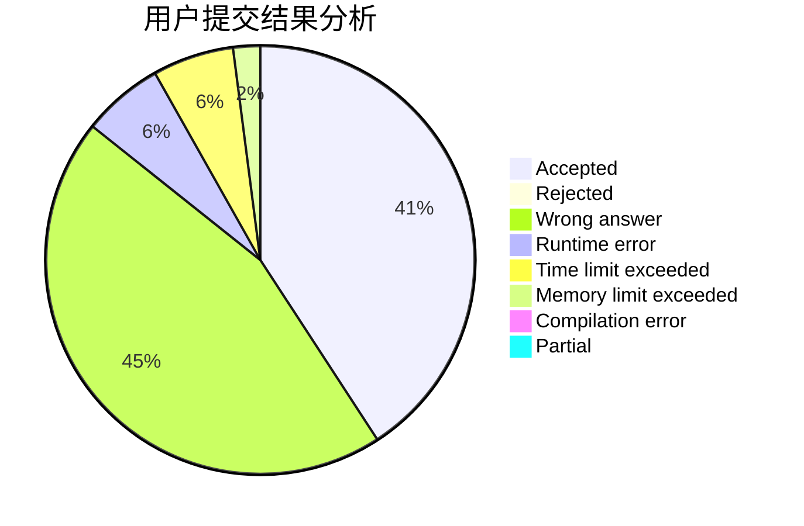
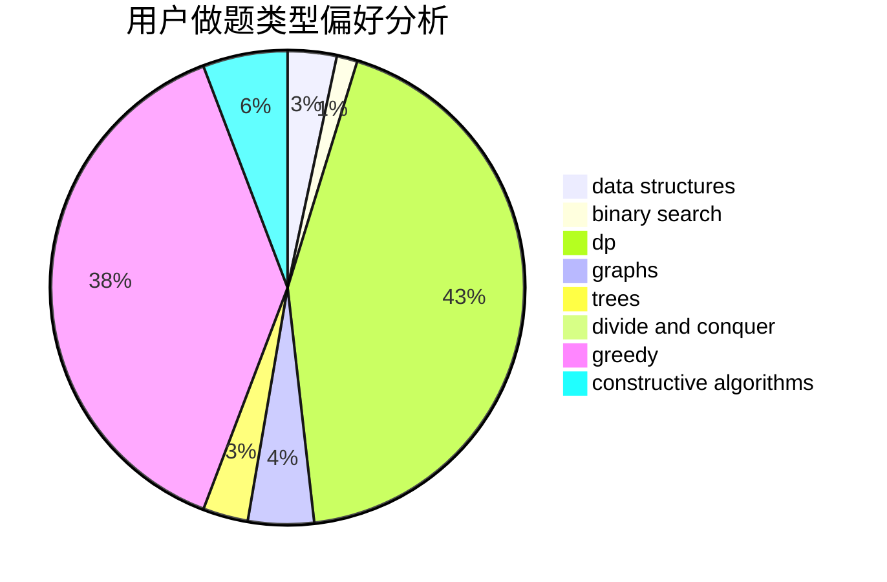

# Ba-bai

<!-- tabs:start -->

#### **用户提交结果分析**

#### **用户做题类型偏好分析**

#### **用户错题知识点分析**

<!-- tabs:end -->
# 推荐题目
[1504A](https://codeforces.com/contest/1504/problem/A)		constructive algorithms,
                        strings		  
[1383F](https://codeforces.com/contest/1383/problem/F)		flows,
                        graphs		  
[1354A](https://codeforces.com/contest/1354/problem/A)		math		  
[30C](https://codeforces.com/contest/30/problem/C)		dp,
                        probabilities		  
[128C](https://codeforces.com/contest/128/problem/C)		combinatorics,
                        dp		  
[155A](https://codeforces.com/contest/155/problem/A)		brute force		  
[489B](https://codeforces.com/contest/489/problem/B)		dfs and similar,
                        dp,
                        graph matchings,
                        greedy,
                        sortings,
                        two pointers		  
[1425B](https://codeforces.com/contest/1425/problem/B)		divide and conquer,
                        dp		  
[398A](https://codeforces.com/contest/398/problem/A)		constructive algorithms,
                        implementation		  
[490A](https://codeforces.com/contest/490/problem/A)		greedy,
                        implementation,
                        sortings		  
