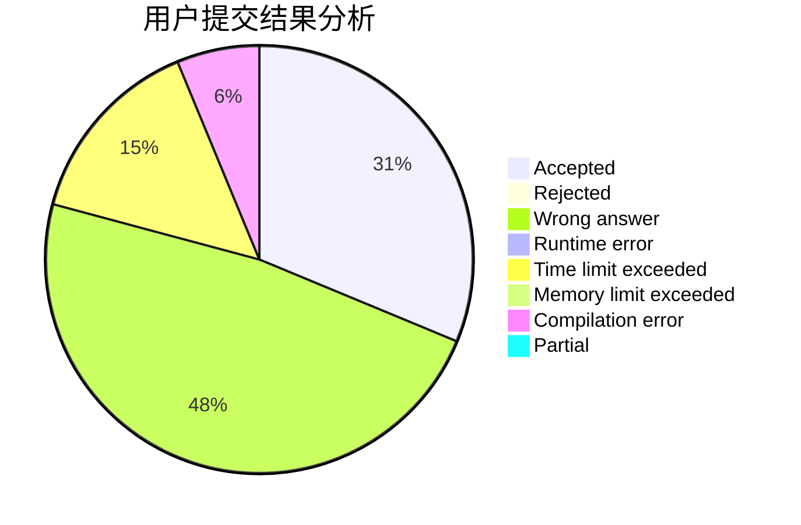
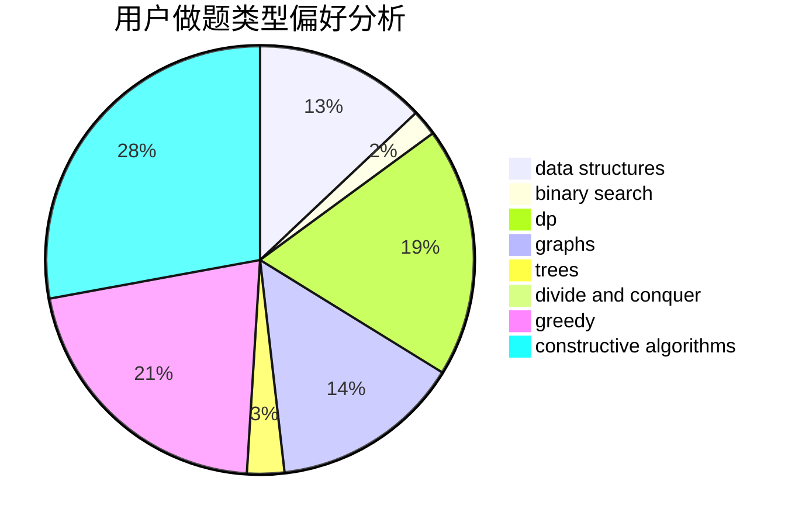

# highmath

<!-- tabs:start -->

#### **用户提交结果分析**

#### **用户做题类型偏好分析**

#### **用户错题知识点分析**

<!-- tabs:end -->
# 推荐题目
[883D](https://codeforces.com/contest/883/problem/D)		binary search,
                        dp,
                        math		  
[1198F](https://codeforces.com/contest/1198/problem/F)		greedy,
                        number theory,
                        probabilities		  
[1346A](https://codeforces.com/contest/1346/problem/A)		*special problem,
                        math		  
[120H](https://codeforces.com/contest/120/problem/H)		graph matchings		  
[802D](https://codeforces.com/contest/802/problem/D)		math		  
[660C](https://codeforces.com/contest/660/problem/C)		binary search,
                        dp,
                        two pointers		  
[821D](https://codeforces.com/contest/821/problem/D)		dfs and similar,
                        graphs,
                        shortest paths		  
[1337D](https://codeforces.com/contest/1337/problem/D)		dsu,graphs,sortings,trees		  
[676C](https://codeforces.com/contest/676/problem/C)		binary search,
                        dp,
                        strings,
                        two pointers		  
[263C](https://codeforces.com/contest/263/problem/C)		brute force,
                        dfs and similar,
                        implementation		  
