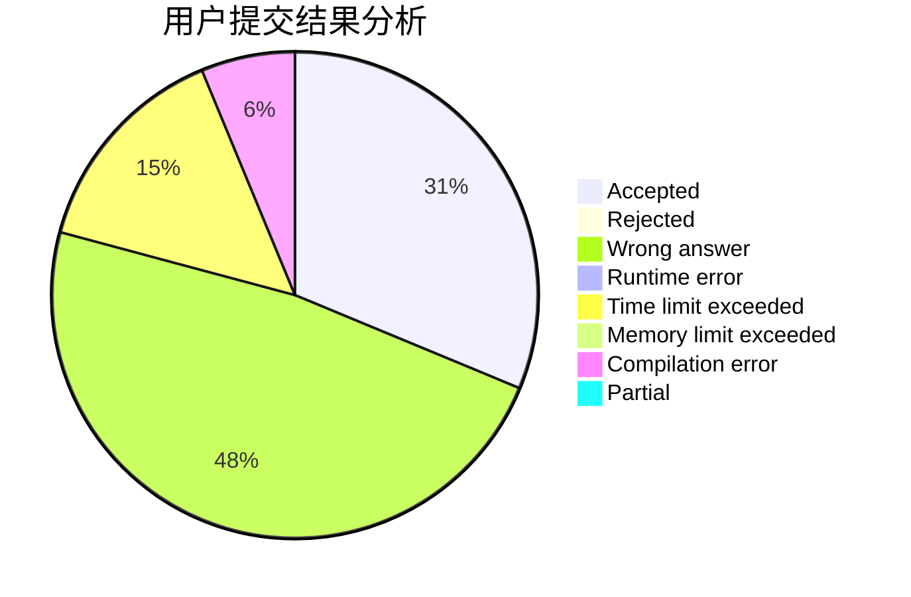
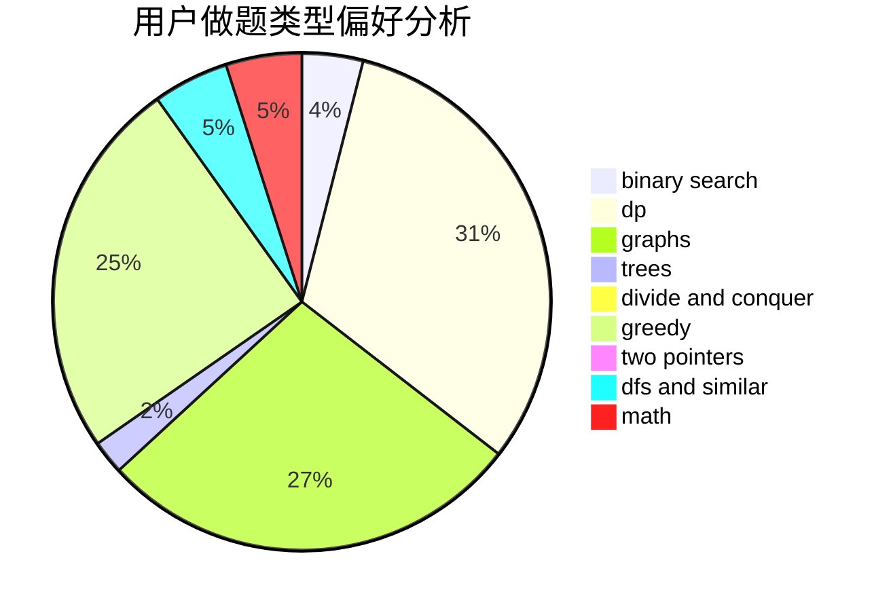

# highmath

<!-- tabs:start -->

#### **用户提交结果分析**

#### **用户做题类型偏好分析**

<!-- tabs:end -->
# 推荐题目
[883D](https://codeforces.com/contest/883/problem/D)
[1198F](https://codeforces.com/contest/1198/problem/F)
[1346A](https://codeforces.com/contest/1346/problem/A)
[120H](https://codeforces.com/contest/120/problem/H)
[802D](https://codeforces.com/contest/802/problem/D)
[660C](https://codeforces.com/contest/660/problem/C)
[821D](https://codeforces.com/contest/821/problem/D)
[1337D](https://codeforces.com/contest/1337/problem/D)
[676C](https://codeforces.com/contest/676/problem/C)
[263C](https://codeforces.com/contest/263/problem/C)
