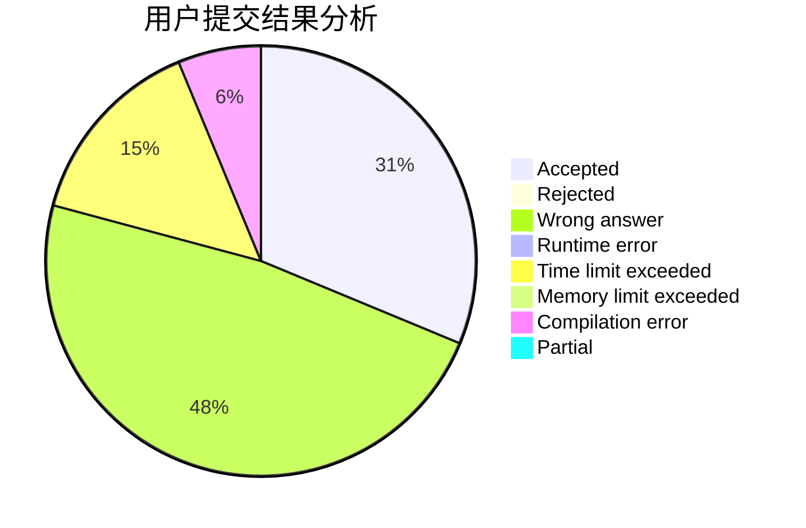
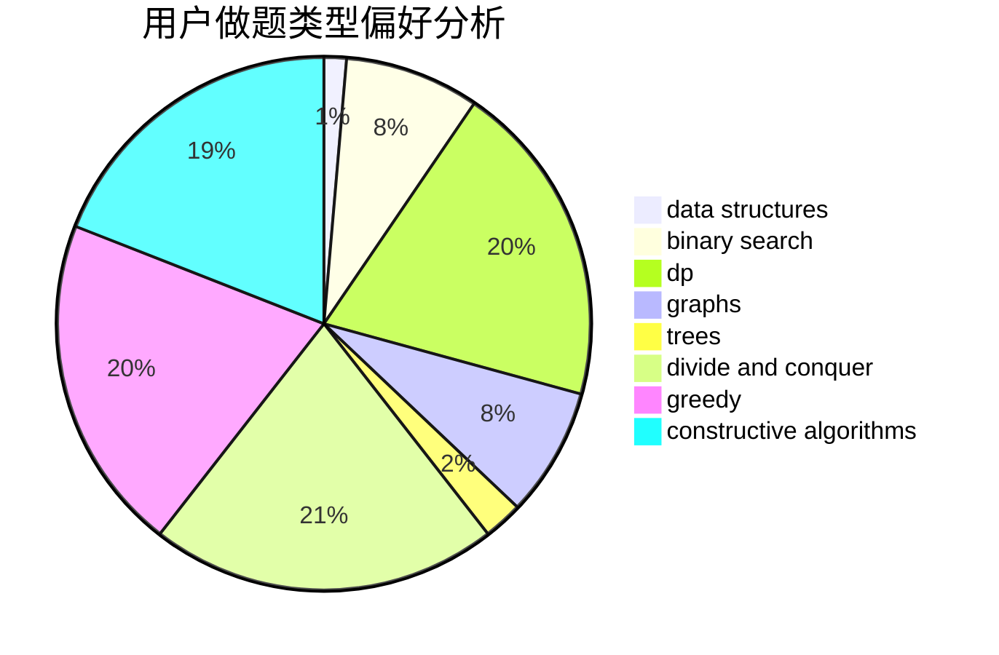

# highmath

<!-- tabs:start -->

#### **用户提交结果分析**

#### **用户做题类型偏好分析**

#### **用户错题知识点分析**

<!-- tabs:end -->
# 推荐题目
[863B](https://codeforces.com/contest/863/problem/B)		brute force,
                        greedy,
                        sortings		  
[1194D](https://codeforces.com/contest/1194/problem/D)		games,
                        math		  
[1339A](https://codeforces.com/contest/1339/problem/A)		brute force,
                        dp,
                        implementation,
                        math		  
[1205E](https://codeforces.com/contest/1205/problem/E)		combinatorics,
                        strings		  
[785A](https://codeforces.com/contest/785/problem/A)		implementation,
                        strings		  
[630G](https://codeforces.com/contest/630/problem/G)		combinatorics,
                        math		  
[805C](https://codeforces.com/contest/805/problem/C)		dsu,graphs,sortings,trees		  
[1331E](https://codeforces.com/contest/1331/problem/E)		dfs and similar,
                        geometry,
                        implementation		  
[652D](https://codeforces.com/contest/652/problem/D)		data structures,
                        sortings		  
[241E](https://codeforces.com/contest/241/problem/E)		graphs,
                        shortest paths		  
