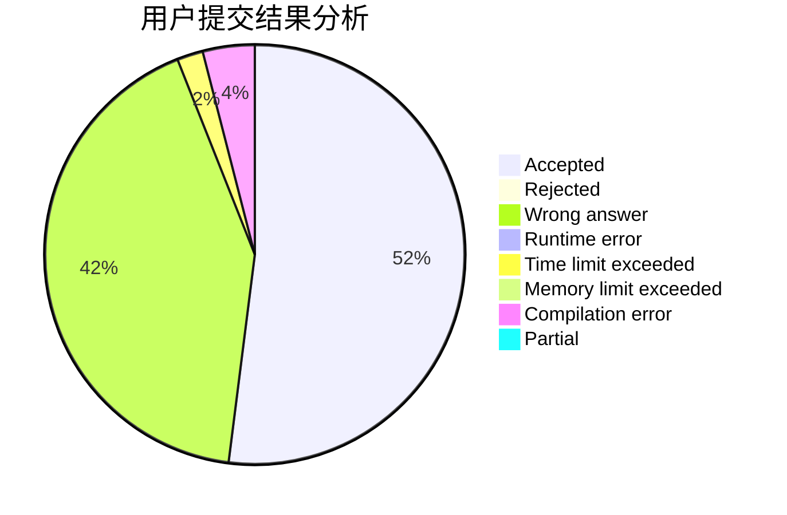
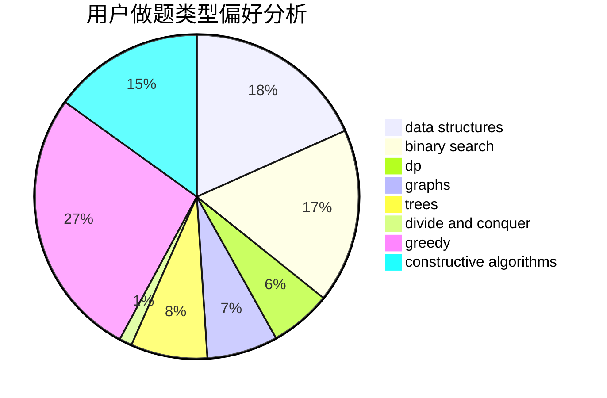
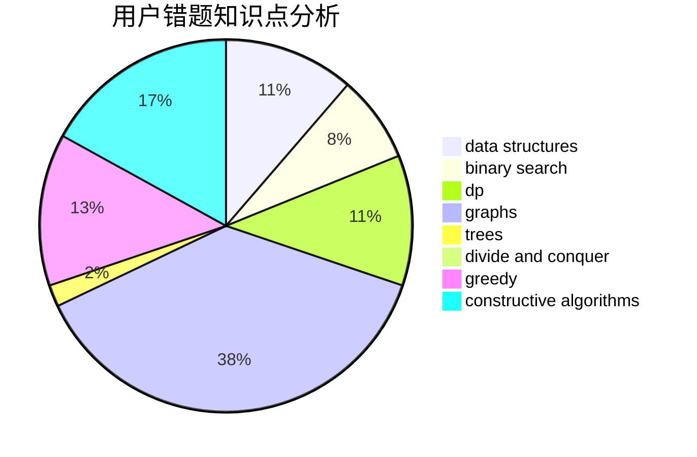

# history100

<!-- tabs:start -->

#### **用户提交结果分析**

#### **用户做题类型偏好分析**

#### **用户错题知识点分析**

<!-- tabs:end -->
# 推荐题目
[1162E](https://codeforces.com/contest/1162/problem/E)		dsu,graphs,sortings,trees		  
[1466G](https://codeforces.com/contest/1466/problem/G)		combinatorics,
                        divide and conquer,
                        hashing,
                        math,
                        string suffix structures,
                        strings		  
[236D](https://codeforces.com/contest/236/problem/D)		dsu,graphs,sortings,trees		  
[1149E](https://codeforces.com/contest/1149/problem/E)		games,
                        graphs		  
[1221C](https://codeforces.com/contest/1221/problem/C)		binary search,
                        math		  
[788E](https://codeforces.com/contest/788/problem/E)		data structures		  
[1387C](https://codeforces.com/contest/1387/problem/C)		*special problem,
                        dp,
                        shortest paths,
                        string suffix structures		  
[237C](https://codeforces.com/contest/237/problem/C)		binary search,
                        number theory,
                        two pointers		  
[1473E](https://codeforces.com/contest/1473/problem/E)		graphs,
                        shortest paths		  
[1261E](https://codeforces.com/contest/1261/problem/E)		dsu,graphs,sortings,trees		  
