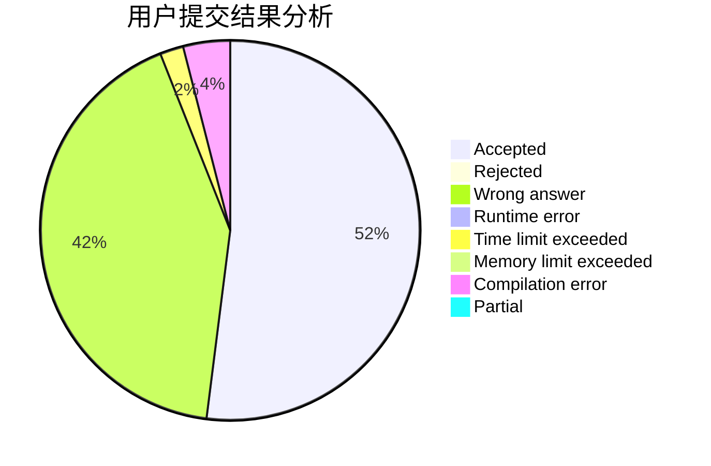
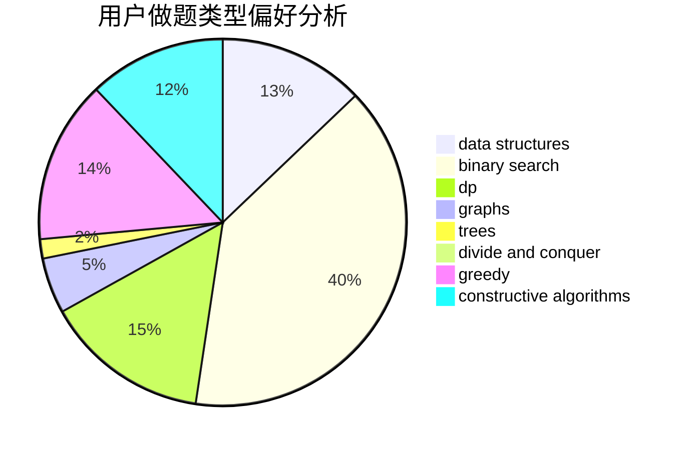
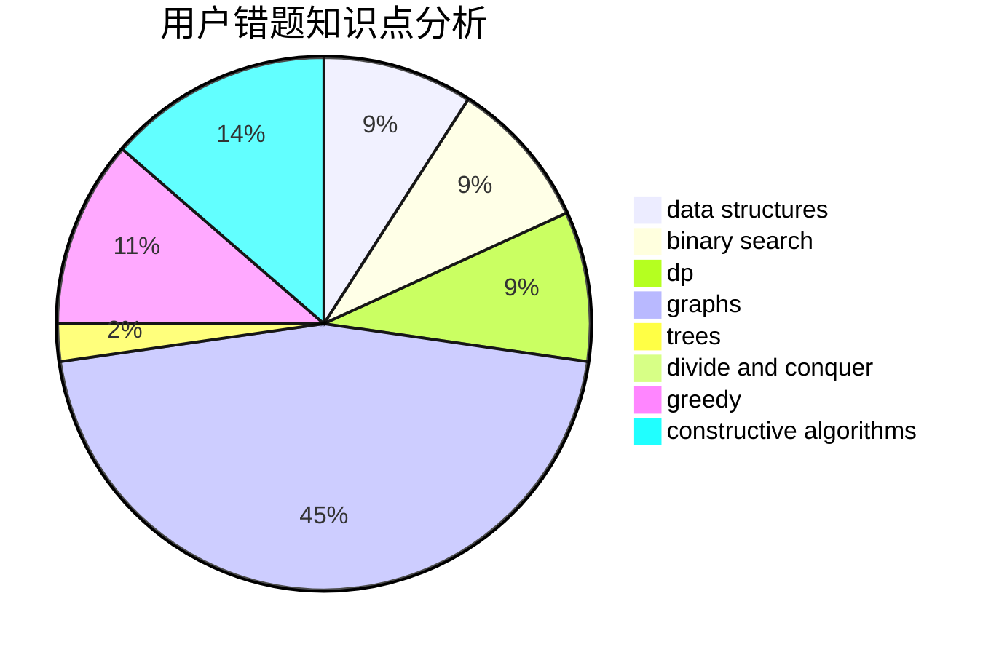

# history100

<!-- tabs:start -->

#### **用户提交结果分析**

#### **用户做题类型偏好分析**

#### **用户错题知识点分析**

<!-- tabs:end -->
# 推荐题目
[1164M](https://codeforces.com/contest/1164/problem/M)		dsu,graphs,sortings,trees		  
[1473G](https://codeforces.com/contest/1473/problem/G)		combinatorics,
                        dp,
                        fft,
                        math		  
[25A](https://codeforces.com/contest/25/problem/A)		brute force		  
[1151C](https://codeforces.com/contest/1151/problem/C)		constructive algorithms,
                        math		  
[1229D](https://codeforces.com/contest/1229/problem/D)		dsu,graphs,sortings,trees		  
[804B](https://codeforces.com/contest/804/problem/B)		combinatorics,
                        greedy,
                        implementation,
                        math		  
[1397C](https://codeforces.com/contest/1397/problem/C)		dsu,graphs,sortings,trees		  
[25C](https://codeforces.com/contest/25/problem/C)		graphs,
                        shortest paths		  
[1482B](https://codeforces.com/contest/1482/problem/B)		implementation,
                        math		  
[1267F](https://codeforces.com/contest/1267/problem/F)		graphs		  
