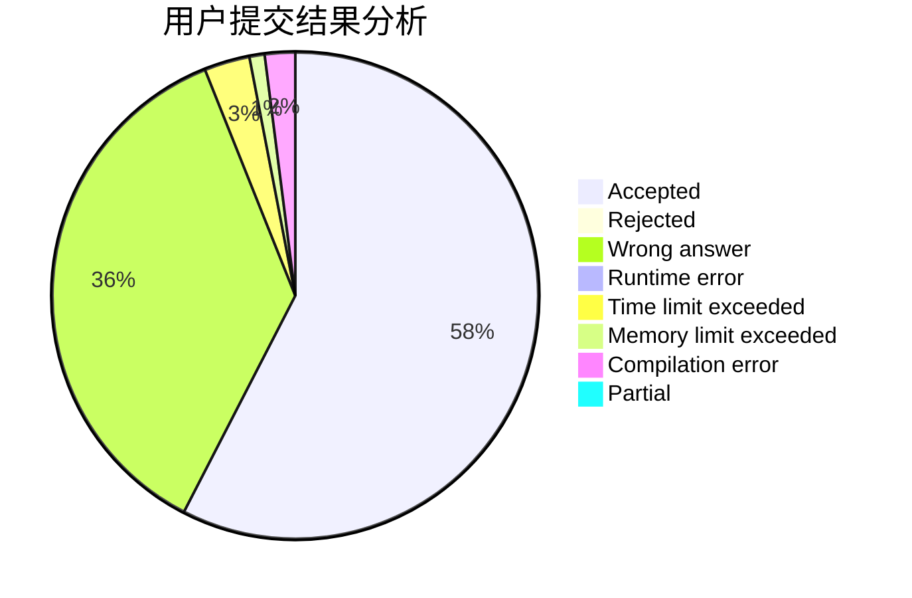
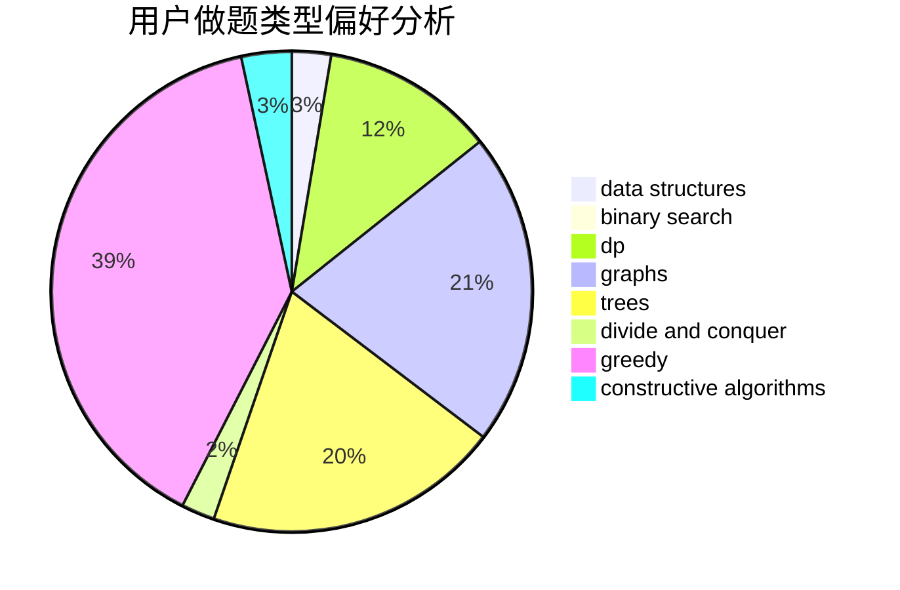
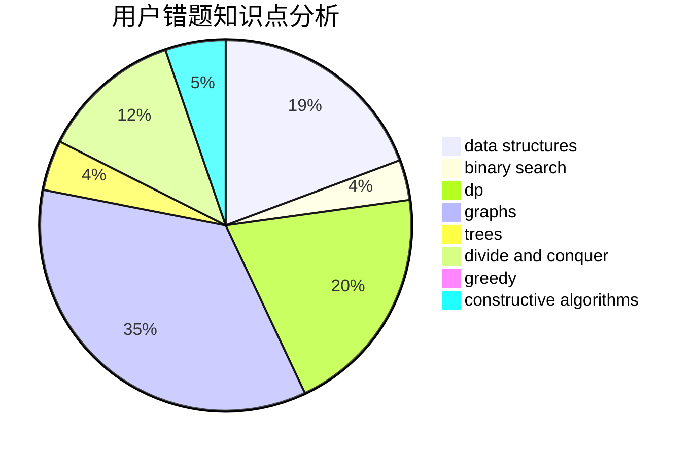

# hjj

<!-- tabs:start -->

#### **用户提交结果分析**

#### **用户做题类型偏好分析**

#### **用户错题知识点分析**

<!-- tabs:end -->
# 推荐题目
[746G](https://codeforces.com/contest/746/problem/G)		constructive algorithms,
                        graphs,
                        trees		  
[1343F](https://codeforces.com/contest/1343/problem/F)		brute force,
                        constructive algorithms,
                        data structures,
                        greedy,
                        implementation		  
[363D](https://codeforces.com/contest/363/problem/D)		binary search,
                        greedy		  
[1199B](https://codeforces.com/contest/1199/problem/B)		geometry,
                        math		  
[123E](https://codeforces.com/contest/123/problem/E)		dfs and similar,
                        dp,
                        probabilities,
                        trees		  
[1016B](https://codeforces.com/contest/1016/problem/B)		brute force,
                        implementation		  
[616B](https://codeforces.com/contest/616/problem/B)		games,
                        greedy		  
[1118E](https://codeforces.com/contest/1118/problem/E)		constructive algorithms,
                        implementation		  
[1056D](https://codeforces.com/contest/1056/problem/D)		constructive algorithms,
                        dfs and similar,
                        dp,
                        graphs,
                        greedy,
                        sortings,
                        trees		  
[519B](https://codeforces.com/contest/519/problem/B)		data structures,
                        implementation,
                        sortings		  
