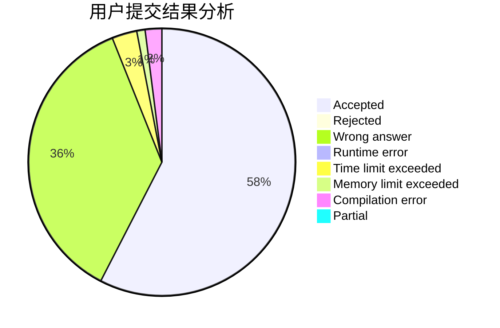
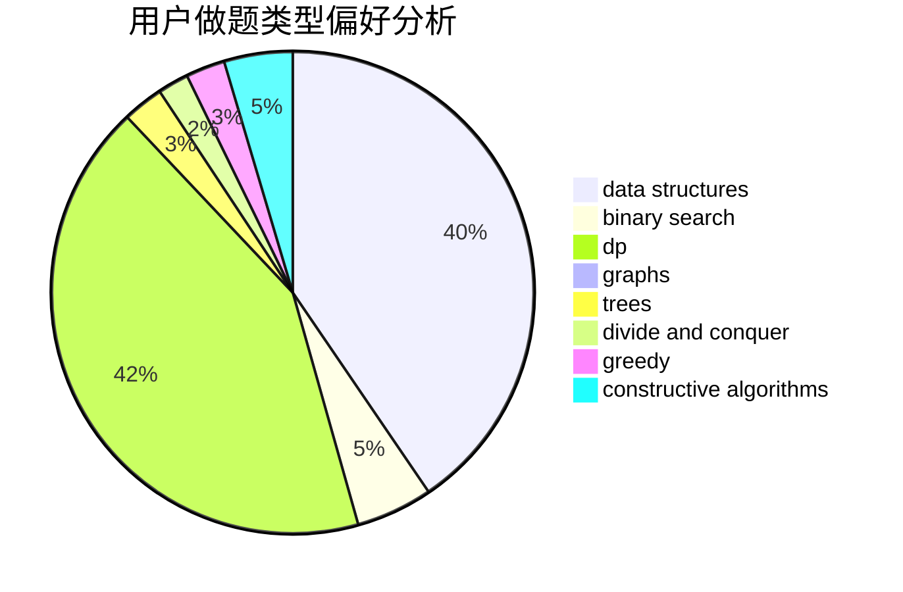
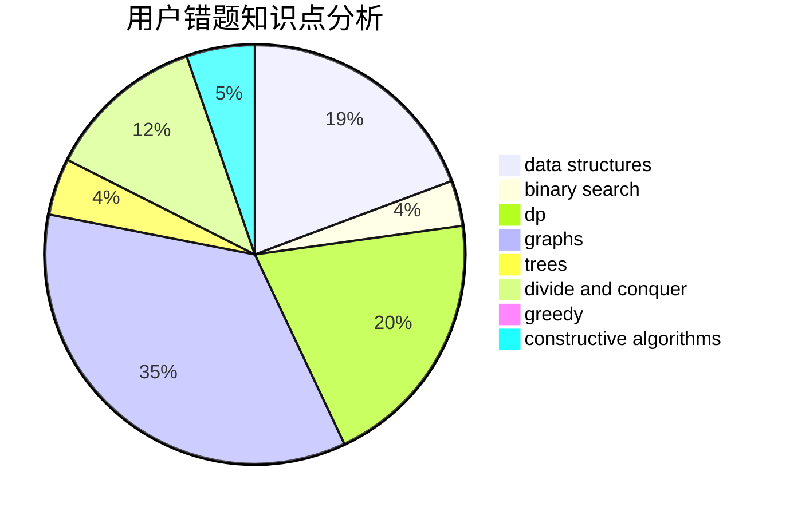

# hjj

<!-- tabs:start -->

#### **用户提交结果分析**

#### **用户做题类型偏好分析**

#### **用户错题知识点分析**

<!-- tabs:end -->
# 推荐题目
[766C](https://codeforces.com/contest/766/problem/C)		brute force,
                        dp,
                        greedy,
                        strings		  
[1350D](https://codeforces.com/contest/1350/problem/D)		dsu,graphs,sortings,trees		  
[38C](https://codeforces.com/contest/38/problem/C)		brute force		  
[1202F](https://codeforces.com/contest/1202/problem/F)		binary search,
                        implementation,
                        math		  
[1245C](https://codeforces.com/contest/1245/problem/C)		dp		  
[1016E](https://codeforces.com/contest/1016/problem/E)		binary search,
                        geometry		  
[633G](https://codeforces.com/contest/633/problem/G)		bitmasks,
                        data structures,
                        dfs and similar,
                        math,
                        number theory		  
[1120C](https://codeforces.com/contest/1120/problem/C)		dp,
                        strings		  
[1056G](https://codeforces.com/contest/1056/problem/G)		brute force,
                        data structures,
                        graphs		  
[544D](https://codeforces.com/contest/544/problem/D)		dsu,graphs,sortings,trees		  
