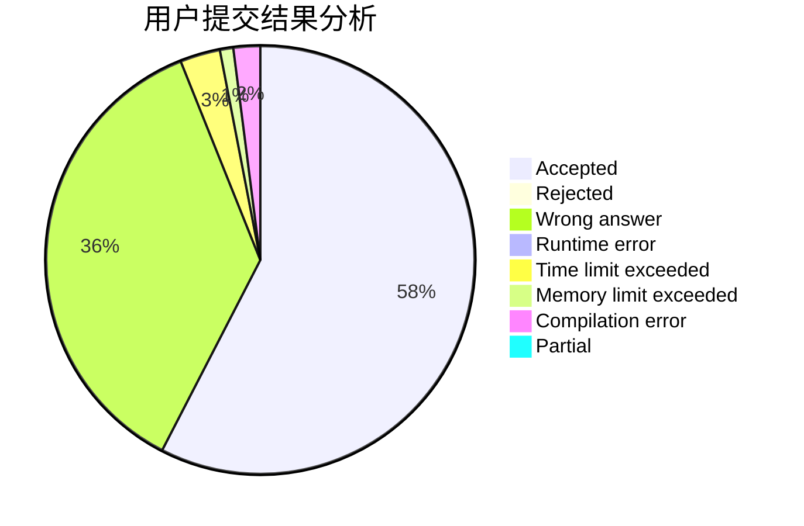
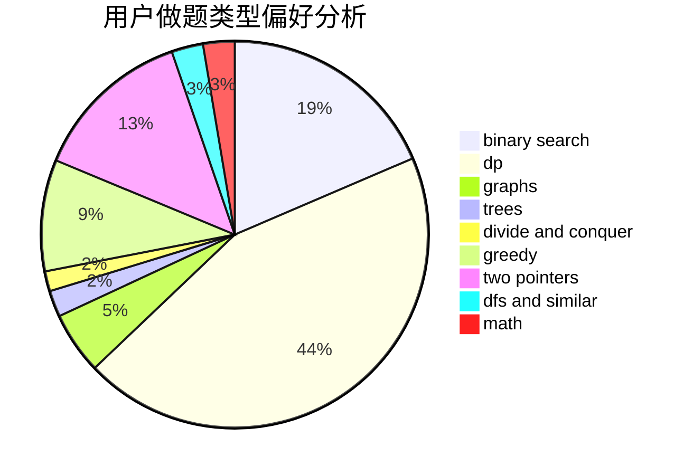

# hjj

<!-- tabs:start -->

#### **用户提交结果分析**

#### **用户做题类型偏好分析**

<!-- tabs:end -->
# 推荐题目
[766C](https://codeforces.com/contest/766/problem/C)
[1350D](https://codeforces.com/contest/1350/problem/D)
[38C](https://codeforces.com/contest/38/problem/C)
[1202F](https://codeforces.com/contest/1202/problem/F)
[1245C](https://codeforces.com/contest/1245/problem/C)
[1016E](https://codeforces.com/contest/1016/problem/E)
[633G](https://codeforces.com/contest/633/problem/G)
[1120C](https://codeforces.com/contest/1120/problem/C)
[1056G](https://codeforces.com/contest/1056/problem/G)
[544D](https://codeforces.com/contest/544/problem/D)
