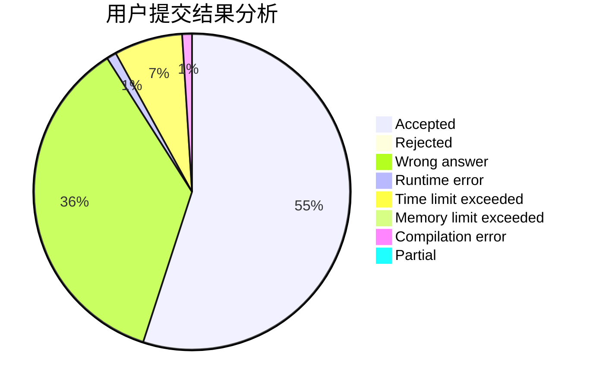
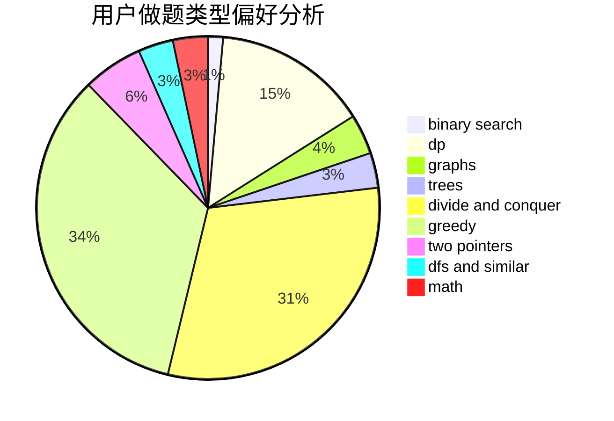

# hkxadpall

<!-- tabs:start -->

#### **用户提交结果分析**

#### **用户做题类型偏好分析**

<!-- tabs:end -->
# 推荐题目
[933B](https://codeforces.com/contest/933/problem/B)
[77B](https://codeforces.com/contest/77/problem/B)
[656F](https://codeforces.com/contest/656/problem/F)
[1395F](https://codeforces.com/contest/1395/problem/F)
[935C](https://codeforces.com/contest/935/problem/C)
[1188C](https://codeforces.com/contest/1188/problem/C)
[474B](https://codeforces.com/contest/474/problem/B)
[1283A](https://codeforces.com/contest/1283/problem/A)
[405D](https://codeforces.com/contest/405/problem/D)
[243C](https://codeforces.com/contest/243/problem/C)
