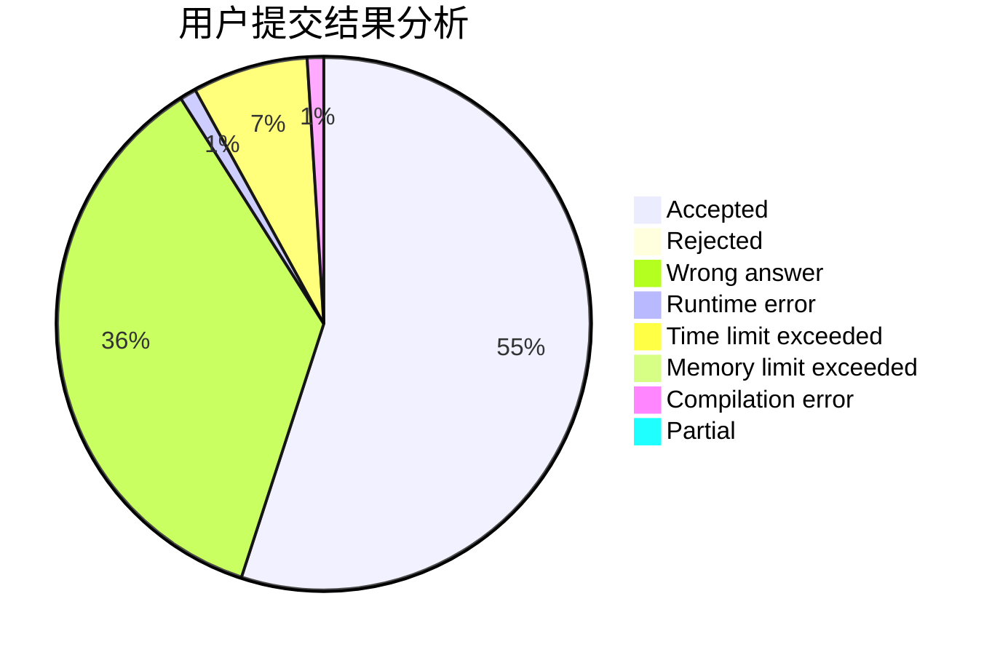
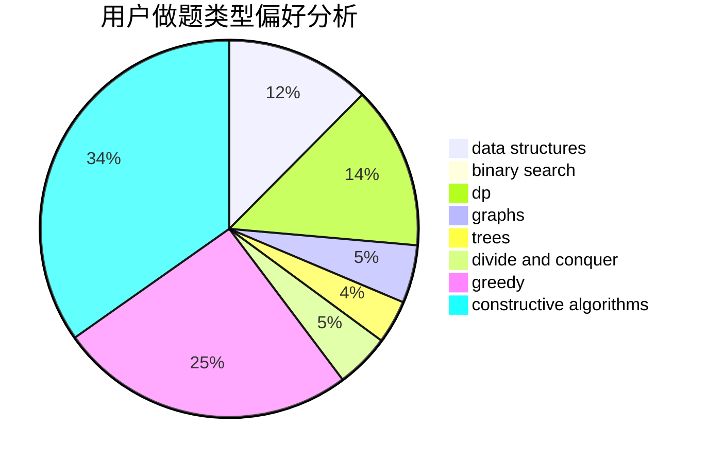
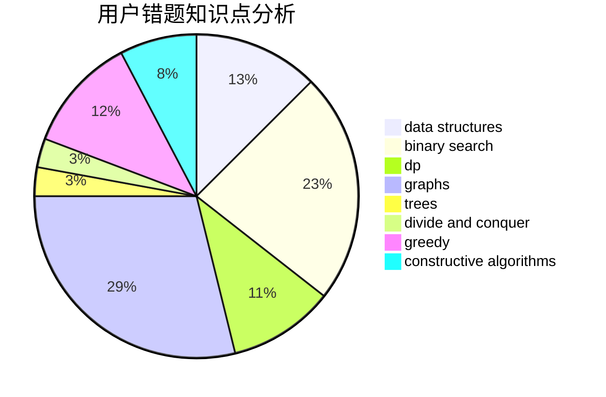

# hkxadpall

<!-- tabs:start -->

#### **用户提交结果分析**

#### **用户做题类型偏好分析**

#### **用户错题知识点分析**

<!-- tabs:end -->
# 推荐题目
[914C](https://codeforces.com/contest/914/problem/C)		brute force,
                        combinatorics,
                        dp		  
[75D](https://codeforces.com/contest/75/problem/D)		data structures,
                        dp,
                        greedy,
                        implementation,
                        math,
                        trees		  
[628F](https://codeforces.com/contest/628/problem/F)		flows		  
[1385F](https://codeforces.com/contest/1385/problem/F)		data structures,
                        greedy,
                        implementation,
                        trees		  
[915D](https://codeforces.com/contest/915/problem/D)		dfs and similar,
                        graphs		  
[1184E1](https://codeforces.com/contest/1184E/problem/1)		graphs,
                        trees		  
[452B](https://codeforces.com/contest/452/problem/B)		brute force,
                        constructive algorithms,
                        geometry,
                        trees		  
[1276E](https://codeforces.com/contest/1276/problem/E)		constructive algorithms		  
[377C](https://codeforces.com/contest/377/problem/C)		bitmasks,
                        dp,
                        games		  
[225C](https://codeforces.com/contest/225/problem/C)		dp,
                        matrices		  
