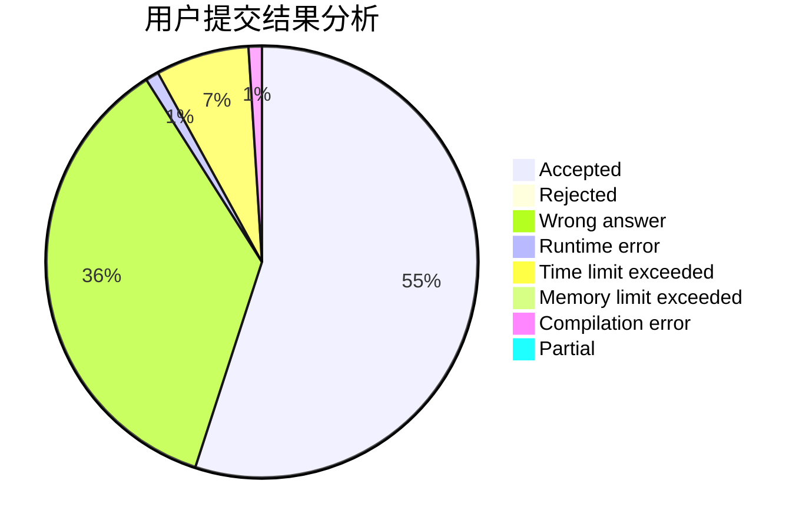
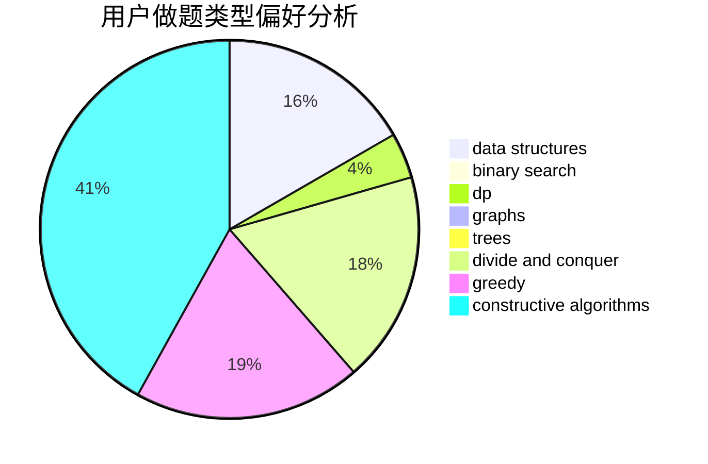
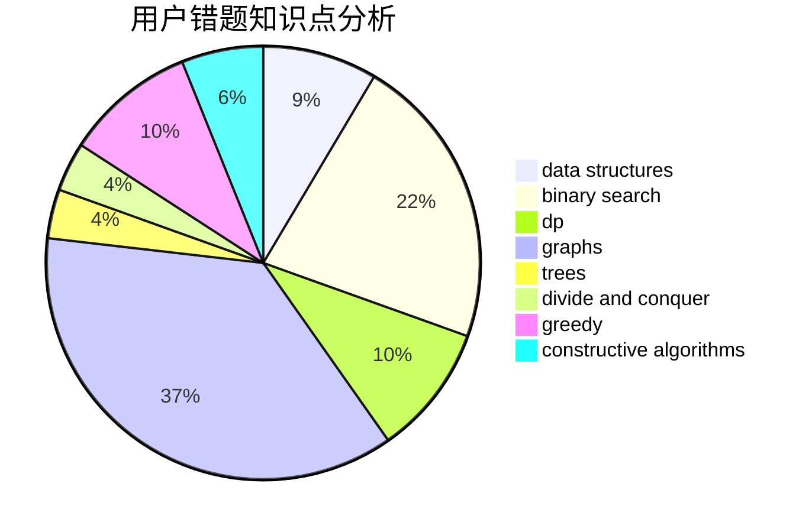

# hkxadpall

<!-- tabs:start -->

#### **用户提交结果分析**

#### **用户做题类型偏好分析**

#### **用户错题知识点分析**

<!-- tabs:end -->
# 推荐题目
[933B](https://codeforces.com/contest/933/problem/B)		math		  
[77B](https://codeforces.com/contest/77/problem/B)		math,
                        probabilities		  
[656F](https://codeforces.com/contest/656/problem/F)		*special problem		  
[1395F](https://codeforces.com/contest/1395/problem/F)		dsu,graphs,sortings,trees		  
[935C](https://codeforces.com/contest/935/problem/C)		geometry		  
[1188C](https://codeforces.com/contest/1188/problem/C)		dp		  
[474B](https://codeforces.com/contest/474/problem/B)		binary search,
                        implementation		  
[1283A](https://codeforces.com/contest/1283/problem/A)		math		  
[405D](https://codeforces.com/contest/405/problem/D)		greedy,
                        implementation,
                        math		  
[243C](https://codeforces.com/contest/243/problem/C)		dfs and similar,
                        implementation		  
