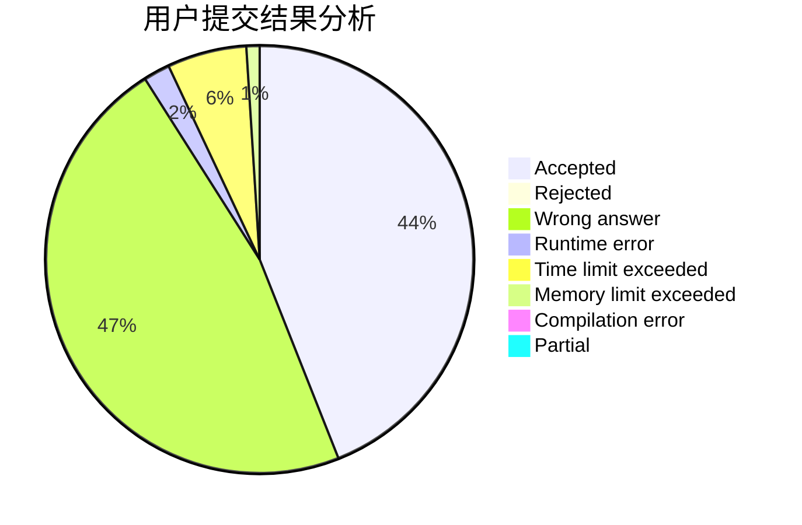
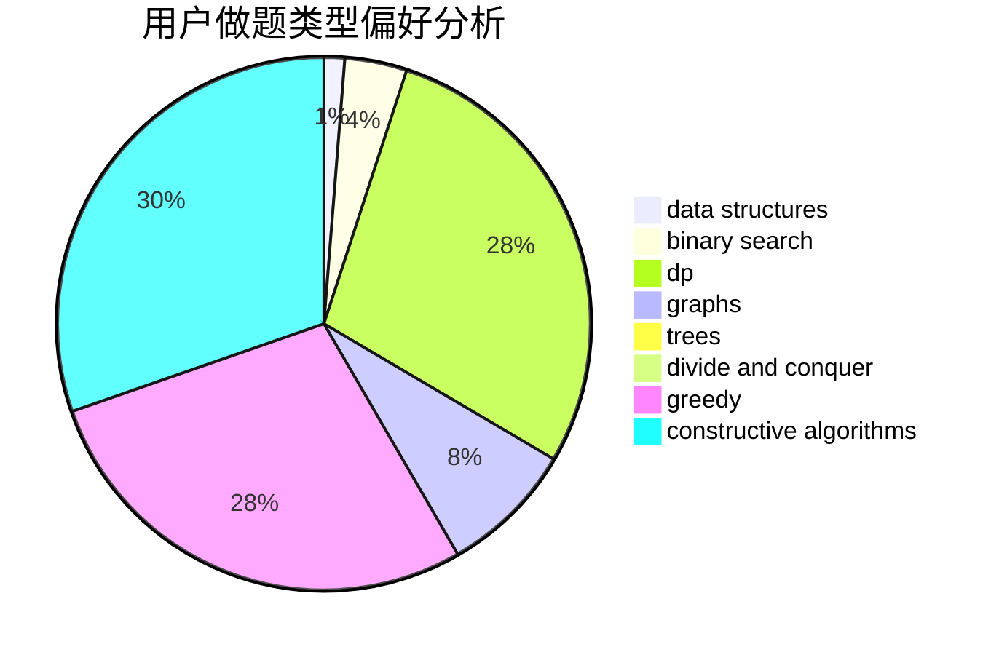
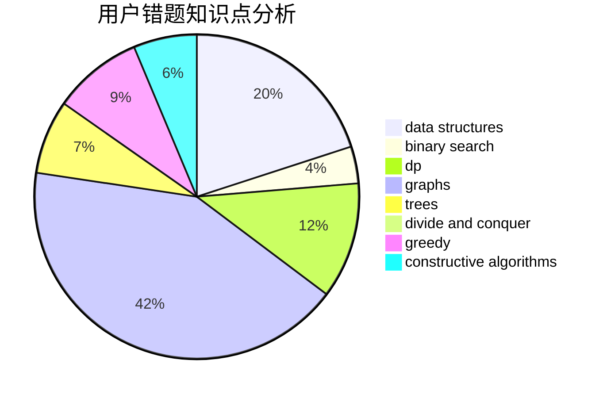

# hlhhlhhlh

<!-- tabs:start -->

#### **用户提交结果分析**

#### **用户做题类型偏好分析**

#### **用户错题知识点分析**

<!-- tabs:end -->
# 推荐题目
[1294F](https://codeforces.com/contest/1294/problem/F)		dfs and similar,
                        dp,
                        greedy,
                        trees		  
[1505D](https://codeforces.com/contest/1505/problem/D)		number theory		  
[1102B](https://codeforces.com/contest/1102/problem/B)		greedy,
                        sortings		  
[1196F](https://codeforces.com/contest/1196/problem/F)		brute force,
                        constructive algorithms,
                        shortest paths,
                        sortings		  
[84C](https://codeforces.com/contest/84/problem/C)		binary search,
                        implementation		  
[288E](https://codeforces.com/contest/288/problem/E)		dp,
                        implementation,
                        math		  
[61B](https://codeforces.com/contest/61/problem/B)		strings		  
[599E](https://codeforces.com/contest/599/problem/E)		bitmasks,
                        dp,
                        trees		  
[77B](https://codeforces.com/contest/77/problem/B)		math,
                        probabilities		  
[246E](https://codeforces.com/contest/246/problem/E)		binary search,
                        data structures,
                        dfs and similar,
                        dp,
                        sortings		  
