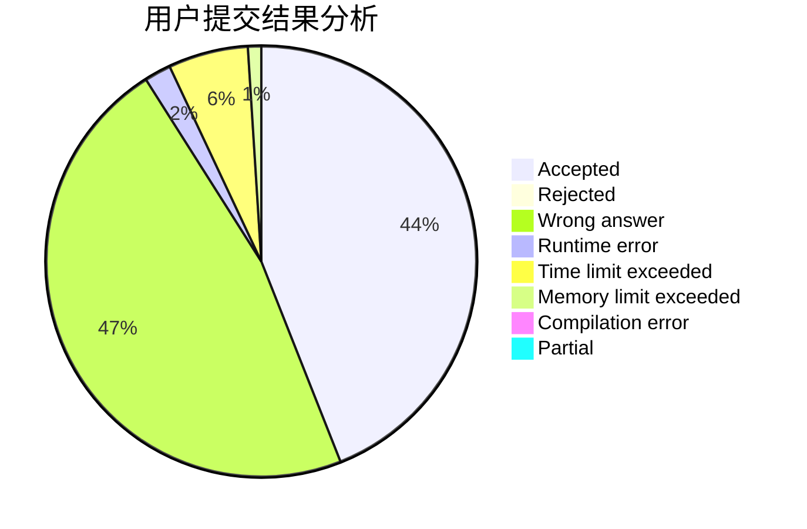
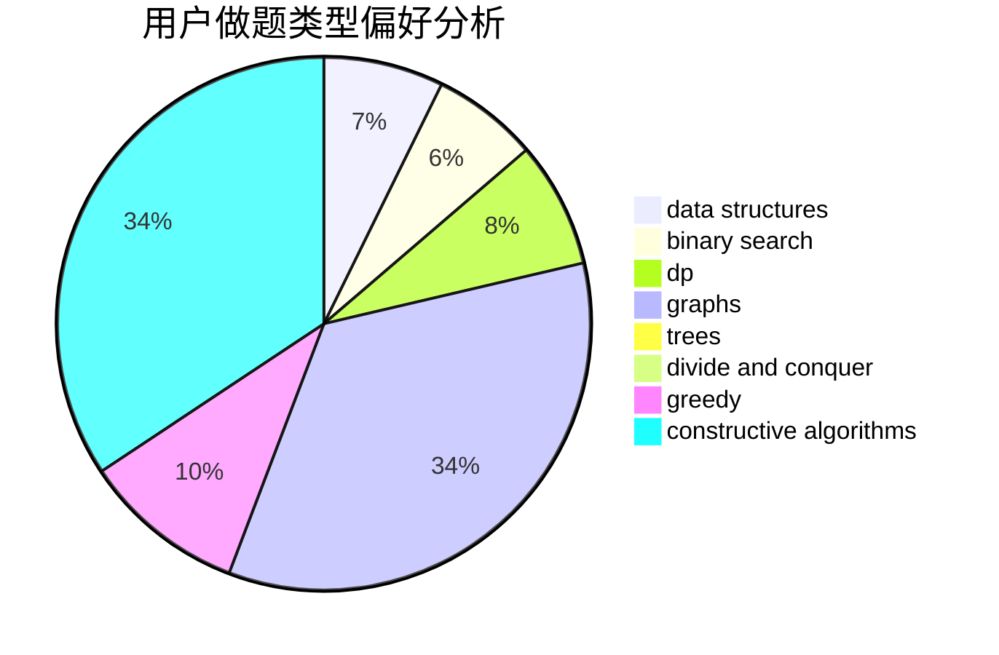
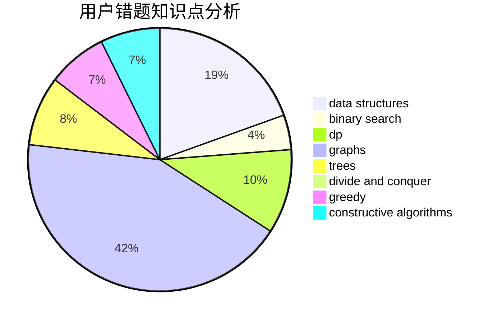

# hlhhlhhlh

<!-- tabs:start -->

#### **用户提交结果分析**

#### **用户做题类型偏好分析**

#### **用户错题知识点分析**

<!-- tabs:end -->
# 推荐题目
[1301C](https://codeforces.com/contest/1301/problem/C)		binary search,
                        combinatorics,
                        greedy,
                        math,
                        strings		  
[152E](https://codeforces.com/contest/152/problem/E)		bitmasks,
                        dp,
                        graphs,
                        trees		  
[1102E](https://codeforces.com/contest/1102/problem/E)		combinatorics,
                        sortings		  
[1200B](https://codeforces.com/contest/1200/problem/B)		dp,
                        greedy		  
[868F](https://codeforces.com/contest/868/problem/F)		divide and conquer,
                        dp		  
[303A](https://codeforces.com/contest/303/problem/A)		constructive algorithms,
                        implementation,
                        math		  
[641E](https://codeforces.com/contest/641/problem/E)		data structures		  
[618A](https://codeforces.com/contest/618/problem/A)		implementation		  
[798B](https://codeforces.com/contest/798/problem/B)		brute force,
                        dp,
                        strings		  
[268A](https://codeforces.com/contest/268/problem/A)		brute force		  
