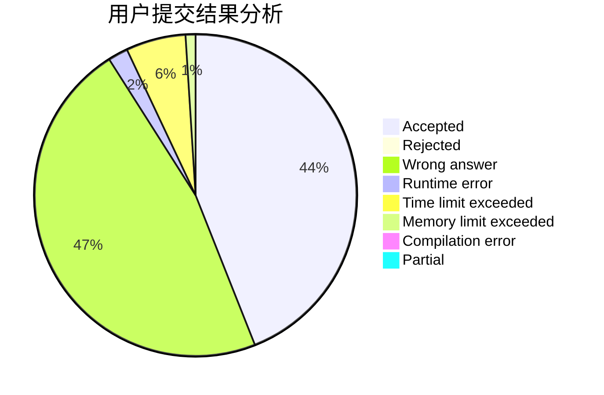
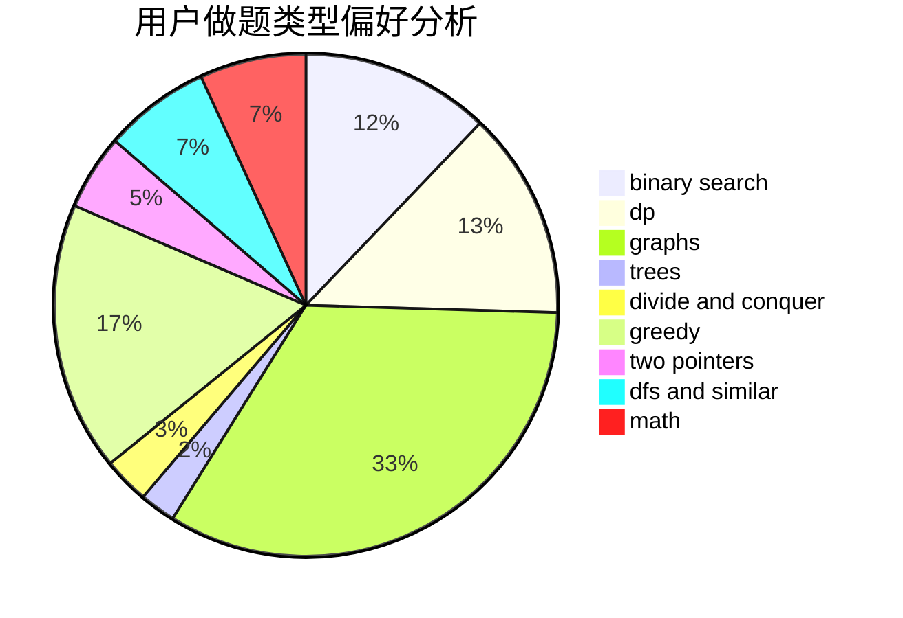

# hlhhlhhlh

<!-- tabs:start -->

#### **用户提交结果分析**

#### **用户做题类型偏好分析**

<!-- tabs:end -->
# 推荐题目
[1301C](https://codeforces.com/contest/1301/problem/C)
[152E](https://codeforces.com/contest/152/problem/E)
[1102E](https://codeforces.com/contest/1102/problem/E)
[1200B](https://codeforces.com/contest/1200/problem/B)
[868F](https://codeforces.com/contest/868/problem/F)
[303A](https://codeforces.com/contest/303/problem/A)
[641E](https://codeforces.com/contest/641/problem/E)
[618A](https://codeforces.com/contest/618/problem/A)
[798B](https://codeforces.com/contest/798/problem/B)
[268A](https://codeforces.com/contest/268/problem/A)
