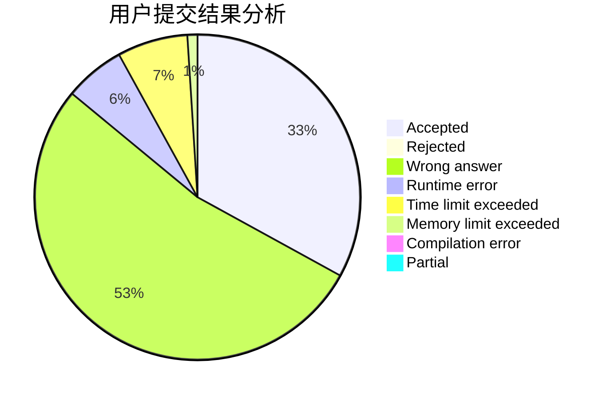
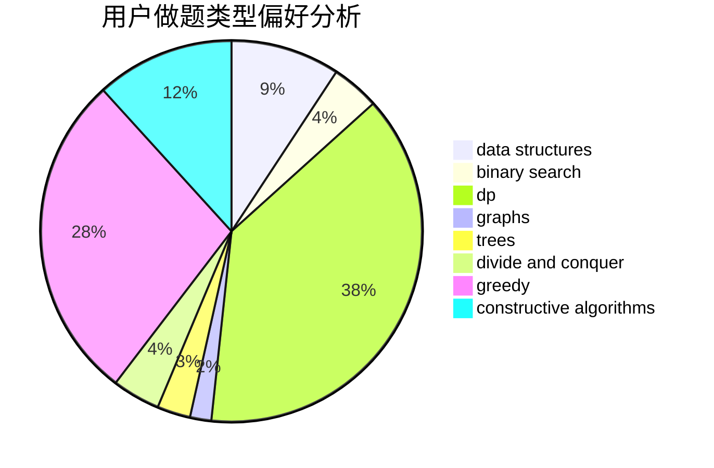
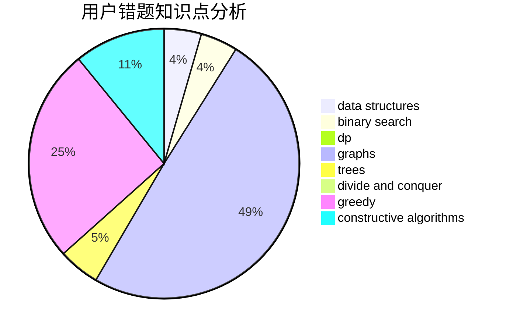

# hmf123

<!-- tabs:start -->

#### **用户提交结果分析**

#### **用户做题类型偏好分析**

#### **用户错题知识点分析**

<!-- tabs:end -->
# 推荐题目
[1272E](https://codeforces.com/contest/1272/problem/E)		dfs and similar,
                        graphs,
                        shortest paths		  
[1285A](https://codeforces.com/contest/1285/problem/A)		math		  
[732E](https://codeforces.com/contest/732/problem/E)		greedy,
                        sortings		  
[102A](https://codeforces.com/contest/102/problem/A)		brute force		  
[200A](https://codeforces.com/contest/200/problem/A)		brute force,
                        data structures		  
[246D](https://codeforces.com/contest/246/problem/D)		brute force,
                        dfs and similar,
                        graphs		  
[199B](https://codeforces.com/contest/199/problem/B)		geometry		  
[1491G](https://codeforces.com/contest/1491/problem/G)		constructive algorithms,
                        graphs,
                        math		  
[195B](https://codeforces.com/contest/195/problem/B)		data structures,
                        implementation,
                        math		  
[816A](https://codeforces.com/contest/816/problem/A)		brute force,
                        implementation		  
