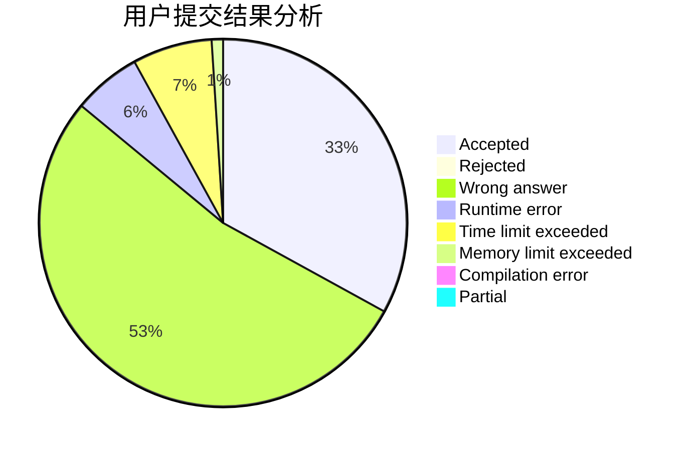
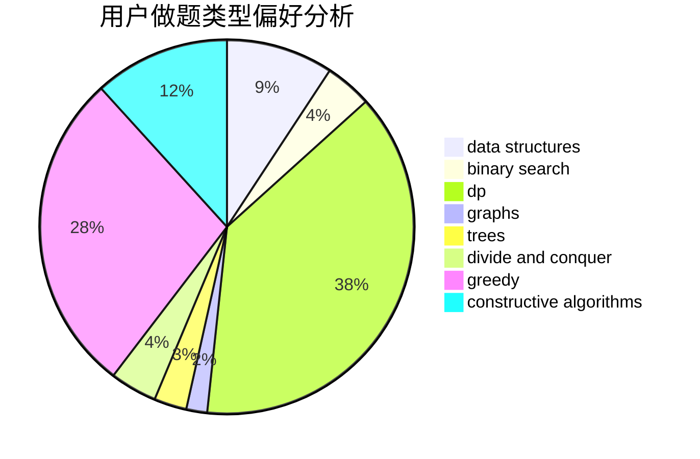
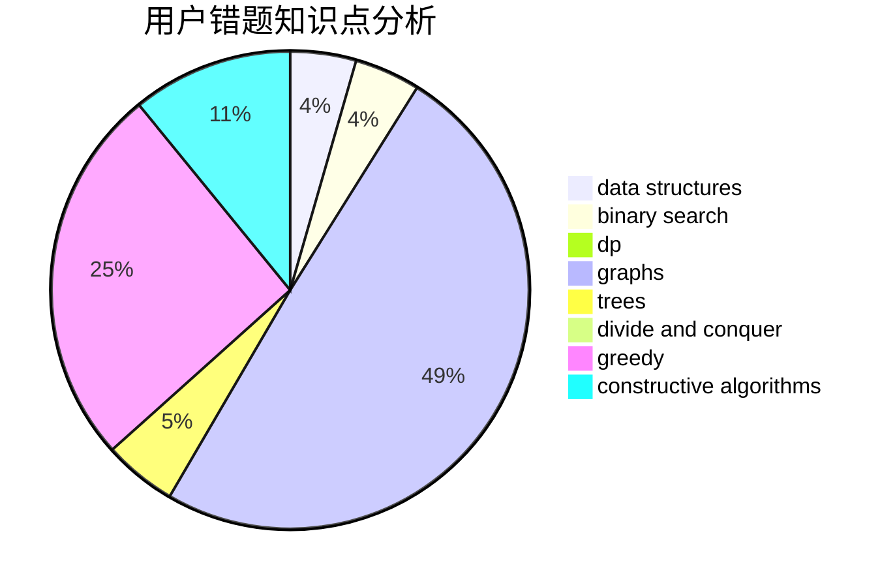

# hmf123
<!-- tabs:start -->
#### **用户提交结果分析**

#### **用户做题类型偏好分析**

#### **用户错题知识点分析**

<!-- tabs:end -->
# 推荐题目
[Splits](http://codeforces.com/problemset/problem/964/A)		math		  
[Nearest Opposite Parity](http://codeforces.com/problemset/problem/1272/E)		dfs and similar,
                        graphs,
                        shortest paths		  
[Special Olympics](http://codeforces.com/problemset/problem/199/B)		geometry		  
[Clothes](http://codeforces.com/problemset/problem/102/A)		brute force		  
[After Training](http://codeforces.com/problemset/problem/195/B)		data structures,
                        implementation,
                        math		  
[Restoring the Expression](http://codeforces.com/problemset/problem/898/F)		brute force,
                        hashing,
                        math		  
[Toy Cars](http://codeforces.com/problemset/problem/545/A)		implementation		  
[Misha and Palindrome Degree](https://codeforces.com/contest/504/problem/C)		binary search,
                        combinatorics,
                        implementation		  
[Design Tutorial: Make It Nondeterministic](http://codeforces.com/problemset/problem/472/C)		greedy		  
[DZY Loves Modification](http://codeforces.com/problemset/problem/446/B)		brute force,
                        data structures,
                        greedy		  
<!-- tabs:start -->
#### **data structures**
[Splits](http://codeforces.com/problemset/problem/195/B)		data structures,
                        implementation,
                        math		  
[Nearest Opposite Parity](http://codeforces.com/problemset/problem/446/B)		brute force,
                        data structures,
                        greedy		  
[Special Olympics](http://codeforces.com/problemset/problem/1322/E)		data structures		  
[Clothes](http://codeforces.com/problemset/problem/665/F)		data structures,
                        dp,
                        math,
                        number theory,
                        sortings,
                        two pointers		  
[After Training](http://codeforces.com/problemset/problem/1239/C)		data structures,
                        greedy,
                        implementation		  
[Restoring the Expression](http://codeforces.com/problemset/problem/834/B)		data structures,
                        implementation		  
[Toy Cars](http://codeforces.com/problemset/problem/1353/D)		constructive algorithms,
                        data structures,
                        sortings		  
[Misha and Palindrome Degree](http://codeforces.com/problemset/problem/1326/E)		data structures,
                        two pointers		  
[Design Tutorial: Make It Nondeterministic](http://codeforces.com/problemset/problem/961/E)		data structures		  
[DZY Loves Modification](http://codeforces.com/problemset/problem/200/A)		brute force,
                        data structures		  
#### **binary search**
[Splits](https://codeforces.com/contest/504/problem/C)		binary search,
                        combinatorics,
                        implementation		  
[Nearest Opposite Parity](http://codeforces.com/problemset/problem/1360/H)		binary search,
                        bitmasks,
                        brute force,
                        constructive algorithms		  
[Special Olympics](http://codeforces.com/problemset/problem/1492/C)		binary search,
                        data structures,
                        dp,
                        greedy,
                        two pointers		  
[Clothes](http://codeforces.com/problemset/problem/1463/D)		binary search,
                        constructive algorithms,
                        greedy,
                        two pointers		  
[After Training](http://codeforces.com/problemset/problem/1490/G)		binary search,
                        data structures,
                        math		  
[Restoring the Expression](http://codeforces.com/problemset/problem/1479/D)		binary search,
                        bitmasks,
                        brute force,
                        data structures,
                        probabilities,
                        trees		  
[Toy Cars](http://codeforces.com/problemset/problem/1436/E)		binary search,
                        data structures,
                        two pointers		  
[Misha and Palindrome Degree](http://codeforces.com/problemset/problem/1461/D)		binary search,
                        brute force,
                        data structures,
                        divide and conquer,
                        implementation,
                        sortings		  
[Design Tutorial: Make It Nondeterministic](http://codeforces.com/problemset/problem/1493/C)		binary search,
                        brute force,
                        constructive algorithms,
                        greedy,
                        strings		  
[DZY Loves Modification](http://codeforces.com/problemset/problem/1487/D)		binary search,
                        brute force,
                        math,
                        number theory		  
#### **dp**
[Splits](http://codeforces.com/problemset/problem/1032/E)		dp,
                        math		  
[Nearest Opposite Parity](http://codeforces.com/problemset/problem/582/D)		dp,
                        math,
                        number theory		  
[Special Olympics](http://codeforces.com/problemset/problem/219/C)		brute force,
                        dp,
                        greedy		  
[Clothes](http://codeforces.com/problemset/problem/665/F)		data structures,
                        dp,
                        math,
                        number theory,
                        sortings,
                        two pointers		  
[After Training](http://codeforces.com/problemset/problem/1307/C)		brute force,
                        dp,
                        math,
                        strings		  
[Restoring the Expression](https://codeforces.com/contest/1243/problem/E)		bitmasks,
                        dfs and similar,
                        dp,
                        graphs		  
[Toy Cars](http://codeforces.com/problemset/problem/152/E)		bitmasks,
                        dp,
                        graphs,
                        trees		  
[Misha and Palindrome Degree](http://codeforces.com/problemset/problem/464/D)		dp,
                        probabilities		  
[Design Tutorial: Make It Nondeterministic](https://codeforces.com/contest/1053/problem/B)		bitmasks,
                        dp		  
[DZY Loves Modification](http://codeforces.com/problemset/problem/1492/C)		binary search,
                        data structures,
                        dp,
                        greedy,
                        two pointers		  
#### **graph**
[Splits](http://codeforces.com/problemset/problem/1272/E)		dfs and similar,
                        graphs,
                        shortest paths		  
[Nearest Opposite Parity](http://codeforces.com/problemset/problem/225/D)		bitmasks,
                        dfs and similar,
                        graphs,
                        implementation		  
[Special Olympics](http://codeforces.com/problemset/problem/107/A)		dfs and similar,
                        graphs		  
[Clothes](https://codeforces.com/contest/1243/problem/E)		bitmasks,
                        dfs and similar,
                        dp,
                        graphs		  
[After Training](http://codeforces.com/problemset/problem/819/E)		constructive algorithms,
                        graphs		  
[Restoring the Expression](http://codeforces.com/problemset/problem/152/E)		bitmasks,
                        dp,
                        graphs,
                        trees		  
[Toy Cars](http://codeforces.com/problemset/problem/246/D)		brute force,
                        dfs and similar,
                        graphs		  
[Misha and Palindrome Degree](http://codeforces.com/problemset/problem/793/G)		data structures,
                        divide and conquer,
                        flows,
                        graph matchings		  
[Design Tutorial: Make It Nondeterministic](http://codeforces.com/problemset/problem/1491/G)		constructive algorithms,
                        graphs,
                        math		  
[DZY Loves Modification](http://codeforces.com/problemset/problem/986/A)		graphs,
                        greedy,
                        number theory,
                        shortest paths		  
#### **trees**
[Splits](https://codeforces.com/contest/1229/problem/B)		math,
                        number theory,
                        trees		  
[Nearest Opposite Parity](http://codeforces.com/problemset/problem/152/E)		bitmasks,
                        dp,
                        graphs,
                        trees		  
[Special Olympics](http://codeforces.com/problemset/problem/1479/D)		binary search,
                        bitmasks,
                        brute force,
                        data structures,
                        probabilities,
                        trees		  
[Clothes](http://codeforces.com/problemset/problem/1511/C)		brute force,
                        data structures,
                        implementation,
                        trees		  
[After Training](http://codeforces.com/problemset/problem/1499/F)		combinatorics,
                        dfs and similar,
                        dp,
                        trees		  
[Restoring the Expression](http://codeforces.com/problemset/problem/1491/E)		brute force,
                        dfs and similar,
                        divide and conquer,
                        number theory,
                        trees		  
[Toy Cars](http://codeforces.com/problemset/problem/1466/D)		data structures,
                        greedy,
                        sortings,
                        trees		  
[Misha and Palindrome Degree](http://codeforces.com/problemset/problem/1495/D)		combinatorics,
                        dfs and similar,
                        graphs,
                        math,
                        shortest paths,
                        trees		  
[Design Tutorial: Make It Nondeterministic](http://codeforces.com/problemset/problem/1303/G)		data structures,
                        divide and conquer,
                        geometry,
                        trees		  
[DZY Loves Modification](http://codeforces.com/problemset/problem/1454/E)		combinatorics,
                        dfs and similar,
                        graphs,
                        trees		  
#### **divide and conquer**
[Splits](http://codeforces.com/problemset/problem/793/G)		data structures,
                        divide and conquer,
                        flows,
                        graph matchings		  
[Nearest Opposite Parity](http://codeforces.com/problemset/problem/1461/D)		binary search,
                        brute force,
                        data structures,
                        divide and conquer,
                        implementation,
                        sortings		  
[Special Olympics](http://codeforces.com/problemset/problem/1466/G)		combinatorics,
                        divide and conquer,
                        hashing,
                        math,
                        string suffix structures,
                        strings		  
[Clothes](http://codeforces.com/problemset/problem/1490/D)		dfs and similar,
                        divide and conquer,
                        implementation		  
[After Training](https://codeforces.com/contest/1483/problem/C)		data structures,
                        divide and conquer,
                        dp		  
[Restoring the Expression](http://codeforces.com/problemset/problem/1491/E)		brute force,
                        dfs and similar,
                        divide and conquer,
                        number theory,
                        trees		  
[Toy Cars](http://codeforces.com/problemset/problem/1303/G)		data structures,
                        divide and conquer,
                        geometry,
                        trees		  
[Misha and Palindrome Degree](http://codeforces.com/problemset/problem/1494/D)		constructive algorithms,
                        data structures,
                        dfs and similar,
                        divide and conquer,
                        dsu,
                        greedy,
                        sortings,
                        trees		  
[Design Tutorial: Make It Nondeterministic](http://codeforces.com/problemset/problem/1482/E)		data structures,
                        divide and conquer,
                        dp		  
[DZY Loves Modification](http://codeforces.com/problemset/problem/566/C)		dfs and similar,
                        divide and conquer,
                        trees		  
#### **greedy**
[Splits](http://codeforces.com/problemset/problem/472/C)		greedy		  
[Nearest Opposite Parity](http://codeforces.com/problemset/problem/446/B)		brute force,
                        data structures,
                        greedy		  
[Special Olympics](http://codeforces.com/problemset/problem/976/E)		greedy,
                        sortings		  
[Clothes](http://codeforces.com/problemset/problem/1374/C)		greedy,
                        strings		  
[After Training](http://codeforces.com/problemset/problem/219/C)		brute force,
                        dp,
                        greedy		  
[Restoring the Expression](http://codeforces.com/problemset/problem/1239/C)		data structures,
                        greedy,
                        implementation		  
[Toy Cars](http://codeforces.com/problemset/problem/1203/B)		greedy,
                        math		  
[Misha and Palindrome Degree](http://codeforces.com/problemset/problem/735/B)		greedy,
                        number theory,
                        sortings		  
[Design Tutorial: Make It Nondeterministic](https://codeforces.com/contest/1086/problem/C)		greedy,
                        implementation,
                        strings		  
[DZY Loves Modification](https://codeforces.com/contest/1072/problem/C)		greedy		  
#### **constructive algorithms**
[Splits](http://codeforces.com/problemset/problem/1353/D)		constructive algorithms,
                        data structures,
                        sortings		  
[Nearest Opposite Parity](http://codeforces.com/problemset/problem/980/B)		constructive algorithms		  
[Special Olympics](http://codeforces.com/problemset/problem/819/E)		constructive algorithms,
                        graphs		  
[Clothes](http://codeforces.com/problemset/problem/1491/G)		constructive algorithms,
                        graphs,
                        math		  
[After Training](http://codeforces.com/problemset/problem/1360/H)		binary search,
                        bitmasks,
                        brute force,
                        constructive algorithms		  
[Restoring the Expression](http://codeforces.com/problemset/problem/1493/A)		constructive algorithms,
                        greedy		  
[Toy Cars](http://codeforces.com/problemset/problem/1463/D)		binary search,
                        constructive algorithms,
                        greedy,
                        two pointers		  
[Misha and Palindrome Degree](https://codeforces.com/contest/1456/problem/B)		bitmasks,
                        brute force,
                        constructive algorithms		  
[Design Tutorial: Make It Nondeterministic](http://codeforces.com/problemset/problem/1492/D)		bitmasks,
                        constructive algorithms,
                        greedy,
                        math		  
[DZY Loves Modification](https://codeforces.com/contest/1504/problem/D)		constructive algorithms,
                        games,
                        interactive		  
#### **sortings**
[Splits](http://codeforces.com/problemset/problem/976/E)		greedy,
                        sortings		  
[Nearest Opposite Parity](http://codeforces.com/problemset/problem/1133/C)		sortings,
                        two pointers		  
[Special Olympics](http://codeforces.com/problemset/problem/665/F)		data structures,
                        dp,
                        math,
                        number theory,
                        sortings,
                        two pointers		  
[Clothes](http://codeforces.com/problemset/problem/1353/D)		constructive algorithms,
                        data structures,
                        sortings		  
[After Training](http://codeforces.com/problemset/problem/735/B)		greedy,
                        number theory,
                        sortings		  
[Restoring the Expression](http://codeforces.com/problemset/problem/977/D)		dfs and similar,
                        math,
                        sortings		  
[Toy Cars](http://codeforces.com/problemset/problem/1333/F)		greedy,
                        implementation,
                        math,
                        number theory,
                        sortings,
                        two pointers		  
[Misha and Palindrome Degree](http://codeforces.com/problemset/problem/732/E)		greedy,
                        sortings		  
[Design Tutorial: Make It Nondeterministic](http://codeforces.com/problemset/problem/1398/B)		games,
                        greedy,
                        sortings		  
[DZY Loves Modification](https://codeforces.com/contest/1496/problem/C)		geometry,
                        greedy,
                        math,
                        sortings		  
<!-- tabs:end -->
