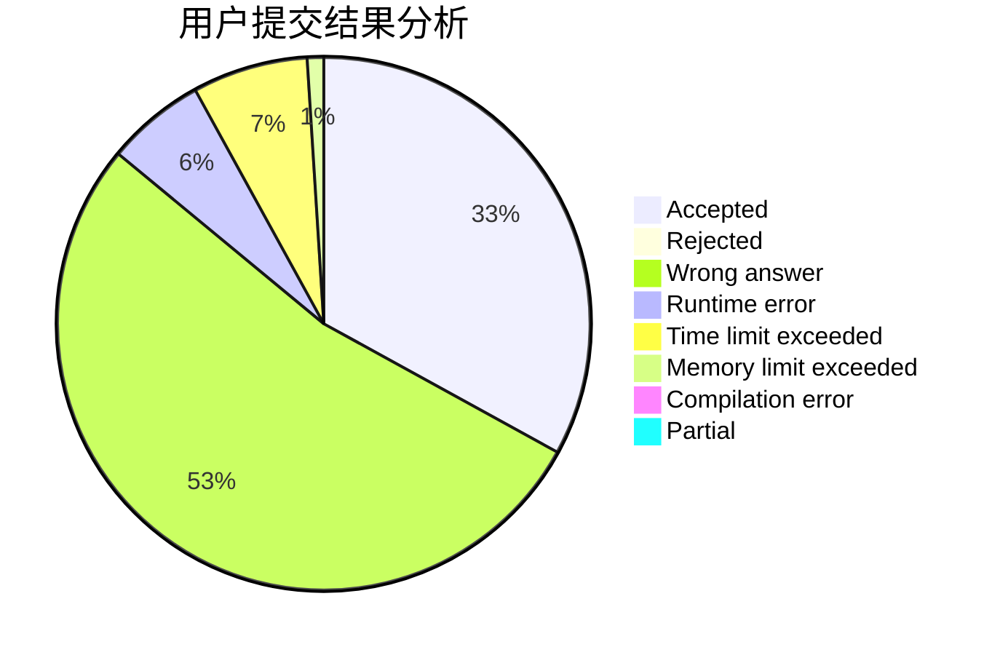
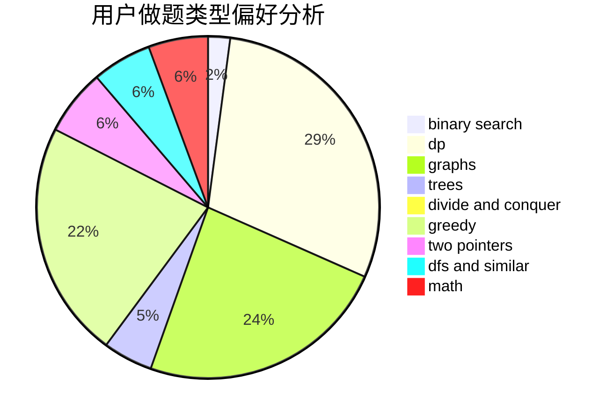

# hmf123

<!-- tabs:start -->

#### **用户提交结果分析**

#### **用户做题类型偏好分析**

<!-- tabs:end -->
# 推荐题目
[12821](https://codeforces.com/contest/1282/problem/1)
[1292B](https://codeforces.com/contest/1292/problem/B)
[750D](https://codeforces.com/contest/750/problem/D)
[1030B](https://codeforces.com/contest/1030/problem/B)
[225C](https://codeforces.com/contest/225/problem/C)
[267A](https://codeforces.com/contest/267/problem/A)
[220B](https://codeforces.com/contest/220/problem/B)
[14D](https://codeforces.com/contest/14/problem/D)
[218B](https://codeforces.com/contest/218/problem/B)
[835B](https://codeforces.com/contest/835/problem/B)
