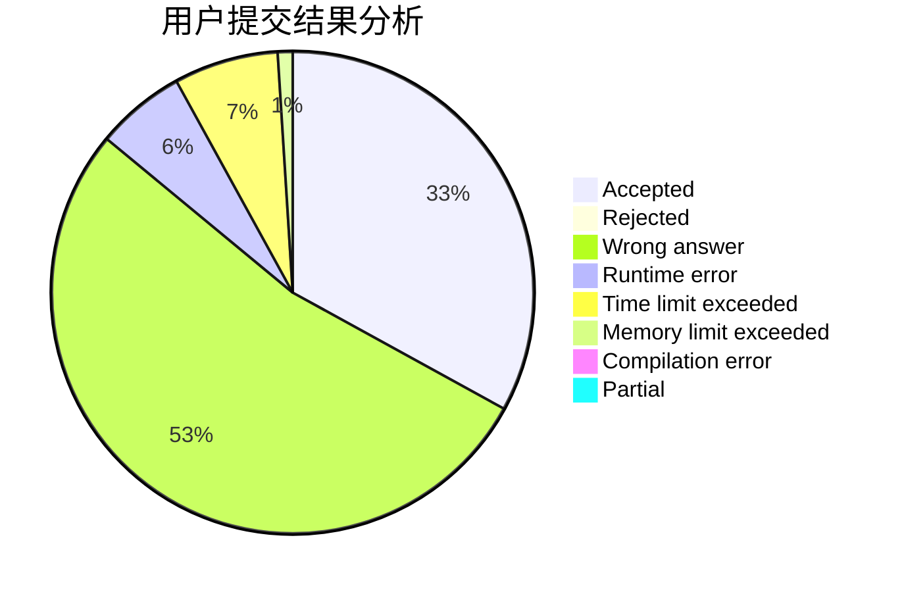
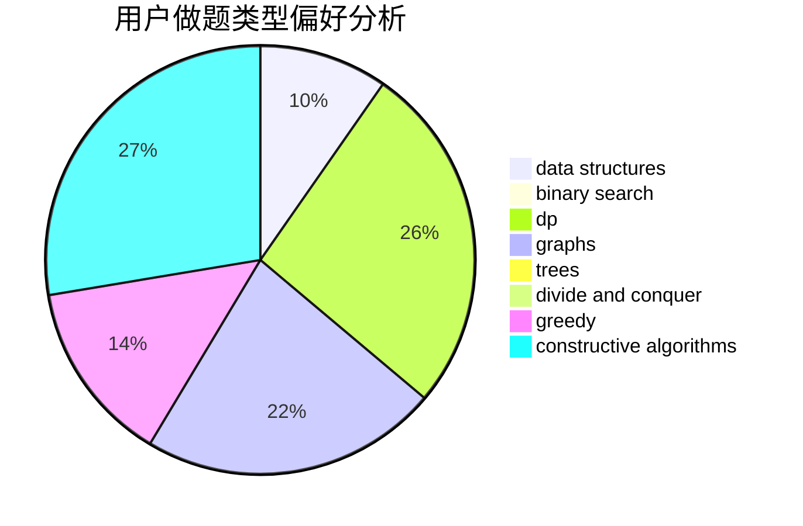
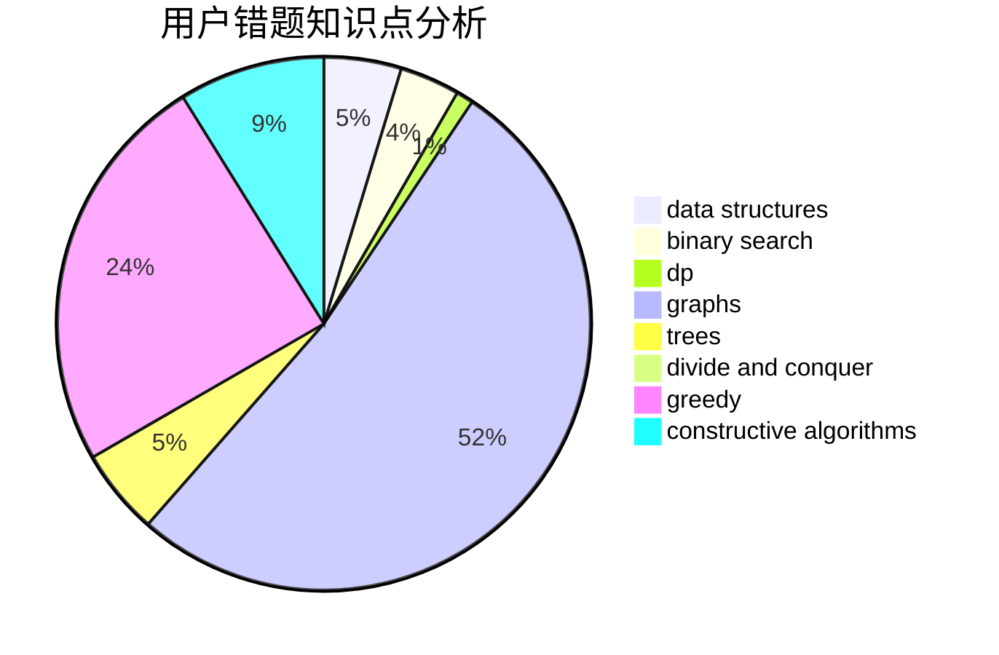

# hmf123

<!-- tabs:start -->

#### **用户提交结果分析**

#### **用户做题类型偏好分析**

#### **用户错题知识点分析**

<!-- tabs:end -->
# 推荐题目
[12821](https://codeforces.com/contest/1282/problem/1)		dsu,graphs,sortings,trees		  
[1292B](https://codeforces.com/contest/1292/problem/B)		brute force,
                        constructive algorithms,
                        geometry,
                        greedy,
                        implementation		  
[750D](https://codeforces.com/contest/750/problem/D)		brute force,
                        data structures,
                        dfs and similar,
                        dp,
                        implementation		  
[1030B](https://codeforces.com/contest/1030/problem/B)		geometry		  
[225C](https://codeforces.com/contest/225/problem/C)		dp,
                        matrices		  
[267A](https://codeforces.com/contest/267/problem/A)		math,
                        number theory		  
[220B](https://codeforces.com/contest/220/problem/B)		constructive algorithms,
                        data structures		  
[14D](https://codeforces.com/contest/14/problem/D)		dfs and similar,
                        dp,
                        graphs,
                        shortest paths,
                        trees,
                        two pointers		  
[218B](https://codeforces.com/contest/218/problem/B)		implementation		  
[835B](https://codeforces.com/contest/835/problem/B)		greedy		  
