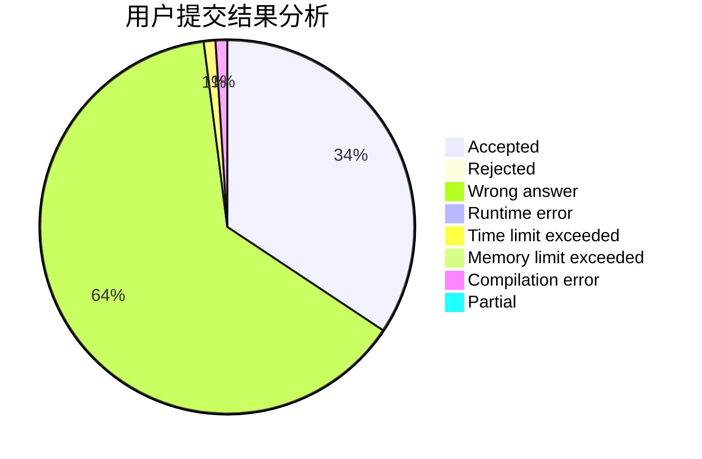
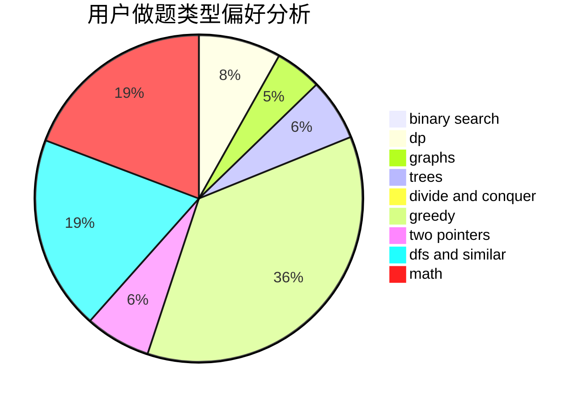

# hmic

<!-- tabs:start -->

#### **用户提交结果分析**

#### **用户做题类型偏好分析**

<!-- tabs:end -->
# 推荐题目
[448B](https://codeforces.com/contest/448/problem/B)
[933B](https://codeforces.com/contest/933/problem/B)
[201C](https://codeforces.com/contest/201/problem/C)
[1156D](https://codeforces.com/contest/1156/problem/D)
[13783](https://codeforces.com/contest/1378/problem/3)
[1058D](https://codeforces.com/contest/1058/problem/D)
[939E](https://codeforces.com/contest/939/problem/E)
[436C](https://codeforces.com/contest/436/problem/C)
[294D](https://codeforces.com/contest/294/problem/D)
[1140A](https://codeforces.com/contest/1140/problem/A)
