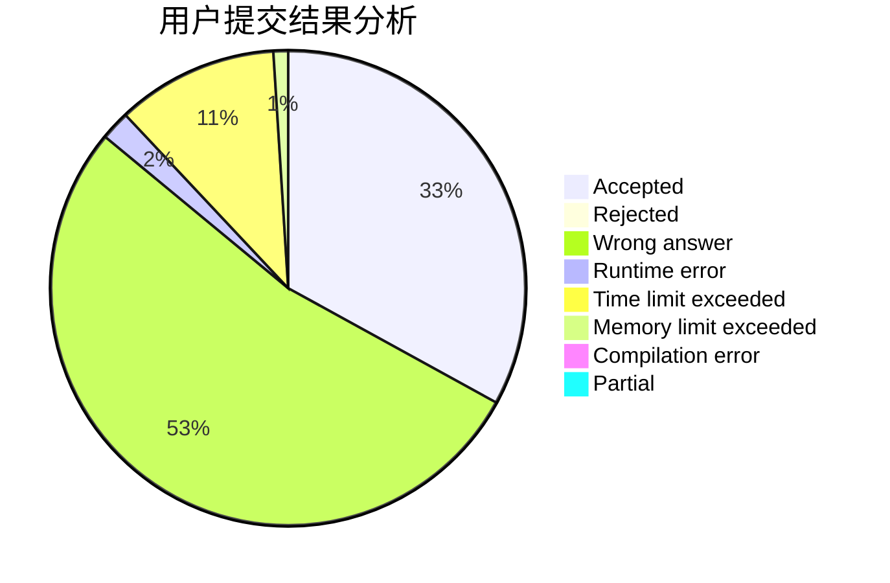
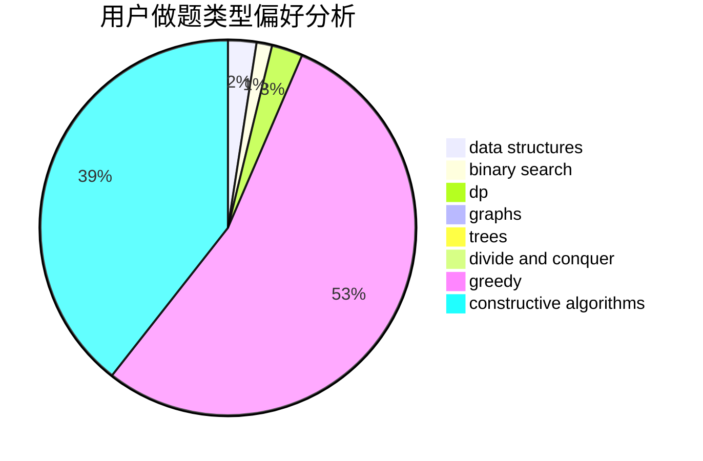

# hnust_chenjiedong

<!-- tabs:start -->

#### **用户提交结果分析**

#### **用户做题类型偏好分析**

#### **用户错题知识点分析**

<!-- tabs:end -->
# 推荐题目
[55D](https://codeforces.com/contest/55/problem/D)		dp,
                        number theory		  
[367B](https://codeforces.com/contest/367/problem/B)		binary search,
                        data structures		  
[402A](https://codeforces.com/contest/402/problem/A)		greedy,
                        math		  
[1070D](https://codeforces.com/contest/1070/problem/D)		greedy		  
[120H](https://codeforces.com/contest/120/problem/H)		graph matchings		  
[446B](https://codeforces.com/contest/446/problem/B)		brute force,
                        data structures,
                        greedy		  
[13783](https://codeforces.com/contest/1378/problem/3)		dsu,graphs,sortings,trees		  
[552D](https://codeforces.com/contest/552/problem/D)		brute force,
                        combinatorics,
                        data structures,
                        geometry,
                        math,
                        sortings		  
[11781](https://codeforces.com/contest/1178/problem/1)		dsu,graphs,sortings,trees		  
[1403A](https://codeforces.com/contest/1403/problem/A)		*special problem,
                        2-sat,
                        binary search,
                        data structures,
                        graphs,
                        interactive,
                        sortings,
                        two pointers		  
