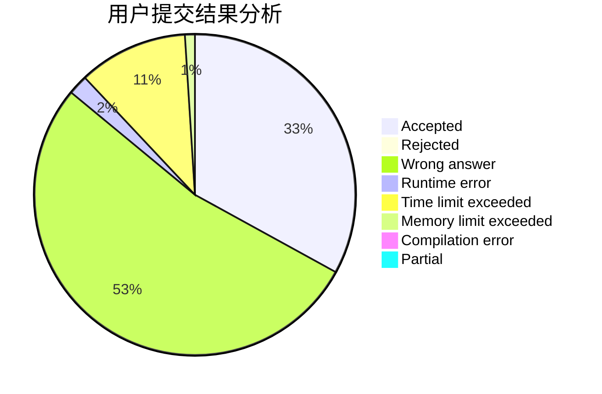
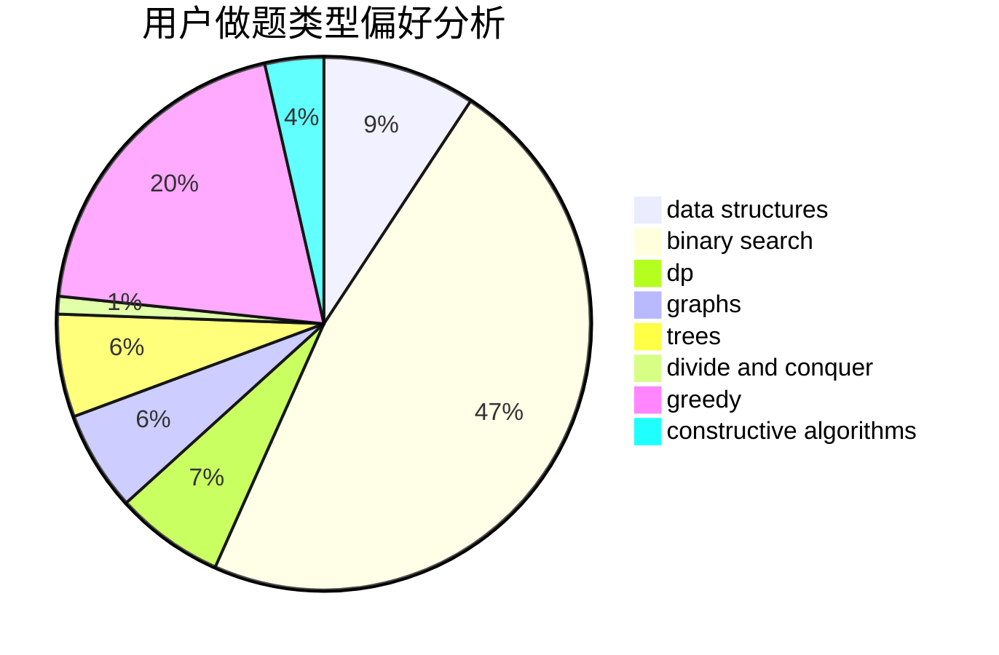

# hnust_chenjiedong

<!-- tabs:start -->

#### **用户提交结果分析**

#### **用户做题类型偏好分析**

#### **用户错题知识点分析**

<!-- tabs:end -->
# 推荐题目
[53A](https://codeforces.com/contest/53/problem/A)		implementation		  
[33A](https://codeforces.com/contest/33/problem/A)		greedy,
                        implementation		  
[372A](https://codeforces.com/contest/372/problem/A)		binary search,
                        greedy,
                        sortings,
                        two pointers		  
[1070A](https://codeforces.com/contest/1070/problem/A)		dp,
                        graphs,
                        number theory,
                        shortest paths		  
[1205E](https://codeforces.com/contest/1205/problem/E)		combinatorics,
                        strings		  
[420D](https://codeforces.com/contest/420/problem/D)		data structures		  
[1370A](https://codeforces.com/contest/1370/problem/A)		greedy,
                        implementation,
                        math,
                        number theory		  
[528C](https://codeforces.com/contest/528/problem/C)		dsu,graphs,sortings,trees		  
[1174E](https://codeforces.com/contest/1174/problem/E)		combinatorics,
                        dp,
                        math,
                        number theory		  
[1394E](https://codeforces.com/contest/1394/problem/E)		strings		  
