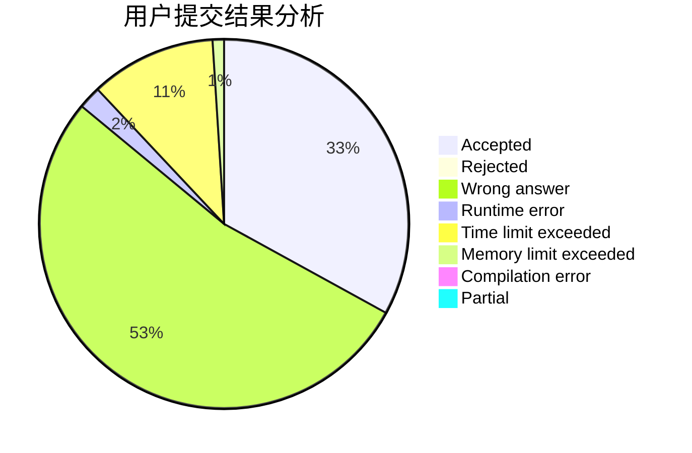
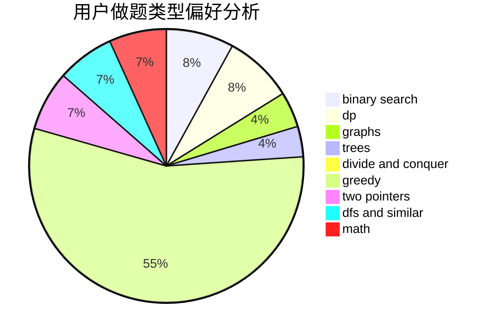

# hnust_chenjiedong

<!-- tabs:start -->

#### **用户提交结果分析**

#### **用户做题类型偏好分析**

<!-- tabs:end -->
# 推荐题目
[55D](https://codeforces.com/contest/55/problem/D)
[367B](https://codeforces.com/contest/367/problem/B)
[402A](https://codeforces.com/contest/402/problem/A)
[1070D](https://codeforces.com/contest/1070/problem/D)
[120H](https://codeforces.com/contest/120/problem/H)
[446B](https://codeforces.com/contest/446/problem/B)
[13783](https://codeforces.com/contest/1378/problem/3)
[552D](https://codeforces.com/contest/552/problem/D)
[11781](https://codeforces.com/contest/1178/problem/1)
[1403A](https://codeforces.com/contest/1403/problem/A)
