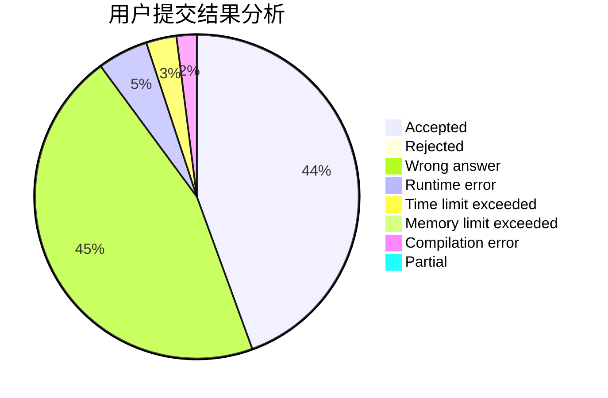
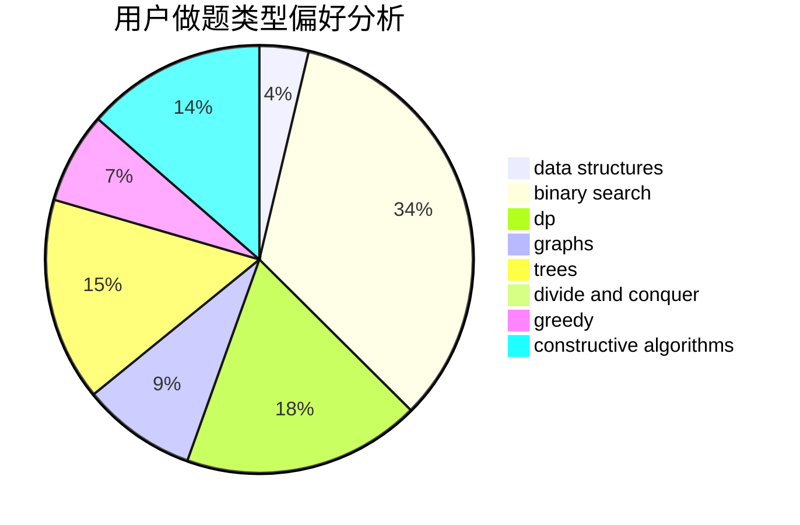

# hnust_chensiyuan

<!-- tabs:start -->

#### **用户提交结果分析**

#### **用户做题类型偏好分析**

#### **用户错题知识点分析**

<!-- tabs:end -->
# 推荐题目
[45G](https://codeforces.com/contest/45/problem/G)		number theory		  
[1424M](https://codeforces.com/contest/1424/problem/M)		graphs,
                        sortings		  
[876A](https://codeforces.com/contest/876/problem/A)		math		  
[1086C](https://codeforces.com/contest/1086/problem/C)		dsu,graphs,sortings,trees		  
[868B](https://codeforces.com/contest/868/problem/B)		implementation		  
[863E](https://codeforces.com/contest/863/problem/E)		data structures,
                        sortings		  
[837G](https://codeforces.com/contest/837/problem/G)		data structures		  
[725B](https://codeforces.com/contest/725/problem/B)		implementation,
                        math		  
[499C](https://codeforces.com/contest/499/problem/C)		dsu,graphs,sortings,trees		  
[80B](https://codeforces.com/contest/80/problem/B)		geometry,
                        math		  
