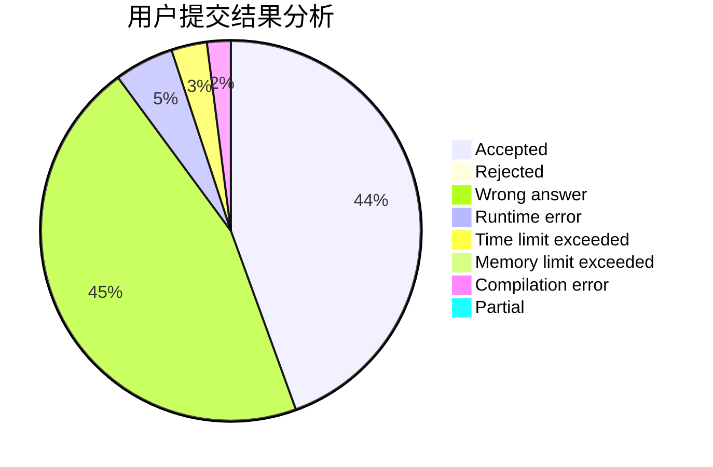
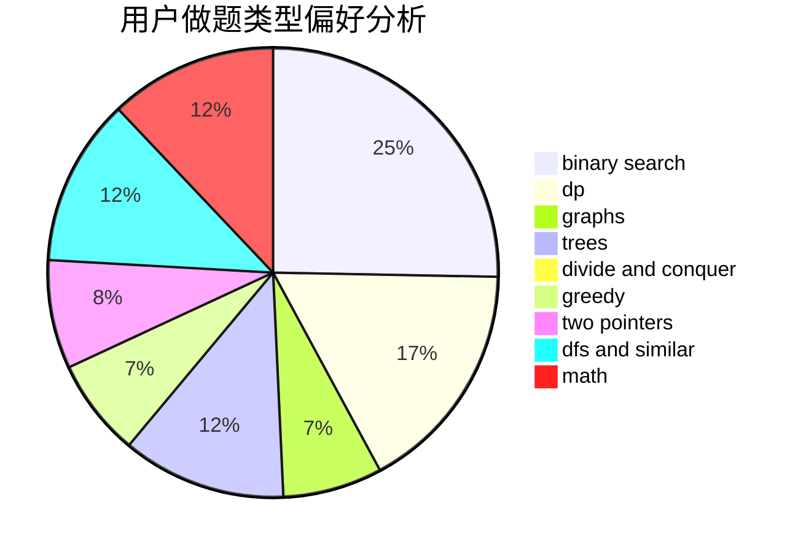

# hnust_chensiyuan

<!-- tabs:start -->

#### **用户提交结果分析**

#### **用户做题类型偏好分析**

<!-- tabs:end -->
# 推荐题目
[45G](https://codeforces.com/contest/45/problem/G)
[1424M](https://codeforces.com/contest/1424/problem/M)
[876A](https://codeforces.com/contest/876/problem/A)
[1086C](https://codeforces.com/contest/1086/problem/C)
[868B](https://codeforces.com/contest/868/problem/B)
[863E](https://codeforces.com/contest/863/problem/E)
[837G](https://codeforces.com/contest/837/problem/G)
[725B](https://codeforces.com/contest/725/problem/B)
[499C](https://codeforces.com/contest/499/problem/C)
[80B](https://codeforces.com/contest/80/problem/B)
