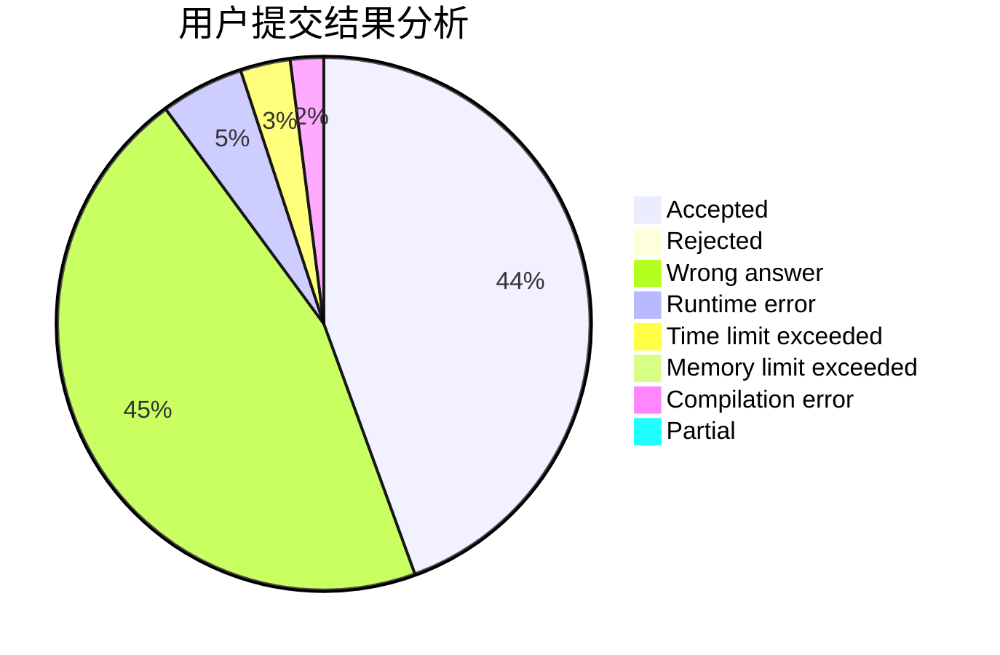
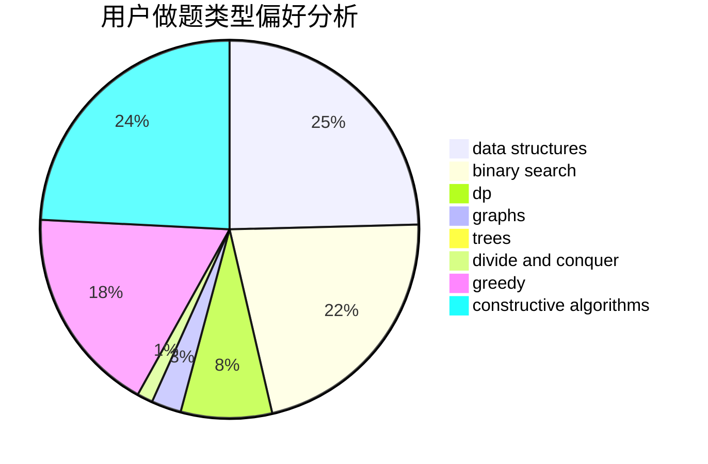

# hnust_chensiyuan

<!-- tabs:start -->

#### **用户提交结果分析**

#### **用户做题类型偏好分析**

#### **用户错题知识点分析**

<!-- tabs:end -->
# 推荐题目
[438B](https://codeforces.com/contest/438/problem/B)		dsu,graphs,sortings,trees		  
[1417C](https://codeforces.com/contest/1417/problem/C)		dsu,graphs,sortings,trees		  
[858A](https://codeforces.com/contest/858/problem/A)		brute force,
                        math,
                        number theory		  
[1085G](https://codeforces.com/contest/1085/problem/G)		combinatorics,
                        data structures,
                        dp		  
[848E](https://codeforces.com/contest/848/problem/E)		combinatorics,
                        divide and conquer,
                        dp,
                        fft,
                        math		  
[845D](https://codeforces.com/contest/845/problem/D)		data structures,
                        dp,
                        greedy		  
[818A](https://codeforces.com/contest/818/problem/A)		implementation,
                        math		  
[706E](https://codeforces.com/contest/706/problem/E)		data structures,
                        implementation		  
[479A](https://codeforces.com/contest/479/problem/A)		brute force,
                        math		  
[795D](https://codeforces.com/contest/795/problem/D)		dsu,graphs,sortings,trees		  
