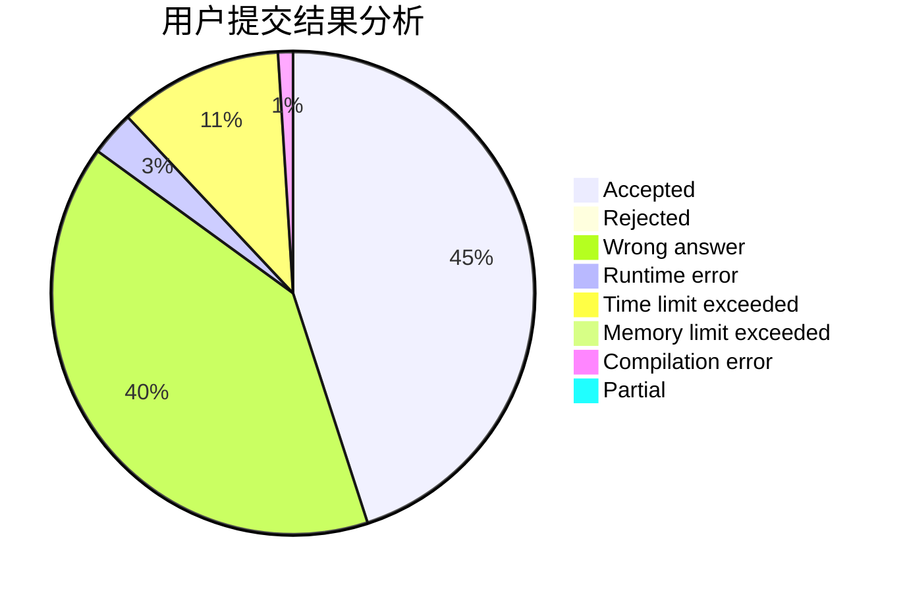
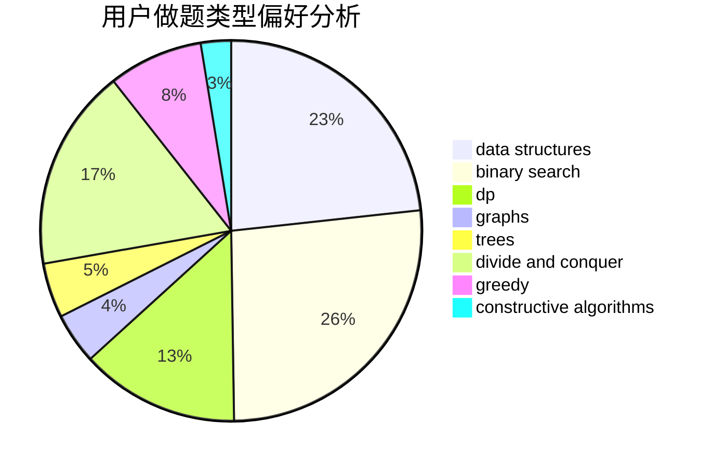

# hnust_dengqiang
<!-- tabs:start -->
#### **用户提交结果分析**

#### **用户做题类型偏好分析**

#### **用户错题知识点分析**

<!-- tabs:end -->
# 推荐题目
[Fixing the Cloud](https://codeforces.com/contest/1460/problem/A)		nan		  
[Collecting Coins](http://codeforces.com/problemset/problem/1294/A)		math		  
[Wrong Answer](https://codeforces.com/contest/1130/problem/E)		constructive algorithms		  
[Propagating tree](http://codeforces.com/problemset/problem/383/C)		data structures,
                        dfs and similar,
                        trees		  
[Barcelonian Distance](https://codeforces.com/contest/1078/problem/A)		geometry,
                        implementation		  
[Rectangle Painting 1](https://codeforces.com/contest/1199/problem/F)		dp		  
[Alyona and a tree](https://codeforces.com/contest/740/problem/D)		binary search,
                        data structures,
                        dfs and similar,
                        graphs,
                        trees		  
[Radio stations](http://codeforces.com/problemset/problem/762/E)		binary search,
                        data structures		  
[Views Matter](http://codeforces.com/problemset/problem/1061/B)		greedy,
                        implementation,
                        sortings		  
[Businessmen Problems](http://codeforces.com/problemset/problem/981/B)		sortings		  
<!-- tabs:start -->
#### **data structures**
[Fixing the Cloud](http://codeforces.com/problemset/problem/383/C)		data structures,
                        dfs and similar,
                        trees		  
[Collecting Coins](https://codeforces.com/contest/740/problem/D)		binary search,
                        data structures,
                        dfs and similar,
                        graphs,
                        trees		  
[Wrong Answer](http://codeforces.com/problemset/problem/762/E)		binary search,
                        data structures		  
[Propagating tree](http://codeforces.com/problemset/problem/802/O)		binary search,
                        data structures,
                        flows		  
[Barcelonian Distance](http://codeforces.com/problemset/problem/1139/F)		data structures,
                        divide and conquer		  
[Rectangle Painting 1](http://codeforces.com/problemset/problem/1017/G)		data structures		  
[Alyona and a tree](http://codeforces.com/problemset/problem/1307/D)		binary search,
                        data structures,
                        dfs and similar,
                        graphs,
                        greedy,
                        shortest paths,
                        sortings		  
[Radio stations](http://codeforces.com/problemset/problem/1458/F)		data structures,
                        trees		  
[Views Matter](https://codeforces.com/contest/1321/problem/B)		data structures,
                        dp,
                        greedy,
                        math,
                        sortings		  
[Businessmen Problems](http://codeforces.com/problemset/problem/1492/C)		binary search,
                        data structures,
                        dp,
                        greedy,
                        two pointers		  
#### **binary search**
[Fixing the Cloud](https://codeforces.com/contest/740/problem/D)		binary search,
                        data structures,
                        dfs and similar,
                        graphs,
                        trees		  
[Collecting Coins](http://codeforces.com/problemset/problem/762/E)		binary search,
                        data structures		  
[Wrong Answer](http://codeforces.com/problemset/problem/97/C)		binary search,
                        graphs,
                        math,
                        shortest paths		  
[Propagating tree](http://codeforces.com/problemset/problem/815/E)		binary search,
                        constructive algorithms,
                        implementation		  
[Barcelonian Distance](http://codeforces.com/problemset/problem/802/O)		binary search,
                        data structures,
                        flows		  
[Rectangle Painting 1](http://codeforces.com/problemset/problem/1307/D)		binary search,
                        data structures,
                        dfs and similar,
                        graphs,
                        greedy,
                        shortest paths,
                        sortings		  
[Alyona and a tree](https://codeforces.com/contest/1020/problem/D)		binary search,
                        interactive		  
[Radio stations](http://codeforces.com/problemset/problem/1250/J)		binary search,
                        greedy		  
[Views Matter](http://codeforces.com/problemset/problem/1492/C)		binary search,
                        data structures,
                        dp,
                        greedy,
                        two pointers		  
[Businessmen Problems](http://codeforces.com/problemset/problem/1463/D)		binary search,
                        constructive algorithms,
                        greedy,
                        two pointers		  
#### **dp**
[Fixing the Cloud](https://codeforces.com/contest/1199/problem/F)		dp		  
[Collecting Coins](http://codeforces.com/problemset/problem/1168/C)		bitmasks,
                        dp		  
[Wrong Answer](http://codeforces.com/problemset/problem/283/B)		dfs and similar,
                        dp,
                        graphs		  
[Propagating tree](http://codeforces.com/problemset/problem/152/E)		bitmasks,
                        dp,
                        graphs,
                        trees		  
[Barcelonian Distance](http://codeforces.com/problemset/problem/478/D)		dp		  
[Rectangle Painting 1](http://codeforces.com/problemset/problem/283/D)		dp,
                        math,
                        number theory		  
[Alyona and a tree](http://codeforces.com/problemset/problem/375/E)		dp,
                        implementation,
                        math		  
[Radio stations](https://codeforces.com/contest/1321/problem/B)		data structures,
                        dp,
                        greedy,
                        math,
                        sortings		  
[Views Matter](http://codeforces.com/problemset/problem/1096/D)		dp		  
[Businessmen Problems](http://codeforces.com/problemset/problem/1420/E)		dp,
                        greedy		  
#### **graph**
[Fixing the Cloud](https://codeforces.com/contest/740/problem/D)		binary search,
                        data structures,
                        dfs and similar,
                        graphs,
                        trees		  
[Collecting Coins](http://codeforces.com/problemset/problem/97/C)		binary search,
                        graphs,
                        math,
                        shortest paths		  
[Wrong Answer](http://codeforces.com/problemset/problem/283/B)		dfs and similar,
                        dp,
                        graphs		  
[Propagating tree](http://codeforces.com/problemset/problem/152/E)		bitmasks,
                        dp,
                        graphs,
                        trees		  
[Barcelonian Distance](http://codeforces.com/problemset/problem/1076/D)		graphs,
                        greedy,
                        shortest paths		  
[Rectangle Painting 1](http://codeforces.com/problemset/problem/1307/D)		binary search,
                        data structures,
                        dfs and similar,
                        graphs,
                        greedy,
                        shortest paths,
                        sortings		  
[Alyona and a tree](http://codeforces.com/problemset/problem/520/B)		dfs and similar,
                        graphs,
                        greedy,
                        implementation,
                        math,
                        shortest paths		  
[Radio stations](http://codeforces.com/problemset/problem/1506/F)		constructive algorithms,
                        graphs,
                        math,
                        shortest paths,
                        sortings		  
[Views Matter](http://codeforces.com/problemset/problem/718/E)		bitmasks,
                        graphs		  
[Businessmen Problems](http://codeforces.com/problemset/problem/1487/C)		brute force,
                        constructive algorithms,
                        dfs and similar,
                        graphs,
                        greedy,
                        implementation,
                        math		  
#### **trees**
[Fixing the Cloud](http://codeforces.com/problemset/problem/383/C)		data structures,
                        dfs and similar,
                        trees		  
[Collecting Coins](https://codeforces.com/contest/740/problem/D)		binary search,
                        data structures,
                        dfs and similar,
                        graphs,
                        trees		  
[Wrong Answer](http://codeforces.com/problemset/problem/152/E)		bitmasks,
                        dp,
                        graphs,
                        trees		  
[Propagating tree](http://codeforces.com/problemset/problem/1458/F)		data structures,
                        trees		  
[Barcelonian Distance](http://codeforces.com/problemset/problem/1479/D)		binary search,
                        bitmasks,
                        brute force,
                        data structures,
                        probabilities,
                        trees		  
[Rectangle Painting 1](http://codeforces.com/problemset/problem/1511/C)		brute force,
                        data structures,
                        implementation,
                        trees		  
[Alyona and a tree](http://codeforces.com/problemset/problem/1499/F)		combinatorics,
                        dfs and similar,
                        dp,
                        trees		  
[Radio stations](http://codeforces.com/problemset/problem/1491/E)		brute force,
                        dfs and similar,
                        divide and conquer,
                        number theory,
                        trees		  
[Views Matter](http://codeforces.com/problemset/problem/1466/D)		data structures,
                        greedy,
                        sortings,
                        trees		  
[Businessmen Problems](http://codeforces.com/problemset/problem/1495/D)		combinatorics,
                        dfs and similar,
                        graphs,
                        math,
                        shortest paths,
                        trees		  
#### **divide and conquer**
[Fixing the Cloud](http://codeforces.com/problemset/problem/1139/F)		data structures,
                        divide and conquer		  
[Collecting Coins](http://codeforces.com/problemset/problem/1461/D)		binary search,
                        brute force,
                        data structures,
                        divide and conquer,
                        implementation,
                        sortings		  
[Wrong Answer](http://codeforces.com/problemset/problem/1466/G)		combinatorics,
                        divide and conquer,
                        hashing,
                        math,
                        string suffix structures,
                        strings		  
[Propagating tree](http://codeforces.com/problemset/problem/1490/D)		dfs and similar,
                        divide and conquer,
                        implementation		  
[Barcelonian Distance](https://codeforces.com/contest/1483/problem/C)		data structures,
                        divide and conquer,
                        dp		  
[Rectangle Painting 1](http://codeforces.com/problemset/problem/1491/E)		brute force,
                        dfs and similar,
                        divide and conquer,
                        number theory,
                        trees		  
[Alyona and a tree](http://codeforces.com/problemset/problem/1303/G)		data structures,
                        divide and conquer,
                        geometry,
                        trees		  
[Radio stations](http://codeforces.com/problemset/problem/1494/D)		constructive algorithms,
                        data structures,
                        dfs and similar,
                        divide and conquer,
                        dsu,
                        greedy,
                        sortings,
                        trees		  
[Views Matter](http://codeforces.com/problemset/problem/1482/E)		data structures,
                        divide and conquer,
                        dp		  
[Businessmen Problems](http://codeforces.com/problemset/problem/566/C)		dfs and similar,
                        divide and conquer,
                        trees		  
#### **greedy**
[Fixing the Cloud](http://codeforces.com/problemset/problem/1061/B)		greedy,
                        implementation,
                        sortings		  
[Collecting Coins](http://codeforces.com/problemset/problem/1389/D)		brute force,
                        greedy,
                        implementation,
                        math		  
[Wrong Answer](https://codeforces.com/contest/1484/problem/C)		brute force,
                        constructive algorithms,
                        greedy,
                        implementation		  
[Propagating tree](https://codeforces.com/contest/1229/problem/A)		brute force,
                        greedy		  
[Barcelonian Distance](http://codeforces.com/problemset/problem/1346/C)		*special problem,
                        greedy,
                        sortings		  
[Rectangle Painting 1](http://codeforces.com/problemset/problem/1076/D)		graphs,
                        greedy,
                        shortest paths		  
[Alyona and a tree](http://codeforces.com/problemset/problem/1218/I)		2-sat,
                        dfs and similar,
                        greedy		  
[Radio stations](http://codeforces.com/problemset/problem/508/B)		greedy,
                        math,
                        strings		  
[Views Matter](http://codeforces.com/problemset/problem/1077/E)		greedy,
                        sortings		  
[Businessmen Problems](http://codeforces.com/problemset/problem/1307/D)		binary search,
                        data structures,
                        dfs and similar,
                        graphs,
                        greedy,
                        shortest paths,
                        sortings		  
#### **constructive algorithms**
[Fixing the Cloud](https://codeforces.com/contest/1130/problem/E)		constructive algorithms		  
[Collecting Coins](http://codeforces.com/problemset/problem/815/E)		binary search,
                        constructive algorithms,
                        implementation		  
[Wrong Answer](http://codeforces.com/problemset/problem/1335/B)		constructive algorithms		  
[Propagating tree](https://codeforces.com/contest/1484/problem/C)		brute force,
                        constructive algorithms,
                        greedy,
                        implementation		  
[Barcelonian Distance](http://codeforces.com/problemset/problem/1336/D)		constructive algorithms,
                        interactive		  
[Rectangle Painting 1](http://codeforces.com/problemset/problem/1506/F)		constructive algorithms,
                        graphs,
                        math,
                        shortest paths,
                        sortings		  
[Alyona and a tree](https://codeforces.com/contest/1397/problem/D)		brute force,
                        constructive algorithms,
                        games,
                        greedy		  
[Radio stations](http://codeforces.com/problemset/problem/798/D)		constructive algorithms,
                        sortings		  
[Views Matter](http://codeforces.com/problemset/problem/1493/A)		constructive algorithms,
                        greedy		  
[Businessmen Problems](http://codeforces.com/problemset/problem/1463/D)		binary search,
                        constructive algorithms,
                        greedy,
                        two pointers		  
#### **sortings**
[Fixing the Cloud](http://codeforces.com/problemset/problem/1061/B)		greedy,
                        implementation,
                        sortings		  
[Collecting Coins](http://codeforces.com/problemset/problem/981/B)		sortings		  
[Wrong Answer](http://codeforces.com/problemset/problem/1346/C)		*special problem,
                        greedy,
                        sortings		  
[Propagating tree](http://codeforces.com/problemset/problem/1077/E)		greedy,
                        sortings		  
[Barcelonian Distance](http://codeforces.com/problemset/problem/1307/D)		binary search,
                        data structures,
                        dfs and similar,
                        graphs,
                        greedy,
                        shortest paths,
                        sortings		  
[Rectangle Painting 1](https://codeforces.com/contest/1321/problem/B)		data structures,
                        dp,
                        greedy,
                        math,
                        sortings		  
[Alyona and a tree](http://codeforces.com/problemset/problem/1506/F)		constructive algorithms,
                        graphs,
                        math,
                        shortest paths,
                        sortings		  
[Radio stations](http://codeforces.com/problemset/problem/798/D)		constructive algorithms,
                        sortings		  
[Views Matter](http://codeforces.com/problemset/problem/1144/B)		greedy,
                        implementation,
                        sortings		  
[Businessmen Problems](https://codeforces.com/contest/1496/problem/C)		geometry,
                        greedy,
                        math,
                        sortings		  
<!-- tabs:end -->
