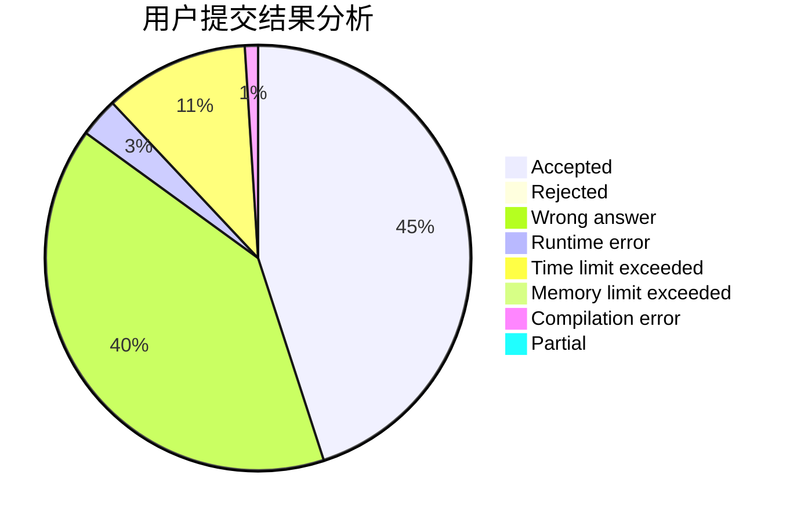
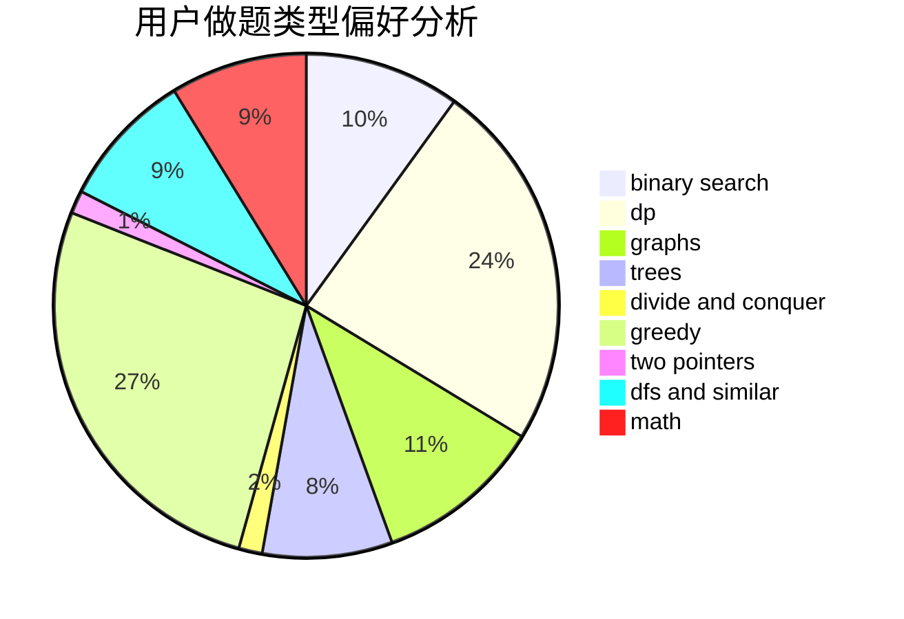

# hnust_dengqiang

<!-- tabs:start -->

#### **用户提交结果分析**

#### **用户做题类型偏好分析**

<!-- tabs:end -->
# 推荐题目
[1061F](https://codeforces.com/contest/1061/problem/F)
[781C](https://codeforces.com/contest/781/problem/C)
[414C](https://codeforces.com/contest/414/problem/C)
[498D](https://codeforces.com/contest/498/problem/D)
[843B](https://codeforces.com/contest/843/problem/B)
[474C](https://codeforces.com/contest/474/problem/C)
[761F](https://codeforces.com/contest/761/problem/F)
[11732](https://codeforces.com/contest/1173/problem/2)
[1078D](https://codeforces.com/contest/1078/problem/D)
[175B](https://codeforces.com/contest/175/problem/B)
