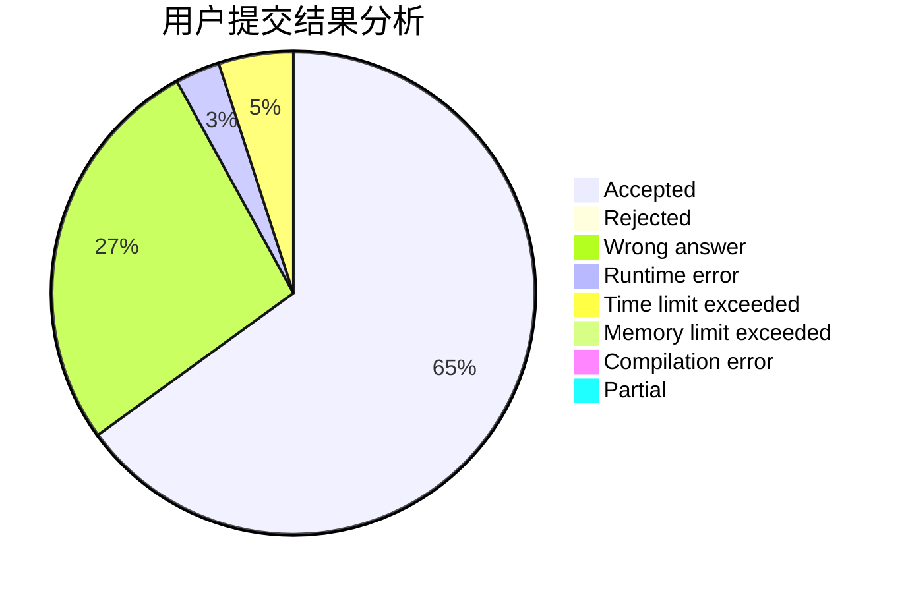
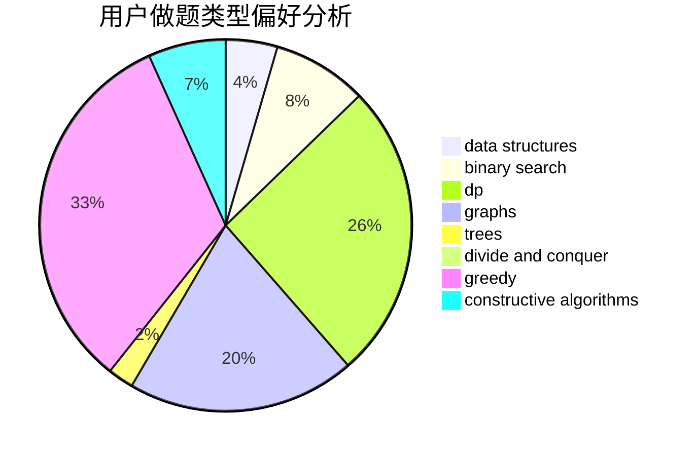
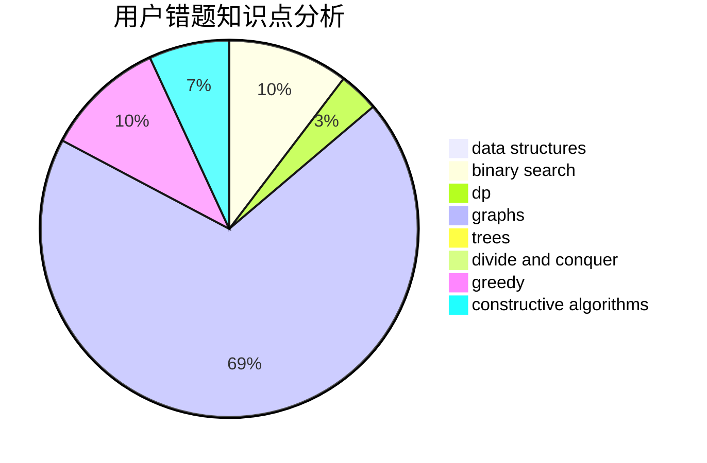

# Baigker

<!-- tabs:start -->

#### **用户提交结果分析**

#### **用户做题类型偏好分析**

#### **用户错题知识点分析**

<!-- tabs:end -->
# 推荐题目
[1360F](https://codeforces.com/contest/1360/problem/F)		bitmasks,
                        brute force,
                        constructive algorithms,
                        dp,
                        hashing,
                        strings		  
[475B](https://codeforces.com/contest/475/problem/B)		brute force,
                        dfs and similar,
                        graphs,
                        implementation		  
[1190B](https://codeforces.com/contest/1190/problem/B)		games		  
[1081A](https://codeforces.com/contest/1081/problem/A)		constructive algorithms,
                        math		  
[474E](https://codeforces.com/contest/474/problem/E)		binary search,
                        data structures,
                        dp,
                        sortings,
                        trees		  
[1509D](https://codeforces.com/contest/1509/problem/D)		dsu,graphs,sortings,trees		  
[1236B](https://codeforces.com/contest/1236/problem/B)		combinatorics,
                        math		  
[243C](https://codeforces.com/contest/243/problem/C)		dfs and similar,
                        implementation		  
[297E](https://codeforces.com/contest/297/problem/E)		data structures		  
[474F](https://codeforces.com/contest/474/problem/F)		data structures,
                        math,
                        number theory		  
