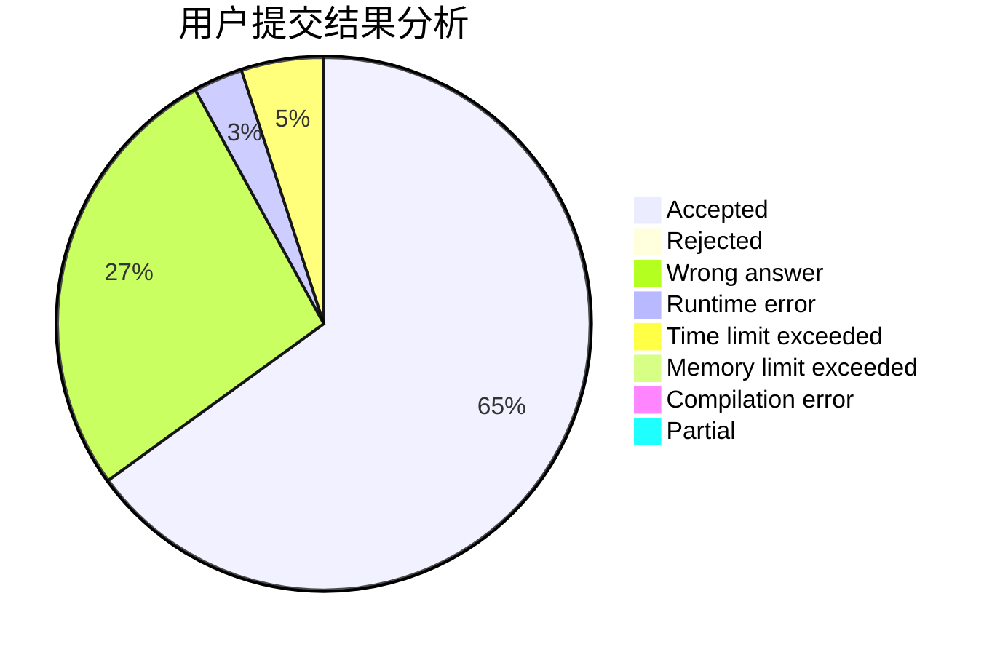
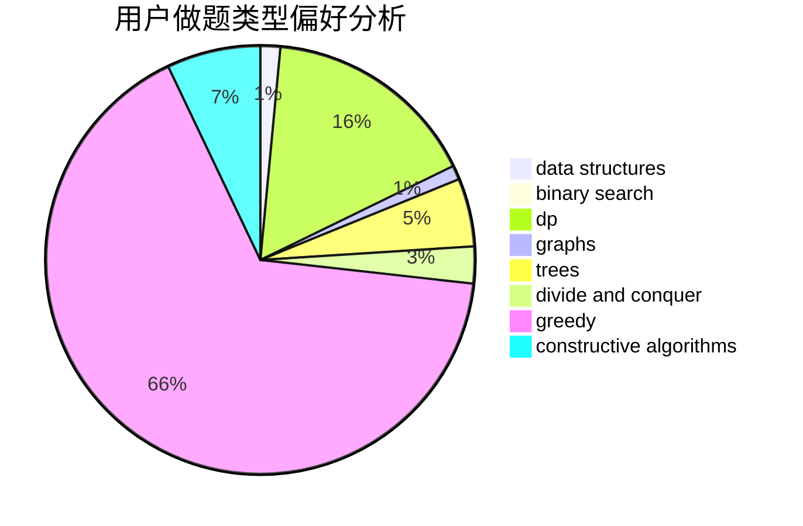
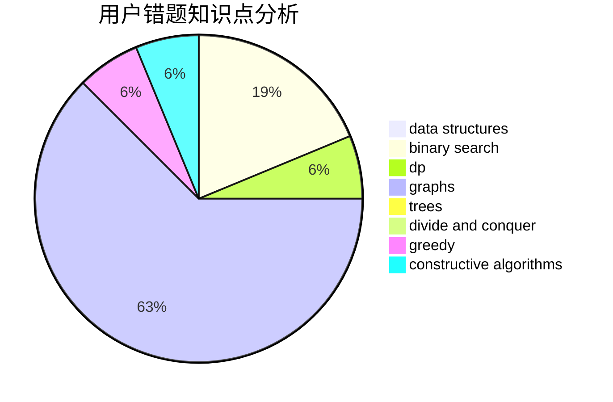

# Baigker

<!-- tabs:start -->

#### **用户提交结果分析**

#### **用户做题类型偏好分析**

#### **用户错题知识点分析**

<!-- tabs:end -->
# 推荐题目
[1368E](https://codeforces.com/contest/1368/problem/E)		constructive algorithms,
                        graphs,
                        greedy		  
[494B](https://codeforces.com/contest/494/problem/B)		dp,
                        strings		  
[11962](https://codeforces.com/contest/1196/problem/2)		dsu,graphs,sortings,trees		  
[1081D](https://codeforces.com/contest/1081/problem/D)		dsu,
                        graphs,
                        shortest paths,
                        sortings		  
[493D](https://codeforces.com/contest/493/problem/D)		constructive algorithms,
                        games,
                        math		  
[160B](https://codeforces.com/contest/160/problem/B)		greedy,
                        sortings		  
[1240E](https://codeforces.com/contest/1240/problem/E)		dsu,graphs,sortings,trees		  
[264D](https://codeforces.com/contest/264/problem/D)		dp,
                        two pointers		  
[315A](https://codeforces.com/contest/315/problem/A)		brute force		  
[493E](https://codeforces.com/contest/493/problem/E)		math		  
