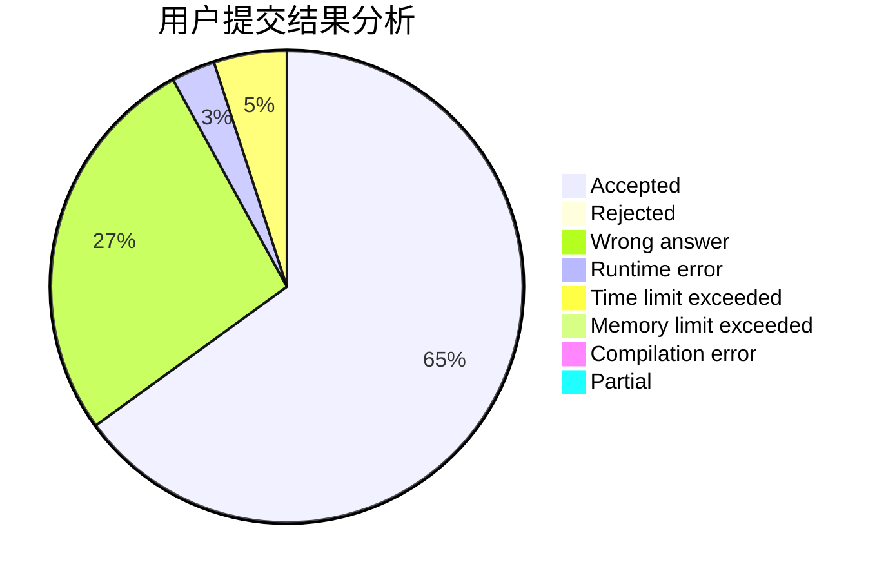
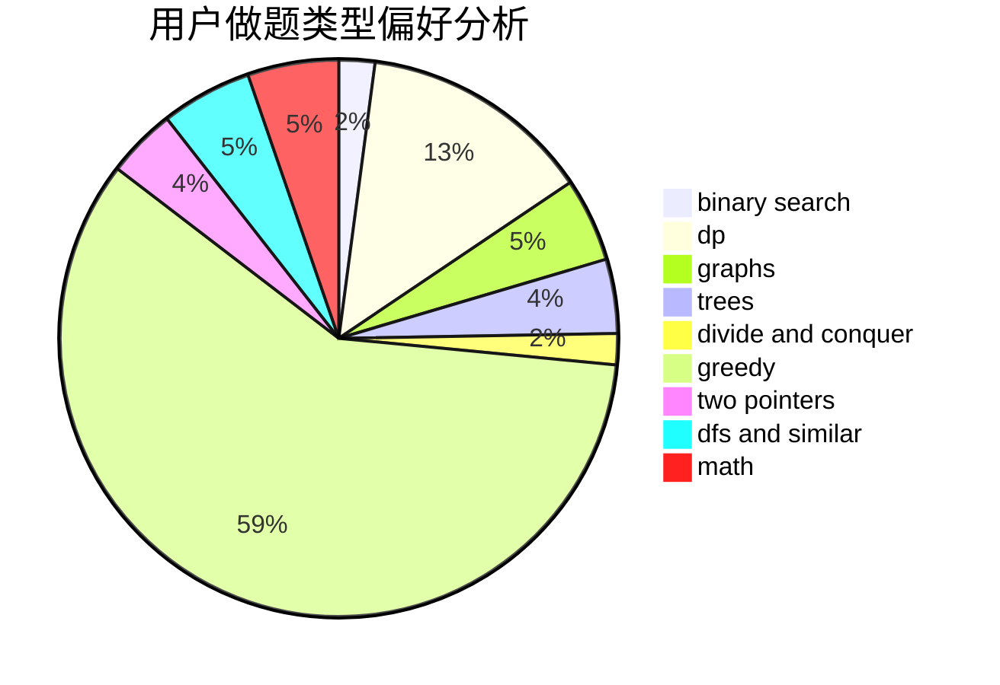

# Baigker

<!-- tabs:start -->

#### **用户提交结果分析**

#### **用户做题类型偏好分析**

<!-- tabs:end -->
# 推荐题目
[1368E](https://codeforces.com/contest/1368/problem/E)
[494B](https://codeforces.com/contest/494/problem/B)
[11962](https://codeforces.com/contest/1196/problem/2)
[1081D](https://codeforces.com/contest/1081/problem/D)
[493D](https://codeforces.com/contest/493/problem/D)
[160B](https://codeforces.com/contest/160/problem/B)
[1240E](https://codeforces.com/contest/1240/problem/E)
[264D](https://codeforces.com/contest/264/problem/D)
[315A](https://codeforces.com/contest/315/problem/A)
[493E](https://codeforces.com/contest/493/problem/E)
