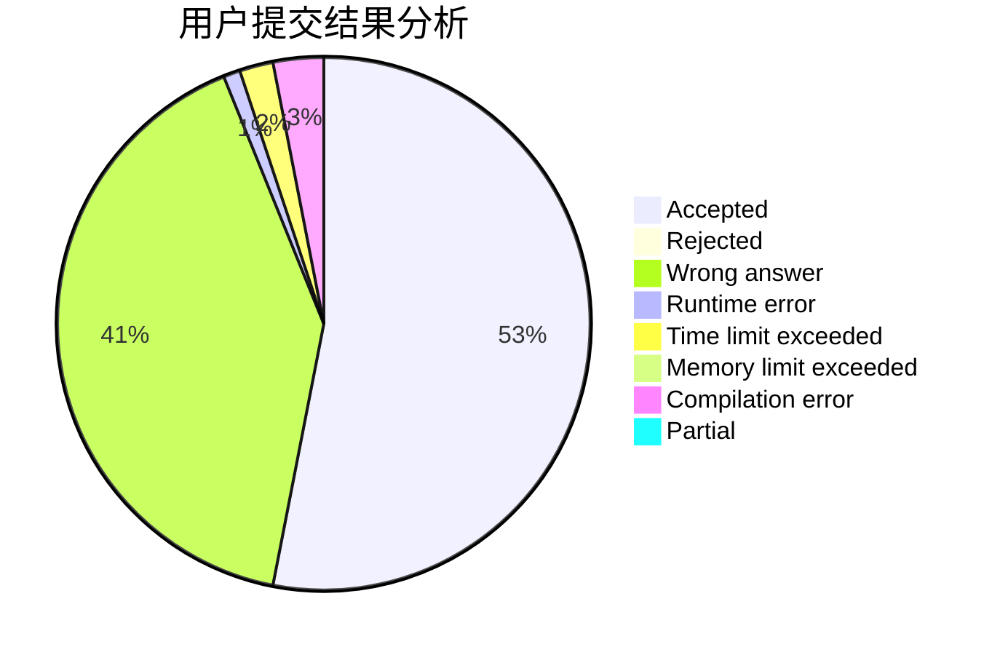
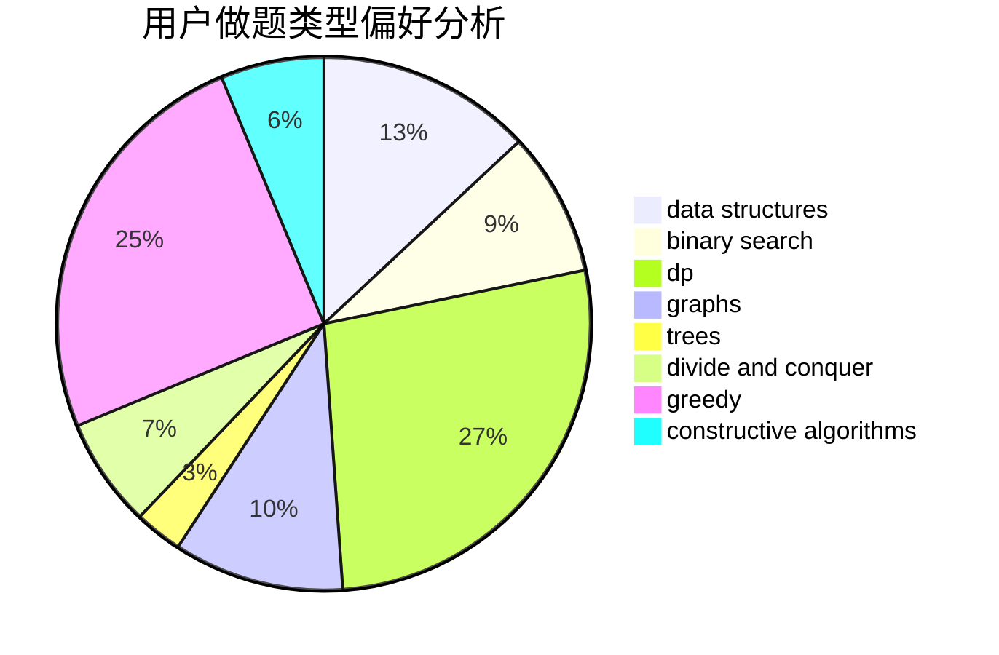
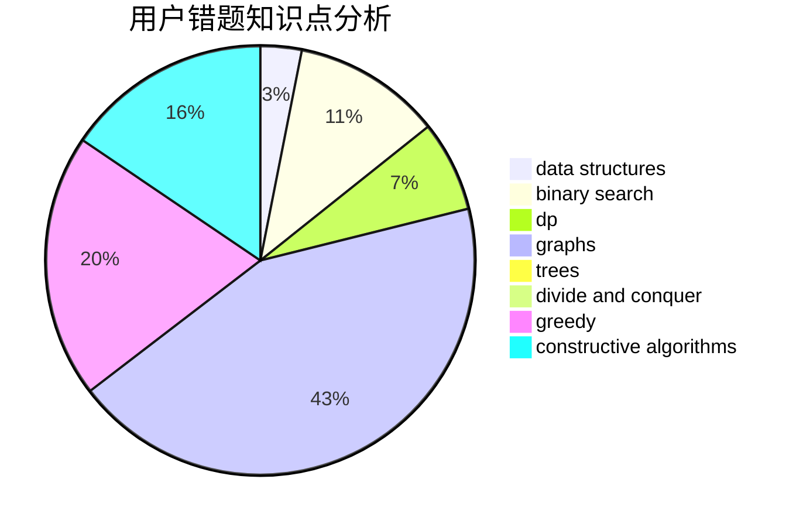

# hnust_fujia

<!-- tabs:start -->

#### **用户提交结果分析**

#### **用户做题类型偏好分析**

#### **用户错题知识点分析**

<!-- tabs:end -->
# 推荐题目
[494E](https://codeforces.com/contest/494/problem/E)		data structures,
                        games		  
[331C3](https://codeforces.com/contest/331C/problem/3)		dp		  
[1281B](https://codeforces.com/contest/1281/problem/B)		greedy		  
[472C](https://codeforces.com/contest/472/problem/C)		greedy		  
[1191F](https://codeforces.com/contest/1191/problem/F)		dsu,graphs,sortings,trees		  
[1102B](https://codeforces.com/contest/1102/problem/B)		greedy,
                        sortings		  
[34A](https://codeforces.com/contest/34/problem/A)		implementation		  
[1157C1](https://codeforces.com/contest/1157C/problem/1)		greedy		  
[1183A](https://codeforces.com/contest/1183/problem/A)		implementation		  
[848E](https://codeforces.com/contest/848/problem/E)		combinatorics,
                        divide and conquer,
                        dp,
                        fft,
                        math		  
