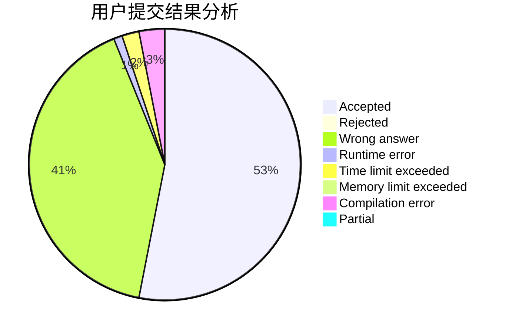
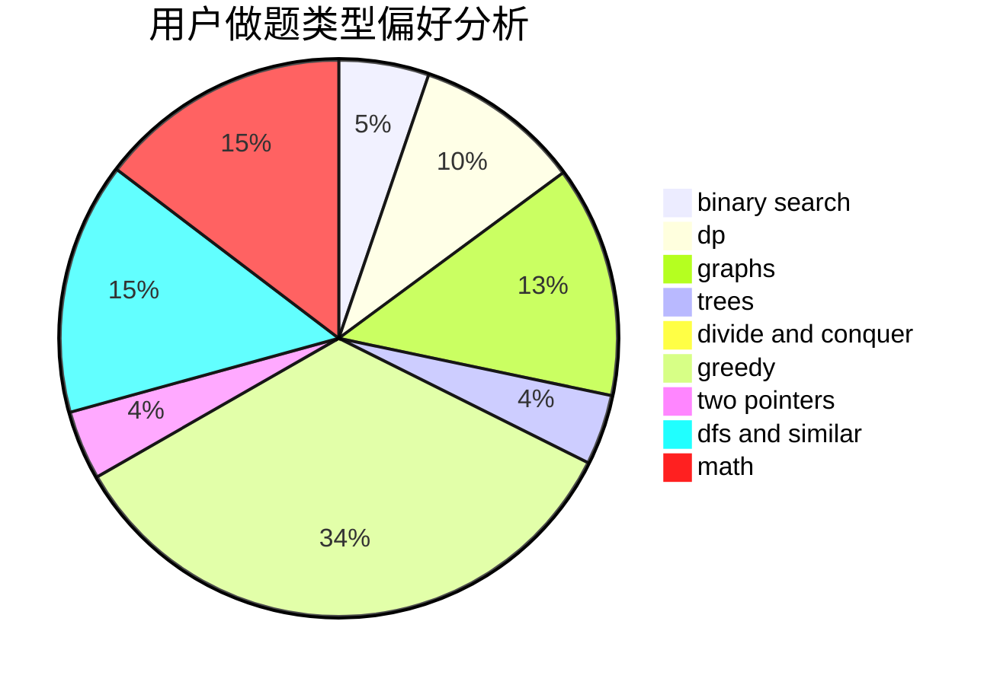

# hnust_fujia

<!-- tabs:start -->

#### **用户提交结果分析**

#### **用户做题类型偏好分析**

<!-- tabs:end -->
# 推荐题目
[515A](https://codeforces.com/contest/515/problem/A)
[359C](https://codeforces.com/contest/359/problem/C)
[1287B](https://codeforces.com/contest/1287/problem/B)
[490F](https://codeforces.com/contest/490/problem/F)
[1197E](https://codeforces.com/contest/1197/problem/E)
[1102E](https://codeforces.com/contest/1102/problem/E)
[376B](https://codeforces.com/contest/376/problem/B)
[1159C](https://codeforces.com/contest/1159/problem/C)
[1185D](https://codeforces.com/contest/1185/problem/D)
[868B](https://codeforces.com/contest/868/problem/B)
