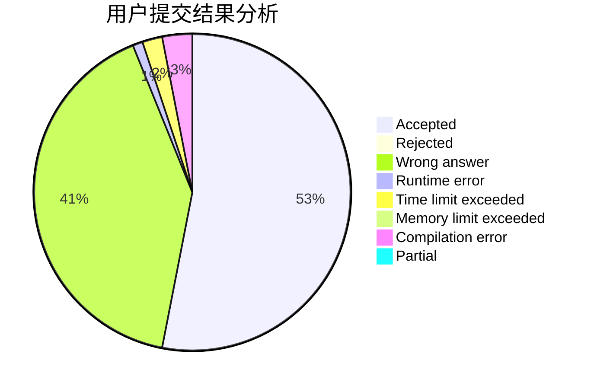
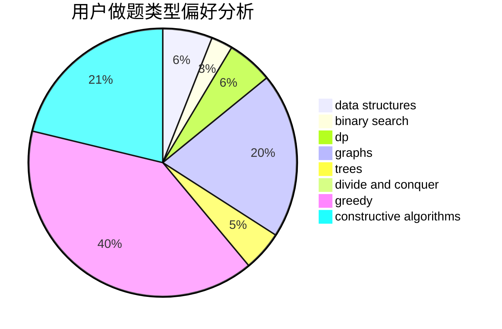
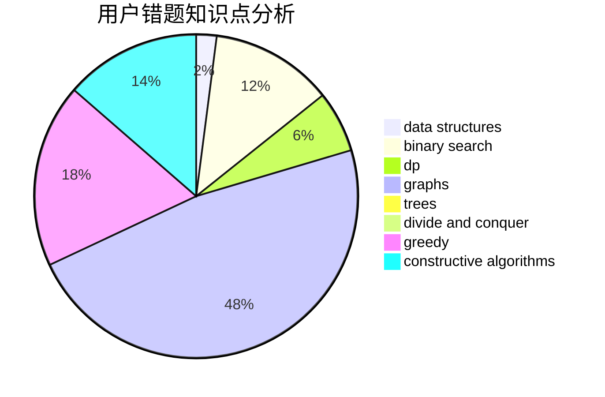

# hnust_fujia

<!-- tabs:start -->

#### **用户提交结果分析**

#### **用户做题类型偏好分析**

#### **用户错题知识点分析**

<!-- tabs:end -->
# 推荐题目
[515A](https://codeforces.com/contest/515/problem/A)		math		  
[359C](https://codeforces.com/contest/359/problem/C)		math,
                        number theory		  
[1287B](https://codeforces.com/contest/1287/problem/B)		brute force,
                        data structures,
                        implementation		  
[490F](https://codeforces.com/contest/490/problem/F)		data structures,
                        dfs and similar,
                        dp,
                        trees		  
[1197E](https://codeforces.com/contest/1197/problem/E)		binary search,
                        combinatorics,
                        data structures,
                        dp,
                        shortest paths,
                        sortings		  
[1102E](https://codeforces.com/contest/1102/problem/E)		combinatorics,
                        sortings		  
[376B](https://codeforces.com/contest/376/problem/B)		implementation		  
[1159C](https://codeforces.com/contest/1159/problem/C)		dsu,graphs,sortings,trees		  
[1185D](https://codeforces.com/contest/1185/problem/D)		implementation,
                        math		  
[868B](https://codeforces.com/contest/868/problem/B)		implementation		  
