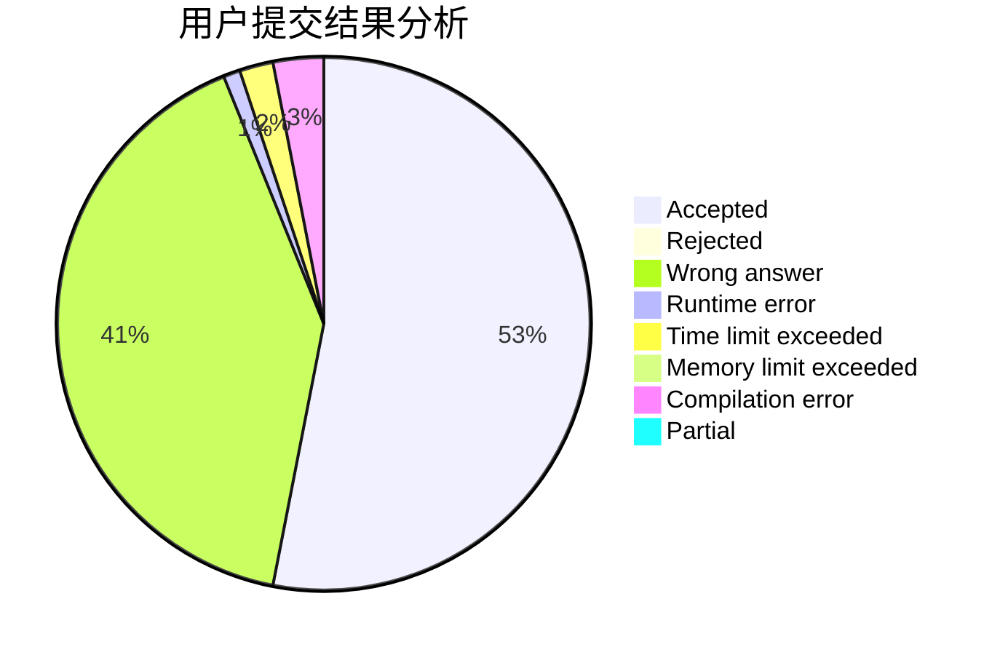
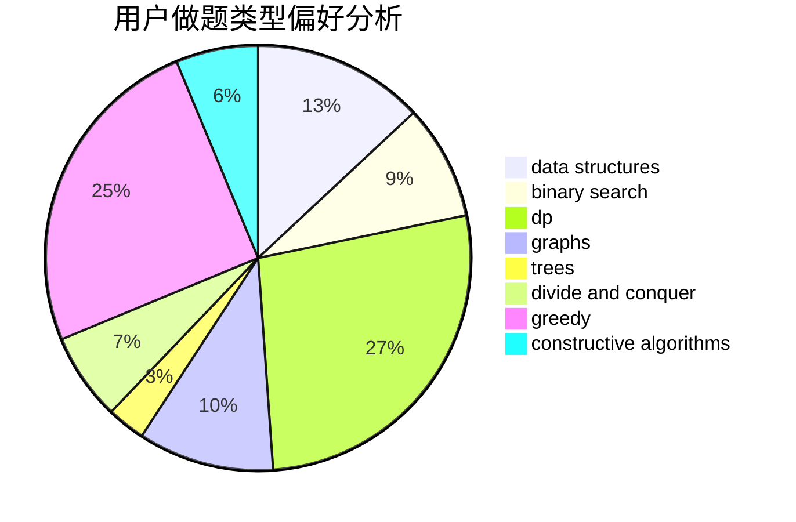
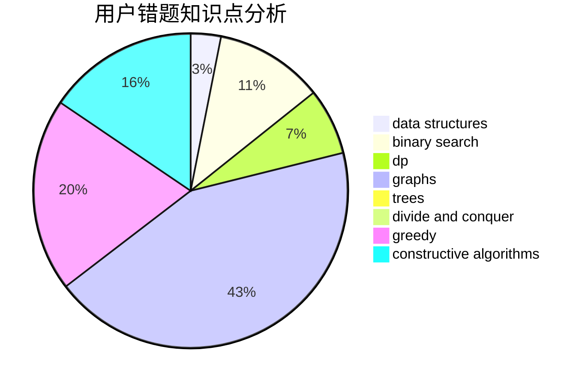

# hnust_fujia
<!-- tabs:start -->
#### **用户提交结果分析**

#### **用户做题类型偏好分析**

#### **用户错题知识点分析**

<!-- tabs:end -->
# 推荐题目
[Azamon Web Services](http://codeforces.com/problemset/problem/1281/B)		greedy		  
[Sharti](http://codeforces.com/problemset/problem/494/E)		data structures,
                        games		  
[The Great Julya Calendar](http://codeforces.com/problemset/problem/331/C3)		dp		  
[The Meeting Place Cannot Be Changed](http://codeforces.com/problemset/problem/780/B)		binary search		  
[Tokitsukaze and Strange Rectangle](https://codeforces.com/contest/1191/problem/F)		data structures,
                        divide and conquer,
                        sortings,
                        two pointers		  
[Bad Ugly Numbers](http://codeforces.com/problemset/problem/1326/A)		constructive algorithms,
                        number theory		  
[Days of Floral Colours](http://codeforces.com/problemset/problem/848/E)		combinatorics,
                        divide and conquer,
                        dp,
                        fft,
                        math		  
[Nearest Interesting Number](http://codeforces.com/problemset/problem/1183/A)		implementation		  
[Bearish Fanpages](https://codeforces.com/contest/674/problem/D)		nan		  
[Points and Segments (easy)](http://codeforces.com/problemset/problem/430/A)		constructive algorithms,
                        sortings		  
<!-- tabs:start -->
#### **data structures**
[Azamon Web Services](http://codeforces.com/problemset/problem/494/E)		data structures,
                        games		  
[Sharti](https://codeforces.com/contest/1191/problem/F)		data structures,
                        divide and conquer,
                        sortings,
                        two pointers		  
[The Great Julya Calendar](http://codeforces.com/problemset/problem/860/E)		data structures,
                        dfs and similar,
                        trees		  
[The Meeting Place Cannot Be Changed](http://codeforces.com/problemset/problem/848/C)		data structures,
                        divide and conquer		  
[Tokitsukaze and Strange Rectangle](http://codeforces.com/problemset/problem/862/E)		binary search,
                        data structures,
                        sortings		  
[Bad Ugly Numbers](https://codeforces.com/contest/860/problem/B)		data structures,
                        implementation,
                        sortings		  
[Days of Floral Colours](http://codeforces.com/problemset/problem/1492/C)		binary search,
                        data structures,
                        dp,
                        greedy,
                        two pointers		  
[Nearest Interesting Number](http://codeforces.com/problemset/problem/1490/G)		binary search,
                        data structures,
                        math		  
[Bearish Fanpages](http://codeforces.com/problemset/problem/1479/D)		binary search,
                        bitmasks,
                        brute force,
                        data structures,
                        probabilities,
                        trees		  
[Points and Segments (easy)](http://codeforces.com/problemset/problem/1497/A)		brute force,
                        data structures,
                        greedy,
                        sortings		  
#### **binary search**
[Azamon Web Services](http://codeforces.com/problemset/problem/780/B)		binary search		  
[Sharti](http://codeforces.com/problemset/problem/750/C)		binary search,
                        greedy,
                        math		  
[The Great Julya Calendar](http://codeforces.com/problemset/problem/919/B)		binary search,
                        brute force,
                        dp,
                        implementation,
                        number theory		  
[The Meeting Place Cannot Be Changed](http://codeforces.com/problemset/problem/862/E)		binary search,
                        data structures,
                        sortings		  
[Tokitsukaze and Strange Rectangle](http://codeforces.com/problemset/problem/1492/C)		binary search,
                        data structures,
                        dp,
                        greedy,
                        two pointers		  
[Bad Ugly Numbers](http://codeforces.com/problemset/problem/1463/D)		binary search,
                        constructive algorithms,
                        greedy,
                        two pointers		  
[Days of Floral Colours](http://codeforces.com/problemset/problem/1490/G)		binary search,
                        data structures,
                        math		  
[Nearest Interesting Number](http://codeforces.com/problemset/problem/1479/D)		binary search,
                        bitmasks,
                        brute force,
                        data structures,
                        probabilities,
                        trees		  
[Bearish Fanpages](http://codeforces.com/problemset/problem/1436/E)		binary search,
                        data structures,
                        two pointers		  
[Points and Segments (easy)](http://codeforces.com/problemset/problem/1461/D)		binary search,
                        brute force,
                        data structures,
                        divide and conquer,
                        implementation,
                        sortings		  
#### **dp**
[Azamon Web Services](http://codeforces.com/problemset/problem/331/C3)		dp		  
[Sharti](http://codeforces.com/problemset/problem/848/E)		combinatorics,
                        divide and conquer,
                        dp,
                        fft,
                        math		  
[The Great Julya Calendar](http://codeforces.com/problemset/problem/23/E)		dp		  
[The Meeting Place Cannot Be Changed](http://codeforces.com/problemset/problem/453/B)		bitmasks,
                        brute force,
                        dp		  
[Tokitsukaze and Strange Rectangle](http://codeforces.com/problemset/problem/919/B)		binary search,
                        brute force,
                        dp,
                        implementation,
                        number theory		  
[Bad Ugly Numbers](http://codeforces.com/problemset/problem/848/D)		combinatorics,
                        dp,
                        flows,
                        graphs		  
[Days of Floral Colours](http://codeforces.com/problemset/problem/516/D)		dfs and similar,
                        dp,
                        dsu,
                        trees,
                        two pointers		  
[Nearest Interesting Number](http://codeforces.com/problemset/problem/913/E)		bitmasks,
                        dp,
                        shortest paths		  
[Bearish Fanpages](http://codeforces.com/problemset/problem/1420/E)		dp,
                        greedy		  
[Points and Segments (easy)](http://codeforces.com/problemset/problem/1511/E)		combinatorics,
                        dp,
                        greedy,
                        math		  
#### **graph**
[Azamon Web Services](http://codeforces.com/problemset/problem/46/F)		dsu,
                        graphs		  
[Sharti](http://codeforces.com/problemset/problem/848/D)		combinatorics,
                        dp,
                        flows,
                        graphs		  
[The Great Julya Calendar](http://codeforces.com/problemset/problem/662/B)		dfs and similar,
                        graphs		  
[The Meeting Place Cannot Be Changed](http://codeforces.com/problemset/problem/1487/C)		brute force,
                        constructive algorithms,
                        dfs and similar,
                        graphs,
                        greedy,
                        implementation,
                        math		  
[Tokitsukaze and Strange Rectangle](http://codeforces.com/problemset/problem/1437/C)		dp,
                        flows,
                        graph matchings,
                        greedy,
                        math,
                        sortings		  
[Bad Ugly Numbers](http://codeforces.com/problemset/problem/1470/D)		constructive algorithms,
                        dfs and similar,
                        graph matchings,
                        graphs,
                        greedy		  
[Days of Floral Colours](http://codeforces.com/problemset/problem/1476/C)		dp,
                        graphs,
                        greedy		  
[Nearest Interesting Number](http://codeforces.com/problemset/problem/1304/D)		constructive algorithms,
                        graphs,
                        greedy,
                        two pointers		  
[Bearish Fanpages](http://codeforces.com/problemset/problem/1475/C)		combinatorics,
                        graphs,
                        math		  
[Points and Segments (easy)](http://codeforces.com/problemset/problem/553/E)		dp,
                        fft,
                        graphs,
                        math,
                        probabilities		  
#### **trees**
[Azamon Web Services](http://codeforces.com/problemset/problem/860/E)		data structures,
                        dfs and similar,
                        trees		  
[Sharti](http://codeforces.com/problemset/problem/516/D)		dfs and similar,
                        dp,
                        dsu,
                        trees,
                        two pointers		  
[The Great Julya Calendar](http://codeforces.com/problemset/problem/1479/D)		binary search,
                        bitmasks,
                        brute force,
                        data structures,
                        probabilities,
                        trees		  
[The Meeting Place Cannot Be Changed](http://codeforces.com/problemset/problem/1511/C)		brute force,
                        data structures,
                        implementation,
                        trees		  
[Tokitsukaze and Strange Rectangle](http://codeforces.com/problemset/problem/1499/F)		combinatorics,
                        dfs and similar,
                        dp,
                        trees		  
[Bad Ugly Numbers](http://codeforces.com/problemset/problem/1491/E)		brute force,
                        dfs and similar,
                        divide and conquer,
                        number theory,
                        trees		  
[Days of Floral Colours](http://codeforces.com/problemset/problem/1466/D)		data structures,
                        greedy,
                        sortings,
                        trees		  
[Nearest Interesting Number](http://codeforces.com/problemset/problem/1495/D)		combinatorics,
                        dfs and similar,
                        graphs,
                        math,
                        shortest paths,
                        trees		  
[Bearish Fanpages](http://codeforces.com/problemset/problem/1303/G)		data structures,
                        divide and conquer,
                        geometry,
                        trees		  
[Points and Segments (easy)](http://codeforces.com/problemset/problem/1454/E)		combinatorics,
                        dfs and similar,
                        graphs,
                        trees		  
#### **divide and conquer**
[Azamon Web Services](https://codeforces.com/contest/1191/problem/F)		data structures,
                        divide and conquer,
                        sortings,
                        two pointers		  
[Sharti](http://codeforces.com/problemset/problem/848/E)		combinatorics,
                        divide and conquer,
                        dp,
                        fft,
                        math		  
[The Great Julya Calendar](http://codeforces.com/problemset/problem/848/C)		data structures,
                        divide and conquer		  
[The Meeting Place Cannot Be Changed](http://codeforces.com/problemset/problem/1461/D)		binary search,
                        brute force,
                        data structures,
                        divide and conquer,
                        implementation,
                        sortings		  
[Tokitsukaze and Strange Rectangle](http://codeforces.com/problemset/problem/1466/G)		combinatorics,
                        divide and conquer,
                        hashing,
                        math,
                        string suffix structures,
                        strings		  
[Bad Ugly Numbers](http://codeforces.com/problemset/problem/1490/D)		dfs and similar,
                        divide and conquer,
                        implementation		  
[Days of Floral Colours](https://codeforces.com/contest/1483/problem/C)		data structures,
                        divide and conquer,
                        dp		  
[Nearest Interesting Number](http://codeforces.com/problemset/problem/1491/E)		brute force,
                        dfs and similar,
                        divide and conquer,
                        number theory,
                        trees		  
[Bearish Fanpages](http://codeforces.com/problemset/problem/1303/G)		data structures,
                        divide and conquer,
                        geometry,
                        trees		  
[Points and Segments (easy)](http://codeforces.com/problemset/problem/1494/D)		constructive algorithms,
                        data structures,
                        dfs and similar,
                        divide and conquer,
                        dsu,
                        greedy,
                        sortings,
                        trees		  
#### **greedy**
[Azamon Web Services](http://codeforces.com/problemset/problem/1281/B)		greedy		  
[Sharti](http://codeforces.com/problemset/problem/1157/C1)		greedy		  
[The Great Julya Calendar](http://codeforces.com/problemset/problem/1102/B)		greedy,
                        sortings		  
[The Meeting Place Cannot Be Changed](http://codeforces.com/problemset/problem/472/C)		greedy		  
[Tokitsukaze and Strange Rectangle](https://codeforces.com/contest/1465/problem/F)		greedy,
                        math		  
[Bad Ugly Numbers](http://codeforces.com/problemset/problem/118/C)		brute force,
                        greedy,
                        sortings,
                        strings		  
[Days of Floral Colours](http://codeforces.com/problemset/problem/909/A)		brute force,
                        greedy,
                        sortings		  
[Nearest Interesting Number](http://codeforces.com/problemset/problem/750/C)		binary search,
                        greedy,
                        math		  
[Bearish Fanpages](http://codeforces.com/problemset/problem/1118/D1)		brute force,
                        greedy		  
[Points and Segments (easy)](http://codeforces.com/problemset/problem/500/C)		constructive algorithms,
                        greedy,
                        implementation,
                        math		  
#### **constructive algorithms**
[Azamon Web Services](http://codeforces.com/problemset/problem/1326/A)		constructive algorithms,
                        number theory		  
[Sharti](http://codeforces.com/problemset/problem/430/A)		constructive algorithms,
                        sortings		  
[The Great Julya Calendar](https://codeforces.com/contest/1113/problem/D)		constructive algorithms,
                        hashing,
                        strings		  
[The Meeting Place Cannot Be Changed](http://codeforces.com/problemset/problem/621/D)		brute force,
                        constructive algorithms,
                        math		  
[Tokitsukaze and Strange Rectangle](http://codeforces.com/problemset/problem/459/C)		combinatorics,
                        constructive algorithms,
                        math		  
[Bad Ugly Numbers](http://codeforces.com/problemset/problem/500/C)		constructive algorithms,
                        greedy,
                        implementation,
                        math		  
[Days of Floral Colours](https://codeforces.com/contest/1173/problem/F)		constructive algorithms		  
[Nearest Interesting Number](http://codeforces.com/problemset/problem/1174/D)		bitmasks,
                        constructive algorithms		  
[Bearish Fanpages](http://codeforces.com/problemset/problem/1450/C1)		constructive algorithms,
                        math		  
[Points and Segments (easy)](https://codeforces.com/contest/1509/problem/D)		constructive algorithms,
                        greedy,
                        implementation,
                        math,
                        strings,
                        two pointers		  
#### **sortings**
[Azamon Web Services](https://codeforces.com/contest/1191/problem/F)		data structures,
                        divide and conquer,
                        sortings,
                        two pointers		  
[Sharti](http://codeforces.com/problemset/problem/430/A)		constructive algorithms,
                        sortings		  
[The Great Julya Calendar](http://codeforces.com/problemset/problem/1102/B)		greedy,
                        sortings		  
[The Meeting Place Cannot Be Changed](http://codeforces.com/problemset/problem/118/C)		brute force,
                        greedy,
                        sortings,
                        strings		  
[Tokitsukaze and Strange Rectangle](http://codeforces.com/problemset/problem/909/A)		brute force,
                        greedy,
                        sortings		  
[Bad Ugly Numbers](http://codeforces.com/problemset/problem/862/E)		binary search,
                        data structures,
                        sortings		  
[Days of Floral Colours](https://codeforces.com/contest/860/problem/B)		data structures,
                        implementation,
                        sortings		  
[Nearest Interesting Number](https://codeforces.com/contest/1496/problem/C)		geometry,
                        greedy,
                        math,
                        sortings		  
[Bearish Fanpages](http://codeforces.com/problemset/problem/1495/A)		geometry,
                        greedy,
                        math,
                        sortings		  
[Points and Segments (easy)](http://codeforces.com/problemset/problem/1497/A)		brute force,
                        data structures,
                        greedy,
                        sortings		  
<!-- tabs:end -->
