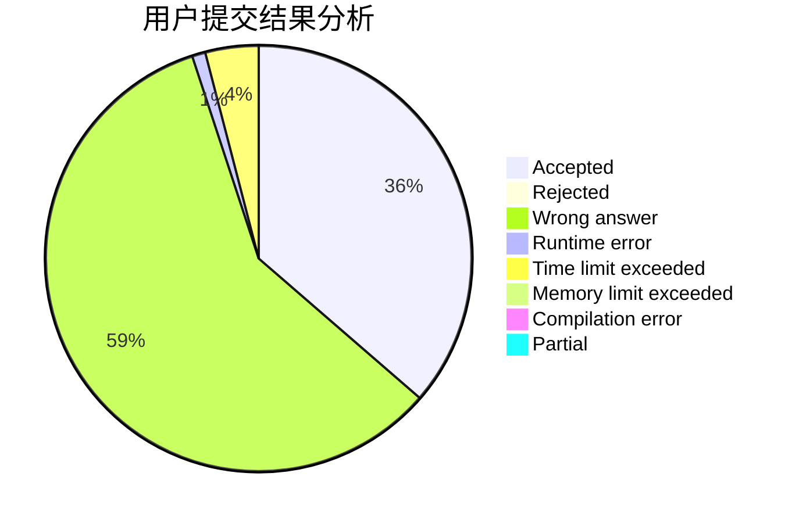
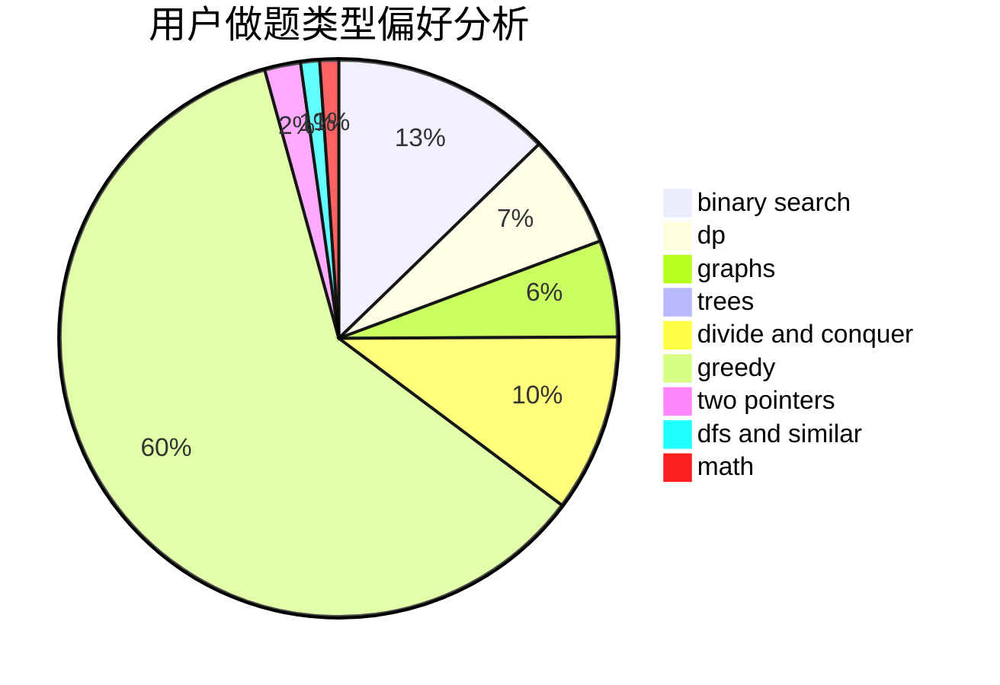

# hnust_gongyufei

<!-- tabs:start -->

#### **用户提交结果分析**

#### **用户做题类型偏好分析**

<!-- tabs:end -->
# 推荐题目
[1435C](https://codeforces.com/contest/1435/problem/C)
[1065B](https://codeforces.com/contest/1065/problem/B)
[261D](https://codeforces.com/contest/261/problem/D)
[1047D](https://codeforces.com/contest/1047/problem/D)
[1055A](https://codeforces.com/contest/1055/problem/A)
[754C](https://codeforces.com/contest/754/problem/C)
[11162](https://codeforces.com/contest/1116/problem/2)
[287C](https://codeforces.com/contest/287/problem/C)
[309A](https://codeforces.com/contest/309/problem/A)
[770B](https://codeforces.com/contest/770/problem/B)
