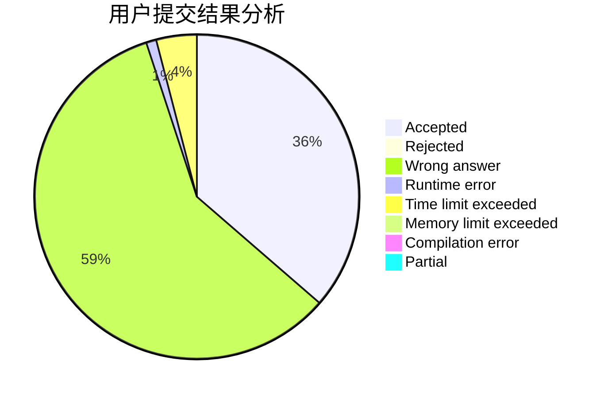
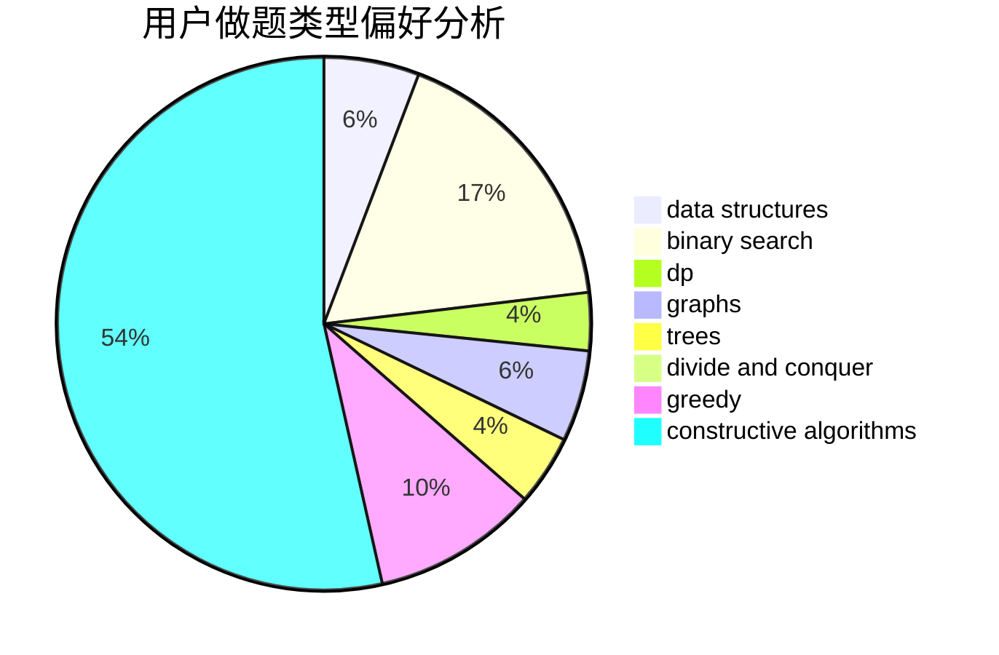
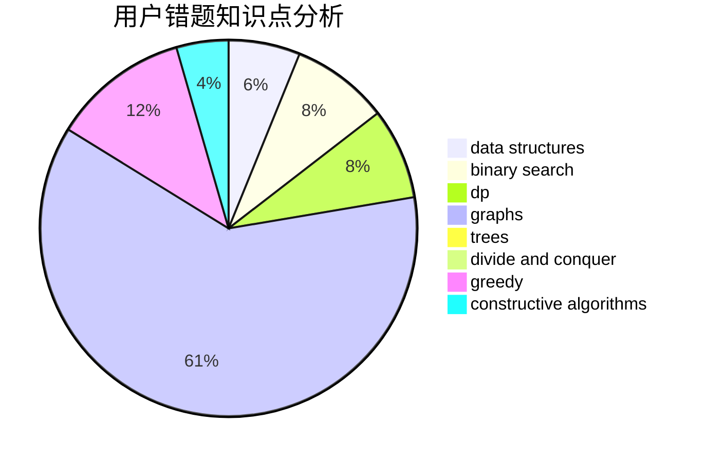

# hnust_gongyufei

<!-- tabs:start -->

#### **用户提交结果分析**

#### **用户做题类型偏好分析**

#### **用户错题知识点分析**

<!-- tabs:end -->
# 推荐题目
[1426F](https://codeforces.com/contest/1426/problem/F)		combinatorics,
                        dp,
                        strings		  
[1064E](https://codeforces.com/contest/1064/problem/E)		dsu,graphs,sortings,trees		  
[240F](https://codeforces.com/contest/240/problem/F)		data structures		  
[1047A](https://codeforces.com/contest/1047/problem/A)		math		  
[1054F](https://codeforces.com/contest/1054/problem/F)		flows,
                        graph matchings		  
[734A](https://codeforces.com/contest/734/problem/A)		implementation,
                        strings		  
[1115G2](https://codeforces.com/contest/1115G/problem/2)		*special problem		  
[271A](https://codeforces.com/contest/271/problem/A)		brute force		  
[292D](https://codeforces.com/contest/292/problem/D)		data structures,
                        dfs and similar,
                        dp,
                        dsu		  
[750E](https://codeforces.com/contest/750/problem/E)		data structures,
                        divide and conquer,
                        dp,
                        matrices		  
