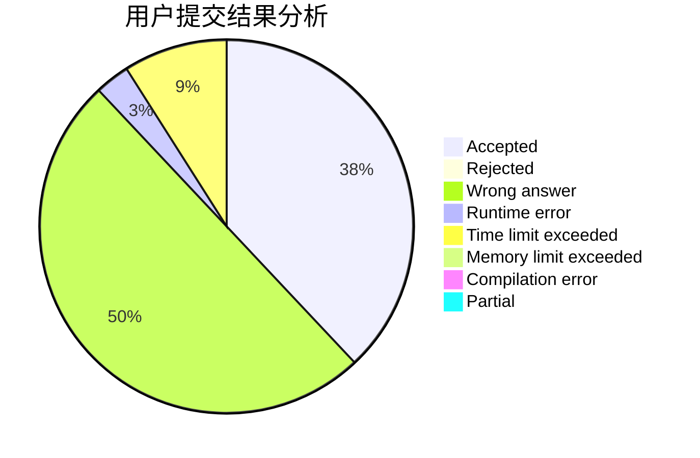
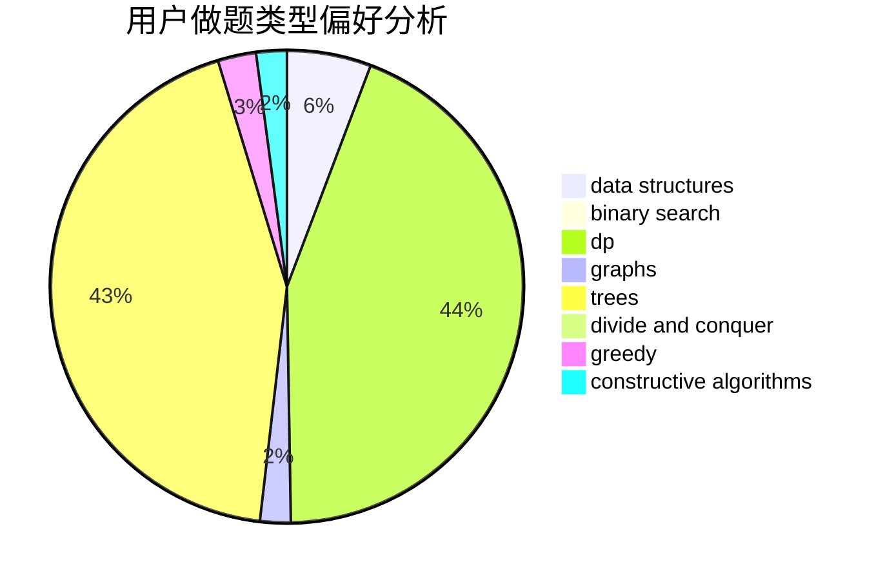

# hnust_hourunlong

<!-- tabs:start -->

#### **用户提交结果分析**

#### **用户做题类型偏好分析**

#### **用户错题知识点分析**

<!-- tabs:end -->
# 推荐题目
[429D](https://codeforces.com/contest/429/problem/D)		data structures,
                        divide and conquer,
                        geometry		  
[1020A](https://codeforces.com/contest/1020/problem/A)		math		  
[700B](https://codeforces.com/contest/700/problem/B)		dfs and similar,
                        dp,
                        graphs,
                        trees		  
[1129C](https://codeforces.com/contest/1129/problem/C)		binary search,
                        data structures,
                        dp,
                        hashing,
                        sortings,
                        string suffix structures,
                        strings		  
[1278A](https://codeforces.com/contest/1278/problem/A)		brute force,
                        implementation,
                        strings		  
[611B](https://codeforces.com/contest/611/problem/B)		bitmasks,
                        brute force,
                        implementation		  
[457D](https://codeforces.com/contest/457/problem/D)		combinatorics,
                        math,
                        probabilities		  
[76C](https://codeforces.com/contest/76/problem/C)		bitmasks,
                        dp,
                        math		  
[461D](https://codeforces.com/contest/461/problem/D)		dsu,
                        math		  
[1450E](https://codeforces.com/contest/1450/problem/E)		constructive algorithms,
                        dfs and similar,
                        graphs,
                        shortest paths		  
