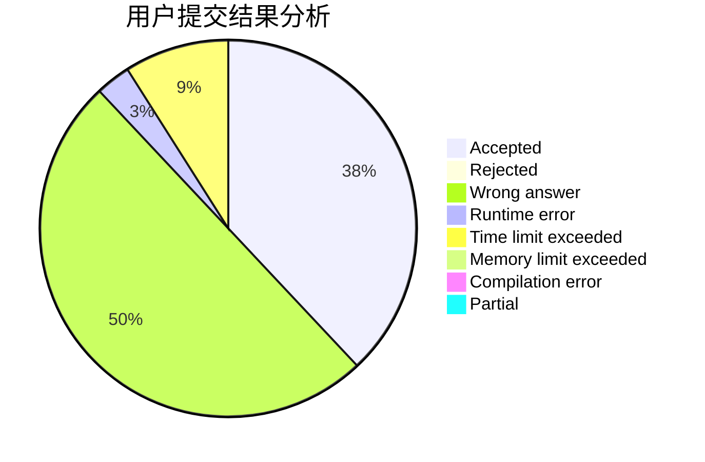
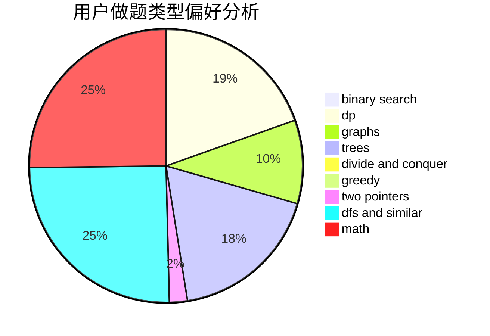

# hnust_hourunlong

<!-- tabs:start -->

#### **用户提交结果分析**

#### **用户做题类型偏好分析**

<!-- tabs:end -->
# 推荐题目
[429D](https://codeforces.com/contest/429/problem/D)
[1020A](https://codeforces.com/contest/1020/problem/A)
[700B](https://codeforces.com/contest/700/problem/B)
[1129C](https://codeforces.com/contest/1129/problem/C)
[1278A](https://codeforces.com/contest/1278/problem/A)
[611B](https://codeforces.com/contest/611/problem/B)
[457D](https://codeforces.com/contest/457/problem/D)
[76C](https://codeforces.com/contest/76/problem/C)
[461D](https://codeforces.com/contest/461/problem/D)
[1450E](https://codeforces.com/contest/1450/problem/E)
