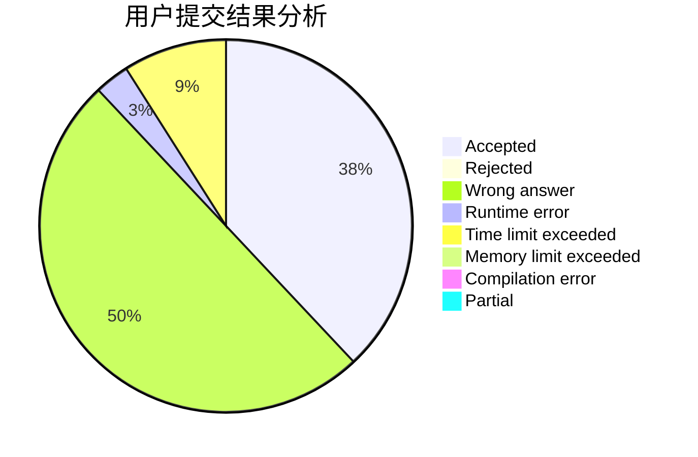
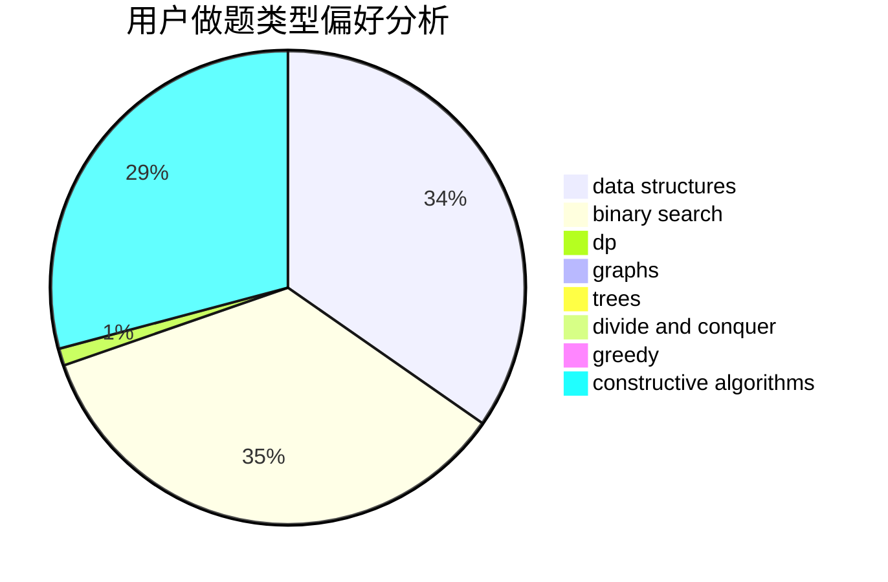

# hnust_hourunlong

<!-- tabs:start -->

#### **用户提交结果分析**

#### **用户做题类型偏好分析**

#### **用户错题知识点分析**

<!-- tabs:end -->
# 推荐题目
[3C](https://codeforces.com/contest/3/problem/C)		brute force,
                        games,
                        implementation		  
[1019E](https://codeforces.com/contest/1019/problem/E)		data structures,
                        divide and conquer,
                        trees		  
[676B](https://codeforces.com/contest/676/problem/B)		implementation,
                        math,
                        math		  
[1119G](https://codeforces.com/contest/1119/problem/G)		constructive algorithms,
                        implementation		  
[1269A](https://codeforces.com/contest/1269/problem/A)		brute force,
                        math		  
[591D](https://codeforces.com/contest/591/problem/D)		dsu,graphs,sortings,trees		  
[436D](https://codeforces.com/contest/436/problem/D)		dp		  
[750C](https://codeforces.com/contest/750/problem/C)		binary search,
                        greedy,
                        math		  
[43B](https://codeforces.com/contest/43/problem/B)		implementation,
                        strings		  
[1439C](https://codeforces.com/contest/1439/problem/C)		binary search,
                        data structures,
                        divide and conquer,
                        greedy,
                        implementation		  
