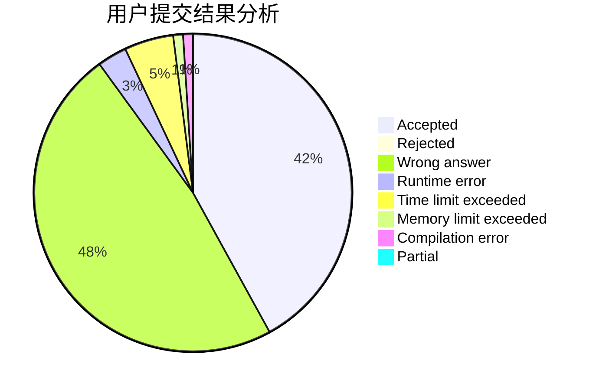
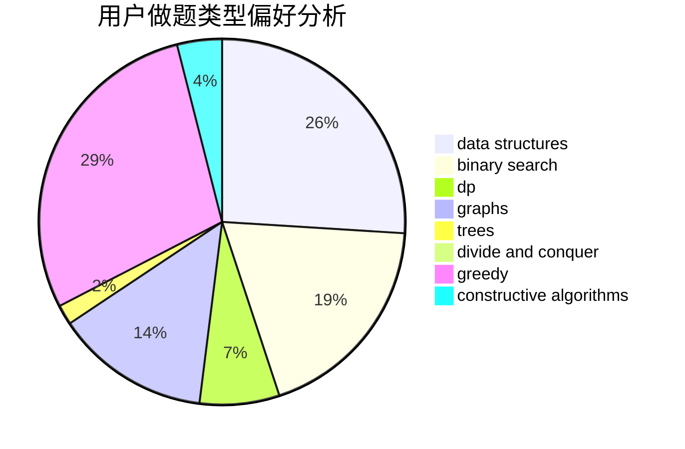

# hnust_jiangyixiang

<!-- tabs:start -->

#### **用户提交结果分析**

#### **用户做题类型偏好分析**

#### **用户错题知识点分析**

<!-- tabs:end -->
# 推荐题目
[181B](https://codeforces.com/contest/181/problem/B)		binary search,
                        brute force		  
[744D](https://codeforces.com/contest/744/problem/D)		geometry		  
[864C](https://codeforces.com/contest/864/problem/C)		greedy,
                        implementation,
                        math		  
[735A](https://codeforces.com/contest/735/problem/A)		implementation,
                        strings		  
[1384A](https://codeforces.com/contest/1384/problem/A)		constructive algorithms,
                        greedy,
                        strings		  
[1301D](https://codeforces.com/contest/1301/problem/D)		constructive algorithms,
                        graphs,
                        implementation		  
[714E](https://codeforces.com/contest/714/problem/E)		dsu,graphs,sortings,trees		  
[1031C](https://codeforces.com/contest/1031/problem/C)		greedy		  
[1042A](https://codeforces.com/contest/1042/problem/A)		binary search,
                        implementation		  
[1213G](https://codeforces.com/contest/1213/problem/G)		divide and conquer,
                        dsu,
                        graphs,
                        sortings,
                        trees		  
