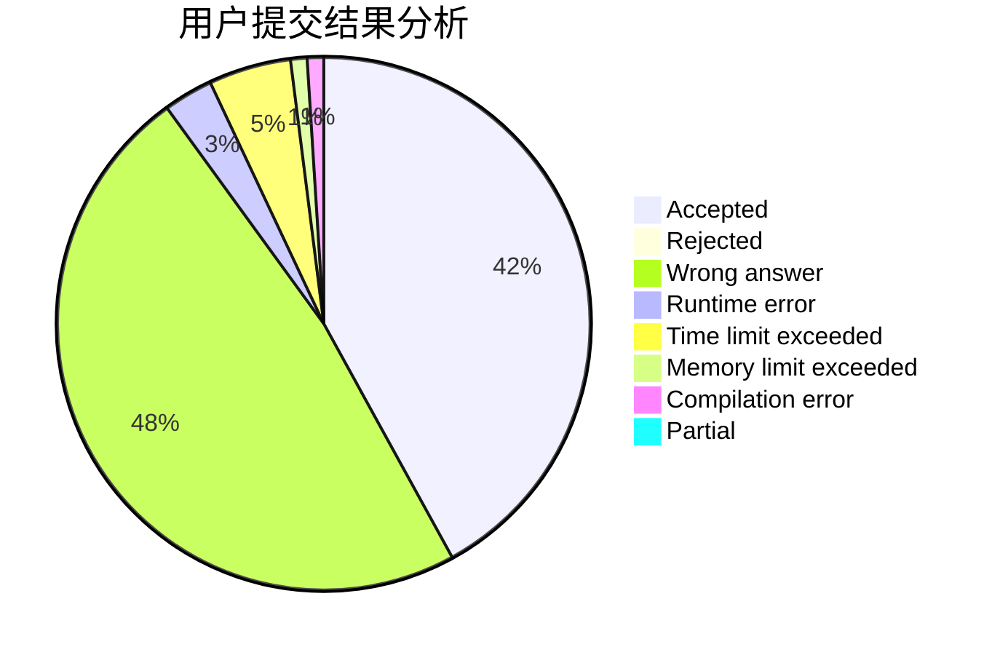
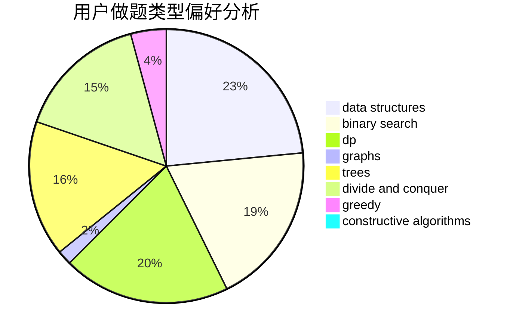

# hnust_jiangyixiang

<!-- tabs:start -->

#### **用户提交结果分析**

#### **用户做题类型偏好分析**

#### **用户错题知识点分析**

<!-- tabs:end -->
# 推荐题目
[208D](https://codeforces.com/contest/208/problem/D)		implementation		  
[764E](https://codeforces.com/contest/764/problem/E)		dsu,graphs,sortings,trees		  
[883M](https://codeforces.com/contest/883/problem/M)		greedy,
                        math		  
[755G](https://codeforces.com/contest/755/problem/G)		combinatorics,
                        divide and conquer,
                        dp,
                        fft,
                        math,
                        number theory		  
[1393D](https://codeforces.com/contest/1393/problem/D)		dfs and similar,
                        dp,
                        implementation,
                        shortest paths		  
[1311A](https://codeforces.com/contest/1311/problem/A)		greedy,
                        implementation,
                        math		  
[733B](https://codeforces.com/contest/733/problem/B)		math		  
[1032E](https://codeforces.com/contest/1032/problem/E)		dp,
                        math		  
[1042D](https://codeforces.com/contest/1042/problem/D)		data structures,
                        divide and conquer,
                        two pointers		  
[1219B](https://codeforces.com/contest/1219/problem/B)		dsu,graphs,sortings,trees		  
