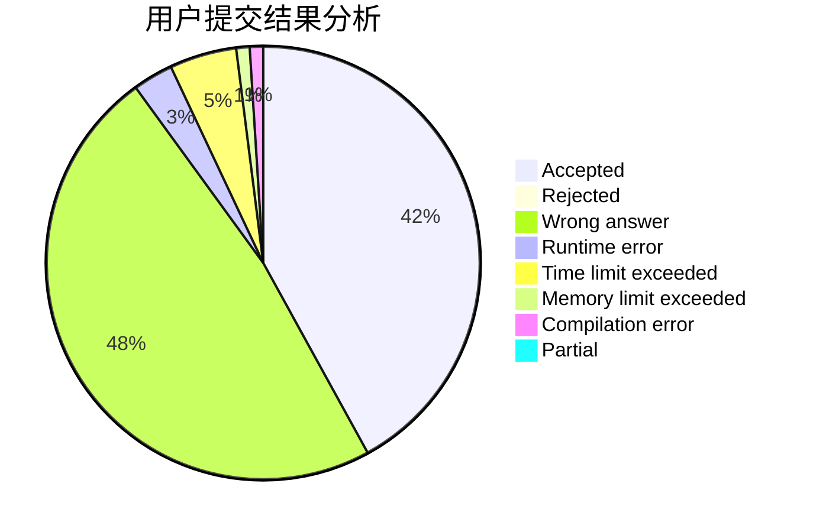
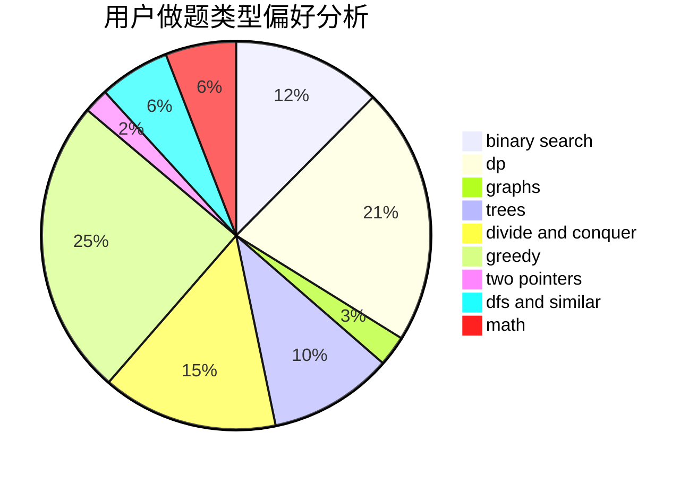

# hnust_jiangyixiang

<!-- tabs:start -->

#### **用户提交结果分析**

#### **用户做题类型偏好分析**

<!-- tabs:end -->
# 推荐题目
[208D](https://codeforces.com/contest/208/problem/D)
[764E](https://codeforces.com/contest/764/problem/E)
[883M](https://codeforces.com/contest/883/problem/M)
[755G](https://codeforces.com/contest/755/problem/G)
[1393D](https://codeforces.com/contest/1393/problem/D)
[1311A](https://codeforces.com/contest/1311/problem/A)
[733B](https://codeforces.com/contest/733/problem/B)
[1032E](https://codeforces.com/contest/1032/problem/E)
[1042D](https://codeforces.com/contest/1042/problem/D)
[1219B](https://codeforces.com/contest/1219/problem/B)
