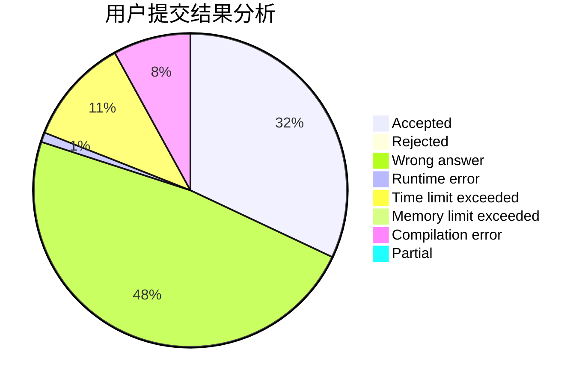
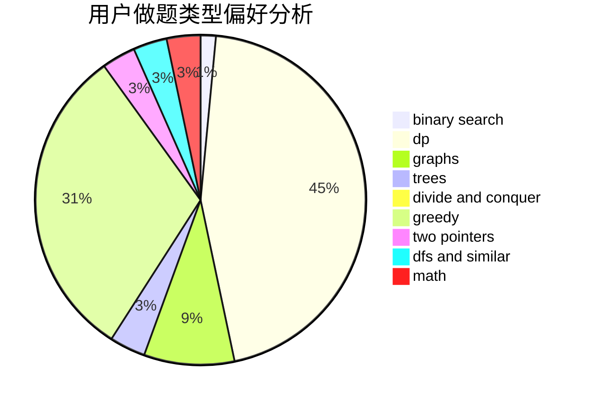

# hnust_jishaohua

<!-- tabs:start -->

#### **用户提交结果分析**

#### **用户做题类型偏好分析**

<!-- tabs:end -->
# 推荐题目
[396C](https://codeforces.com/contest/396/problem/C)
[1466H](https://codeforces.com/contest/1466/problem/H)
[1444E](https://codeforces.com/contest/1444/problem/E)
[845D](https://codeforces.com/contest/845/problem/D)
[718D](https://codeforces.com/contest/718/problem/D)
[1164F](https://codeforces.com/contest/1164/problem/F)
[791B](https://codeforces.com/contest/791/problem/B)
[914E](https://codeforces.com/contest/914/problem/E)
[380D](https://codeforces.com/contest/380/problem/D)
[12542](https://codeforces.com/contest/1254/problem/2)
