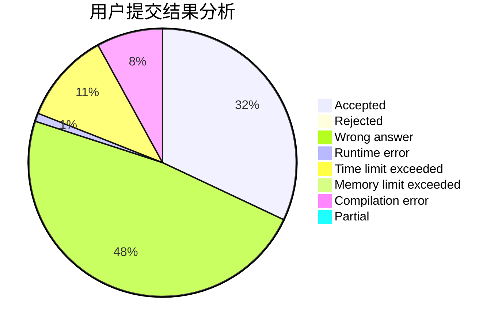
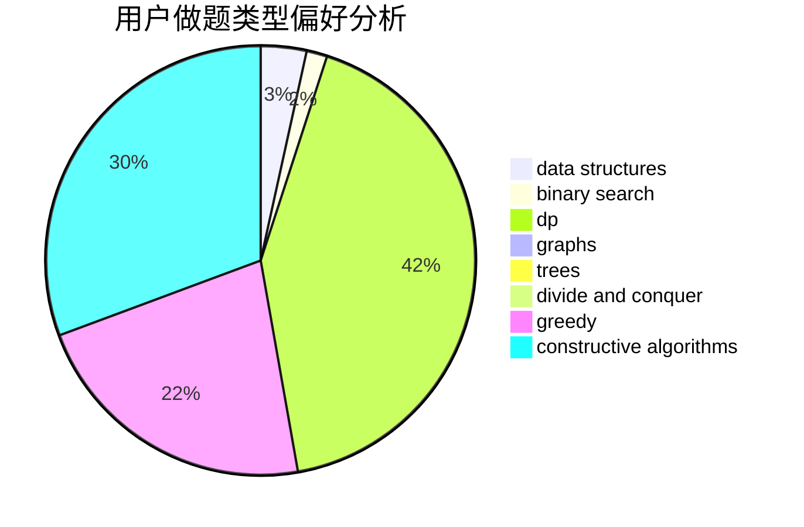

# hnust_jishaohua

<!-- tabs:start -->

#### **用户提交结果分析**

#### **用户做题类型偏好分析**

#### **用户错题知识点分析**

<!-- tabs:end -->
# 推荐题目
[396C](https://codeforces.com/contest/396/problem/C)		data structures,
                        graphs,
                        trees		  
[1466H](https://codeforces.com/contest/1466/problem/H)		combinatorics,
                        dp,
                        graphs,
                        greedy,
                        math		  
[1444E](https://codeforces.com/contest/1444/problem/E)		brute force,
                        dfs and similar,
                        dp,
                        interactive,
                        trees		  
[845D](https://codeforces.com/contest/845/problem/D)		data structures,
                        dp,
                        greedy		  
[718D](https://codeforces.com/contest/718/problem/D)		dp,
                        hashing,
                        trees		  
[1164F](https://codeforces.com/contest/1164/problem/F)		dsu,graphs,sortings,trees		  
[791B](https://codeforces.com/contest/791/problem/B)		dsu,graphs,sortings,trees		  
[914E](https://codeforces.com/contest/914/problem/E)		bitmasks,
                        data structures,
                        divide and conquer,
                        trees		  
[380D](https://codeforces.com/contest/380/problem/D)		combinatorics,
                        math		  
[12542](https://codeforces.com/contest/1254/problem/2)		dsu,graphs,sortings,trees		  
